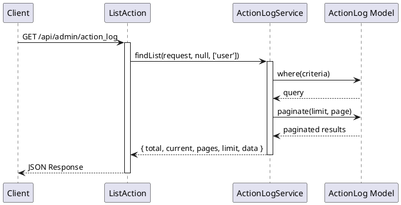
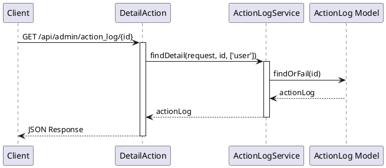

# ActionLog API 仕様書

## 概要

アクションログ管理に関する API エンドポイントです。アクションログの一覧取得、詳細取得などの機能を提供します。

---

## アクションログ API

### 1. アクションログ一覧取得

#### エンドポイント

```
GET /api/admin/action_log
```

#### HTTP メソッド

`GET`

#### 認証

必須（auth:sanctum）

#### リクエストパラメータ

##### Query Parameters

| パラメータ名 | 型      | 必須 | 説明                                          |
| ------------ | ------- | ---- | --------------------------------------------- |
| current      | integer | 任意 | 現在のページ番号（デフォルト: 1）             |
| limit        | integer | 任意 | 1 ページあたりの件数（デフォルト: config 値） |
| criteria     | array   | 任意 | 検索条件                                      |

#### レスポンス構造

##### 成功時 (200)

```json
{
    "success": true,
    "timestamp": 1234567890,
    "payload": {
        "total": 1000,
        "current": 1,
        "pages": 100,
        "limit": 10,
        "data": [
            {
                "id": "550e8400-e29b-41d4-a716-446655440000",
                "title": "アクションログタイトル",
                "user_id": 1,
                "user": {
                    "id": 1,
                    "name": "ユーザー名",
                    "email": "user@example.com"
                },
                "action": "create",
                "model": "Content",
                "model_id": 1,
                "ip_address": "192.168.1.1",
                "user_agent": "Mozilla/5.0...",
                "request_data": {},
                "response_data": {},
                "created_at": "2024-01-01 12:00:00",
                "updated_at": "2024-01-01 12:00:00"
            }
        ]
    }
}
```

#### 使用しているモデル・サービス

-   **モデル**: `App\Mod\ActionLog\Domain\Models\ActionLog`
-   **サービス**: `App\Mod\ActionLog\Domain\ActionLogService`
-   **Action**: `App\Mod\ActionLog\Actions\Admin\ListAction`

#### 処理の流れ



#### 想定されるエラーケース

-   **401 Unauthorized**: 認証されていない

---

### 2. アクションログ詳細取得

#### エンドポイント

```
GET /api/admin/action_log/{id}
```

#### HTTP メソッド

`GET`

#### 認証

必須（auth:sanctum）

#### リクエストパラメータ

##### Path Parameters

| パラメータ名 | 型      | 必須 | 説明            |
| ------------ | ------- | ---- | --------------- |
| id           | integer | 必須 | アクションログ ID |

#### レスポンス構造

##### 成功時 (200)

```json
{
    "success": true,
    "timestamp": 1234567890,
    "payload": {
        "data": {
            "id": "550e8400-e29b-41d4-a716-446655440000",
            "title": "アクションログタイトル",
            "user_id": 1,
            "user": {
                "id": 1,
                "name": "ユーザー名",
                "email": "user@example.com"
            },
            "action": "create",
            "model": "Content",
            "model_id": 1,
            "ip_address": "192.168.1.1",
            "user_agent": "Mozilla/5.0...",
            "request_data": {},
            "response_data": {},
            "created_at": "2024-01-01 12:00:00",
            "updated_at": "2024-01-01 12:00:00"
            ...
        }
    }
}
```

#### 使用しているモデル・サービス

-   **モデル**: `App\Mod\ActionLog\Domain\Models\ActionLog`
-   **サービス**: `App\Mod\ActionLog\Domain\ActionLogService`
-   **Action**: `App\Mod\ActionLog\Actions\Admin\DetailAction`

#### 処理の流れ



#### 想定されるエラーケース

-   **401 Unauthorized**: 認証されていない
-   **404 Not Found**: アクションログが見つからない

