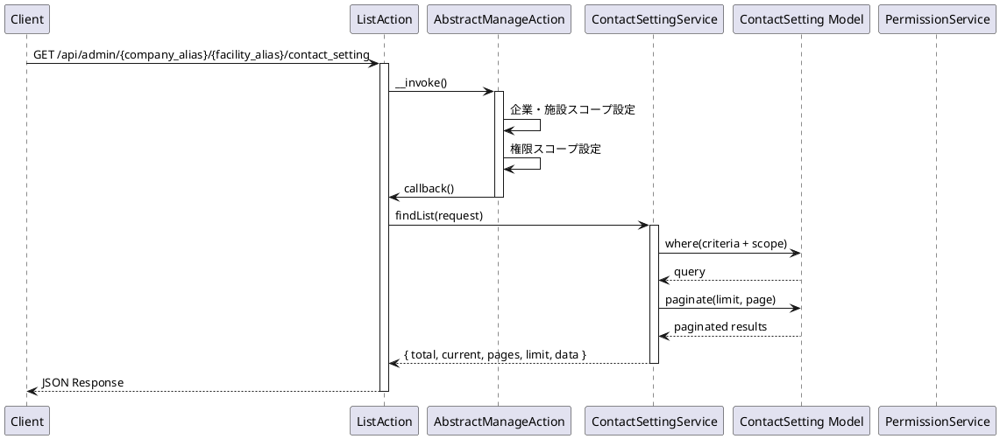
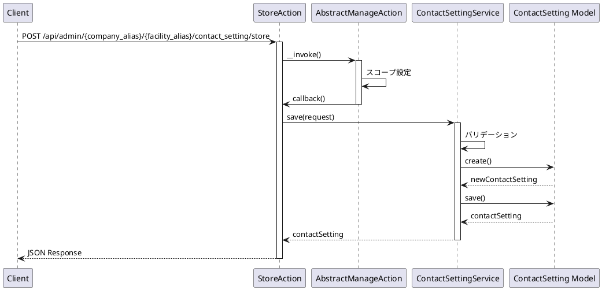
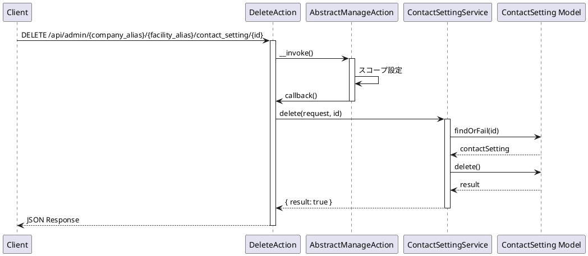

# ContactSetting API 仕様書

## 概要

お問い合わせ設定管理に関する API エンドポイントです。お問い合わせ設定の CRUD 操作、並び替え、リソース取得などの機能を提供します。

---

## お問い合わせ設定 API

### 1. お問い合わせ設定一覧取得

#### エンドポイント

```
GET /api/admin/{company_alias}/{facility_alias}/contact_setting
```

#### HTTP メソッド

`GET`

#### 認証

必須（auth:sanctum, ActionLogMiddleware, PermissionMiddleware:contact_setting）

#### リクエストパラメータ

##### Path Parameters

| パラメータ名   | 型     | 必須 | 説明           |
| -------------- | ------ | ---- | -------------- |
| company_alias  | string | 必須 | 企業エイリアス |
| facility_alias | string | 必須 | 施設エイリアス |

##### Query Parameters

| パラメータ名 | 型      | 必須 | 説明                                          |
| ------------ | ------- | ---- | --------------------------------------------- |
| current      | integer | 任意 | 現在のページ番号（デフォルト: 1）             |
| limit        | integer | 任意 | 1 ページあたりの件数（デフォルト: config 値） |
| criteria     | array   | 任意 | 検索条件                                      |

#### レスポンス構造

##### 成功時 (200)

```json
{
    "success": true,
    "timestamp": 1234567890,
    "payload": {
        "total": 10,
        "current": 1,
        "pages": 1,
        "limit": 10,
        "data": [
            {
                "id": "550e8400-e29b-41d4-a716-446655440000",
                "title": "お問い合わせ設定名",
                "token": "token-string",
                "from_address": "from@example.com",
                "from_name": "送信者名",
                "to_address": "to@example.com",
                "subject": "件名",
                "body": "本文",
                "is_return": true,
                "return_field": "email",
                "return_subject": "返信件名",
                "return_body": "返信本文",
                "is_recaptcha": false,
                "recaptcha_site_key": null,
                "recaptcha_secret_key": null,
                "fields": {},
                "publish_at": "2024-01-01 00:00:00",
                "expires_at": null,
                "sort_num": 1,
                "status": "active",
                "created_by": 1,
                "updated_by": 1,
                "free_search": null,
                "created_at": "2024-01-01 00:00:00",
                "updated_at": "2024-01-01 00:00:00"
            }
        ]
    }
}
```

#### 使用しているモデル・サービス

-   **モデル**: `App\Mod\ContactSetting\Domain\Models\ContactSetting`
-   **サービス**: `App\Mod\ContactSetting\Domain\ContactSettingService`
-   **Action**: `App\Mod\ContactSetting\Actions\Admin\ListAction`

#### 処理の流れ



#### 想定されるエラーケース

-   **401 Unauthorized**: 認証されていない
-   **403 Forbidden**: 権限がない
-   **404 Not Found**: 企業または施設が見つからない

---

### 2. お問い合わせ設定作成

#### エンドポイント

```
POST /api/admin/{company_alias}/{facility_alias}/contact_setting/store
```

#### HTTP メソッド

`POST`

#### 認証

必須（auth:sanctum, ActionLogMiddleware, PermissionMiddleware:contact_setting）

#### リクエストパラメータ

##### Path Parameters

| パラメータ名   | 型     | 必須 | 説明           |
| -------------- | ------ | ---- | -------------- |
| company_alias  | string | 必須 | 企業エイリアス |
| facility_alias | string | 必須 | 施設エイリアス |

##### Body Parameters

| パラメータ名         | 型      | 必須         | 説明                           |
| -------------------- | ------- | ------------ | ------------------------------ |
| title                | string  | 必須         | お問い合わせ設定名             |
| token                | string  | 任意         | トークン                       |
| from_address         | string  | 必須         | 送信者アドレス                 |
| from_name            | string  | 任意         | 送信者名                       |
| to_address           | string  | 必須         | 送信先アドレス                 |
| subject              | string  | 必須         | 件名                           |
| body                 | string  | 必須         | 本文                           |
| is_return            | boolean | 任意         | 返信機能有効フラグ             |
| return_field         | string  | 条件付き必須 | 返信フィールド（is_return 時） |
| return_subject       | string  | 条件付き必須 | 返信件名（is_return 時）       |
| return_body          | string  | 条件付き必須 | 返信本文（is_return 時）       |
| is_recaptcha         | boolean | 任意         | reCAPTCHA 有効フラグ           |
| recaptcha_site_key   | string  | 条件付き必須 | reCAPTCHA サイトキー           |
| recaptcha_secret_key | string  | 条件付き必須 | reCAPTCHA シークレットキー     |
| fields               | object  | 任意         | フィールド設定（JSON）         |
| publish_at           | string  | 任意         | 公開開始日時（YYYY-MM-DD HH:mm:ss） |
| expires_at           | string  | 任意         | 公開終了日時（YYYY-MM-DD HH:mm:ss） |
| sort_num             | integer | 任意         | 並び順                         |
| status               | string  | 任意         | ステータス                     |

#### バリデーション

-   `title`: required
-   `from_address`: required
-   `to_address`: required
-   `subject`: required
-   `body`: required
-   `return_field`: required（is_return が true の場合）
-   `return_subject`: required（is_return が true の場合）
-   `return_body`: required（is_return が true の場合）
-   `recaptcha_site_key`: required（is_recaptcha が true の場合）
-   `recaptcha_secret_key`: required（is_recaptcha が true の場合）

#### レスポンス構造

##### 成功時 (200)

```json
{
    "success": true,
    "timestamp": 1234567890,
    "payload": {
        "data": {
            "id": "550e8400-e29b-41d4-a716-446655440000",
            "title": "新規お問い合わせ設定名",
            "token": "token-string",
            "from_address": "from@example.com",
            "from_name": "送信者名",
            "to_address": "to@example.com",
            "subject": "件名",
            "body": "本文",
            "is_return": true,
            "return_field": "email",
            "return_subject": "返信件名",
            "return_body": "返信本文",
            "is_recaptcha": false,
            "recaptcha_site_key": null,
            "recaptcha_secret_key": null,
            "fields": {},
            "publish_at": "2024-01-01 00:00:00",
            "expires_at": null,
            "sort_num": 1,
            "status": "active",
            "created_by": 1,
            "updated_by": 1,
            "free_search": null,
            "created_at": "2024-01-01 00:00:00",
            "updated_at": "2024-01-01 00:00:00"
        }
    }
}
```

#### 使用しているモデル・サービス

-   **モデル**: `App\Mod\ContactSetting\Domain\Models\ContactSetting`
-   **サービス**: `App\Mod\ContactSetting\Domain\ContactSettingService`
-   **Action**: `App\Mod\ContactSetting\Actions\Admin\StoreAction`

#### 処理の流れ



#### 想定されるエラーケース

-   **400 Bad Request**: バリデーションエラー
    -   タイトルが未入力
    -   送信者アドレスが未入力
    -   送信先アドレスが未入力
    -   件名が未入力
    -   本文が未入力
    -   返信設定が不完全（is_return が true の場合）
    -   reCAPTCHA 設定が不完全（is_recaptcha が true の場合）
-   **401 Unauthorized**: 認証されていない
-   **403 Forbidden**: 権限がない
-   **404 Not Found**: 企業または施設が見つからない
-   **500 Internal Server Error**: その他のエラー

---

### 3. お問い合わせ設定詳細取得

#### エンドポイント

```
GET /api/admin/{company_alias}/{facility_alias}/contact_setting/{id}
```

#### HTTP メソッド

`GET`

#### 認証

必須（auth:sanctum, ActionLogMiddleware, PermissionMiddleware:contact_setting）

#### リクエストパラメータ

##### Path Parameters

| パラメータ名   | 型      | 必須 | 説明                  |
| -------------- | ------- | ---- | --------------------- |
| company_alias  | string  | 必須 | 企業エイリアス        |
| facility_alias | string  | 必須 | 施設エイリアス        |
| id             | integer | 必須 | お問い合わせ設定 ID |

#### レスポンス構造

##### 成功時 (200)

```json
{
    "success": true,
    "timestamp": 1234567890,
    "payload": {
        "data": {
            "id": 1,
            "title": "お問い合わせ設定名",
            "from_address": "from@example.com",
            "to_address": "to@example.com",
            "subject": "件名",
            "body": "本文",
            ...
        }
    }
}
```

#### 使用しているモデル・サービス

-   **モデル**: `App\Mod\ContactSetting\Domain\Models\ContactSetting`
-   **サービス**: `App\Mod\ContactSetting\Domain\ContactSettingService`
-   **Action**: `App\Mod\ContactSetting\Actions\Admin\DetailAction`

#### 処理の流れ

お問い合わせ設定一覧取得と同じ（単一レコード）

#### 想定されるエラーケース

-   **401 Unauthorized**: 認証されていない
-   **403 Forbidden**: 権限がない
-   **404 Not Found**: お問い合わせ設定が見つからない

---

### 4. お問い合わせ設定更新

#### エンドポイント

```
PUT /api/admin/{company_alias}/{facility_alias}/contact_setting/{id}
```

#### HTTP メソッド

`PUT`

#### 認証

必須（auth:sanctum, ActionLogMiddleware, PermissionMiddleware:contact_setting）

#### リクエストパラメータ

##### Path Parameters

| パラメータ名   | 型      | 必須 | 説明                  |
| -------------- | ------- | ---- | --------------------- |
| company_alias  | string  | 必須 | 企業エイリアス        |
| facility_alias | string  | 必須 | 施設エイリアス        |
| id             | integer | 必須 | お問い合わせ設定 ID |

##### Body Parameters

お問い合わせ設定作成と同じ

#### バリデーション

お問い合わせ設定作成と同じ

#### レスポンス構造

##### 成功時 (200)

```json
{
    "success": true,
    "timestamp": 1234567890,
    "payload": {
        "data": {
            "id": 1,
            "title": "更新されたお問い合わせ設定名",
            ...
        }
    }
}
```

#### 使用しているモデル・サービス

-   **モデル**: `App\Mod\ContactSetting\Domain\Models\ContactSetting`
-   **サービス**: `App\Mod\ContactSetting\Domain\ContactSettingService`
-   **Action**: `App\Mod\ContactSetting\Actions\Admin\UpdateAction`

#### 処理の流れ

お問い合わせ設定作成と同じ（更新処理）

#### 想定されるエラーケース

-   **400 Bad Request**: バリデーションエラー
-   **401 Unauthorized**: 認証されていない
-   **403 Forbidden**: 権限がない
-   **404 Not Found**: お問い合わせ設定が見つからない
-   **500 Internal Server Error**: その他のエラー

---

### 5. お問い合わせ設定削除

#### エンドポイント

```
DELETE /api/admin/{company_alias}/{facility_alias}/contact_setting/{id}
```

#### HTTP メソッド

`DELETE`

#### 認証

必須（auth:sanctum, ActionLogMiddleware, PermissionMiddleware:contact_setting）

#### リクエストパラメータ

##### Path Parameters

| パラメータ名   | 型      | 必須 | 説明                  |
| -------------- | ------- | ---- | --------------------- |
| company_alias  | string  | 必須 | 企業エイリアス        |
| facility_alias | string  | 必須 | 施設エイリアス        |
| id             | integer | 必須 | お問い合わせ設定 ID |

#### レスポンス構造

##### 成功時 (200)

```json
{
    "success": true,
    "timestamp": 1234567890,
    "payload": {
        "data": {
            "result": true
        }
    }
}
```

#### 使用しているモデル・サービス

-   **モデル**: `App\Mod\ContactSetting\Domain\Models\ContactSetting`
-   **サービス**: `App\Mod\ContactSetting\Domain\ContactSettingService`
-   **Action**: `App\Mod\ContactSetting\Actions\Admin\DeleteAction`

#### 処理の流れ



#### 想定されるエラーケース

-   **401 Unauthorized**: 認証されていない
-   **403 Forbidden**: 権限がない
-   **404 Not Found**: お問い合わせ設定が見つからない
-   **500 Internal Server Error**: その他のエラー

---

### 6. お問い合わせ設定並び替え

#### エンドポイント

```
POST /api/admin/{company_alias}/{facility_alias}/contact_setting/sort
```

#### HTTP メソッド

`POST`

#### 認証

必須（auth:sanctum, ActionLogMiddleware, PermissionMiddleware:contact_setting）

#### リクエストパラメータ

##### Path Parameters

| パラメータ名   | 型     | 必須 | 説明           |
| -------------- | ------ | ---- | -------------- |
| company_alias  | string | 必須 | 企業エイリアス |
| facility_alias | string | 必須 | 施設エイリアス |

##### Body Parameters

| パラメータ名 | 型    | 必須 | 説明                 |
| ------------ | ----- | ---- | -------------------- |
| sort_ids     | array | 必須 | 並び替え後の ID 配列 |

#### レスポンス構造

##### 成功時 (200)

```json
{
    "success": true,
    "timestamp": 1234567890,
    "payload": {
        "data": {
            "result": true
        }
    }
}
```

#### 使用しているモデル・サービス

-   **モデル**: `App\Mod\ContactSetting\Domain\Models\ContactSetting`
-   **サービス**: `App\Mod\ContactSetting\Domain\ContactSettingService`
-   **Action**: `App\Mod\ContactSetting\Actions\Admin\SortAction`

#### 処理の流れ

コンテンツモデル並び替えと同じ

#### 想定されるエラーケース

-   **400 Bad Request**: バリデーションエラー
    -   sort_ids が未指定
-   **401 Unauthorized**: 認証されていない
-   **403 Forbidden**: 権限がない
-   **404 Not Found**: 指定された ID のお問い合わせ設定が見つからない
-   **500 Internal Server Error**: その他のエラー

---

### 7. お問い合わせ設定リソース取得（全件）

#### エンドポイント

```
GET /api/admin/{company_alias}/{facility_alias}/contact_setting/resource
```

#### HTTP メソッド

`GET`

#### 認証

必須（auth:sanctum）

#### リクエストパラメータ

##### Path Parameters

| パラメータ名   | 型     | 必須 | 説明           |
| -------------- | ------ | ---- | -------------- |
| company_alias  | string | 必須 | 企業エイリアス |
| facility_alias | string | 必須 | 施設エイリアス |

##### Query Parameters

| パラメータ名 | 型    | 必須 | 説明     |
| ------------ | ----- | ---- | -------- |
| criteria     | array | 任意 | 検索条件 |

#### レスポンス構造

##### 成功時 (200)

```json
{
    "success": true,
    "timestamp": 1234567890,
    "payload": {
        "data": [...]
    }
}
```

#### 使用しているモデル・サービス

-   **モデル**: `App\Mod\ContactSetting\Domain\Models\ContactSetting`
-   **サービス**: `App\Mod\ContactSetting\Domain\ContactSettingService`
-   **Action**: `App\Mod\ContactSetting\Actions\Admin\ResourceAction`

#### 処理の流れ

お問い合わせ設定一覧取得と同じ（ページネーションなし）

#### 想定されるエラーケース

-   **401 Unauthorized**: 認証されていない

---

### 8. お問い合わせ設定検索

#### エンドポイント

```
GET /api/admin/{company_alias}/{facility_alias}/contact_setting/find
```

#### HTTP メソッド

`GET`

#### 認証

必須（auth:sanctum）

#### リクエストパラメータ

##### Path Parameters

| パラメータ名   | 型     | 必須 | 説明           |
| -------------- | ------ | ---- | -------------- |
| company_alias  | string | 必須 | 企業エイリアス |
| facility_alias | string | 必須 | 施設エイリアス |

##### Query Parameters

| パラメータ名 | 型    | 必須 | 説明     |
| ------------ | ----- | ---- | -------- |
| criteria     | array | 任意 | 検索条件 |

#### レスポンス構造

##### 成功時 (200)

```json
{
    "success": true,
    "timestamp": 1234567890,
    "payload": {
        "data": {...}
    }
}
```

#### 使用しているモデル・サービス

-   **モデル**: `App\Mod\ContactSetting\Domain\Models\ContactSetting`
-   **サービス**: `App\Mod\ContactSetting\Domain\ContactSettingService`
-   **Action**: `App\Mod\ContactSetting\Actions\Admin\FindAction`

#### 処理の流れ

お問い合わせ設定詳細取得と同じ（検索条件による）

#### 想定されるエラーケース

-   **401 Unauthorized**: 認証されていない

