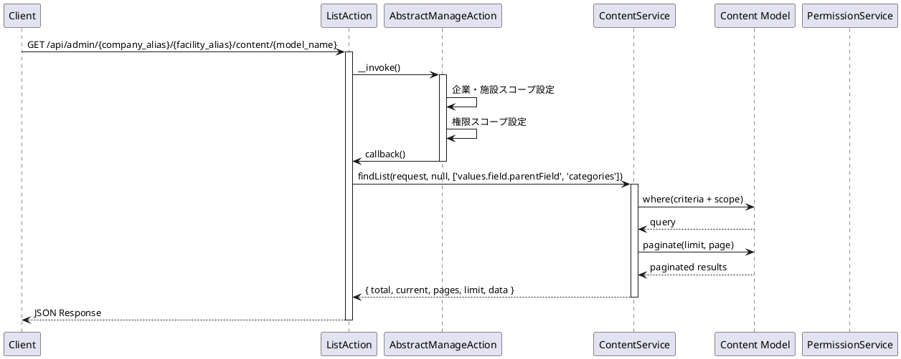
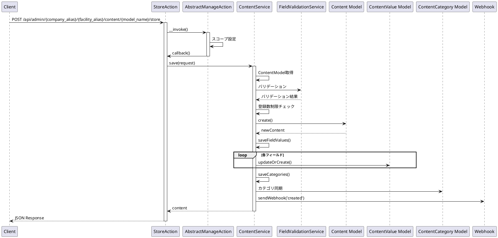
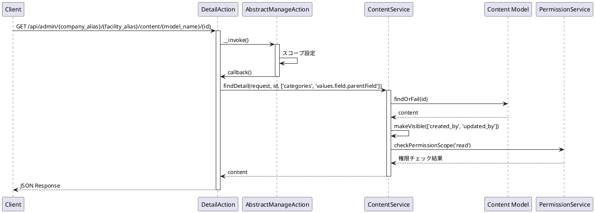
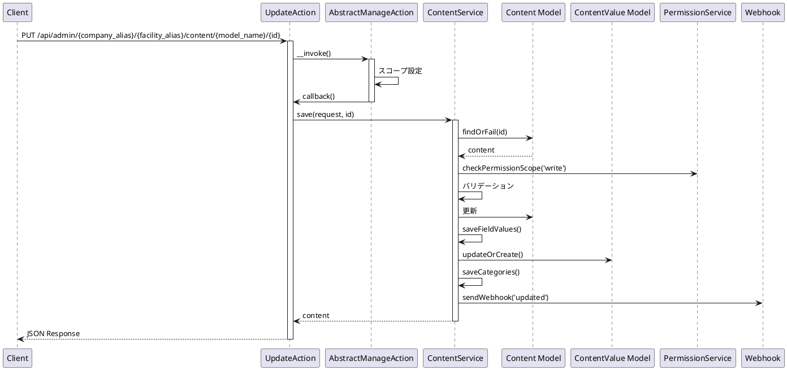
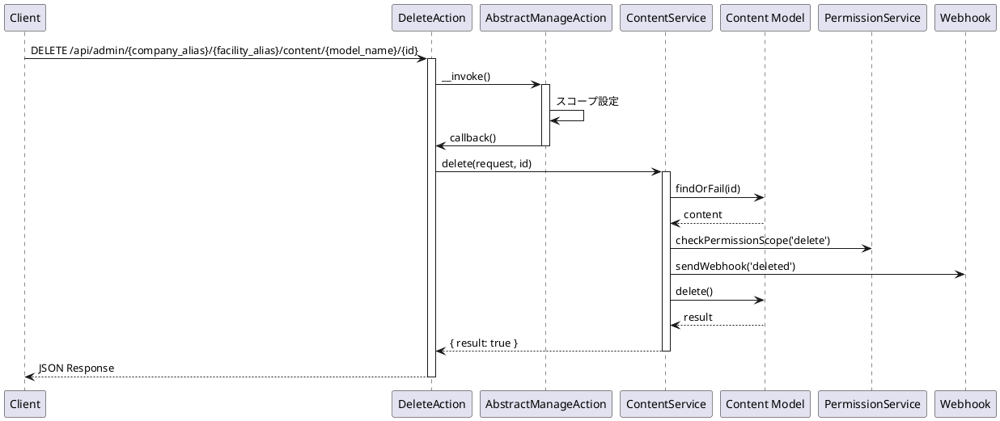
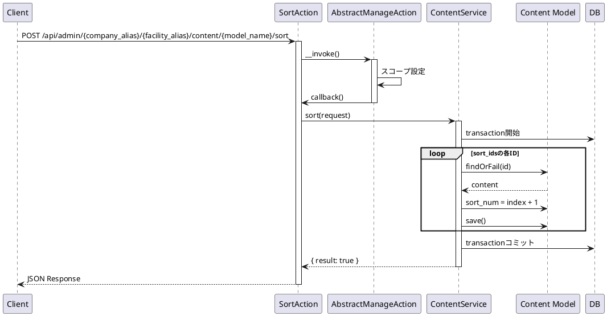
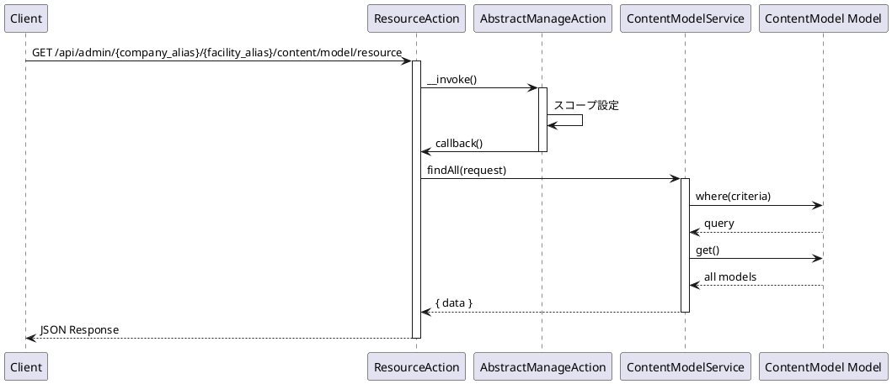
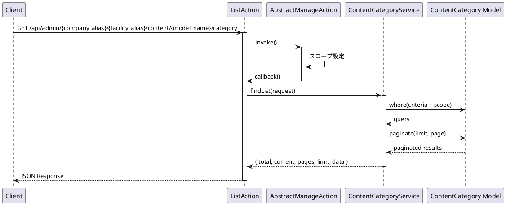
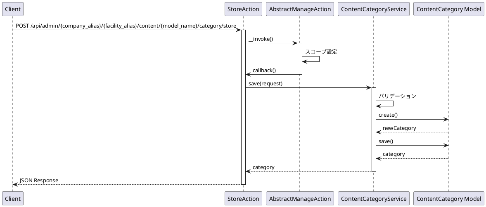
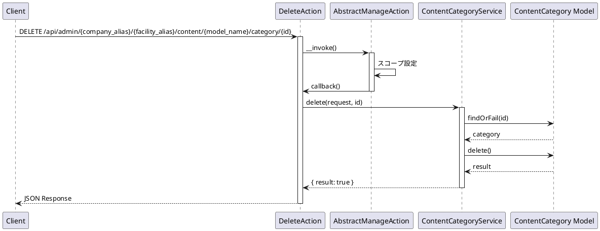

# Content API 仕様書

## 概要

コンテンツ管理に関する API エンドポイントです。コンテンツの CRUD 操作、カテゴリ管理、モデル関連の操作などの機能を提供します。

---

## コンテンツ API

### 1. コンテンツ一覧取得

#### エンドポイント

```
GET /api/admin/{company_alias}/{facility_alias}/content/{model_name}
```

#### HTTP メソッド

`GET`

#### 認証

必須（auth:sanctum, ActionLogMiddleware, PermissionMiddleware:content）

#### リクエストパラメータ

##### Path Parameters

| パラメータ名   | 型     | 必須 | 説明                             |
| -------------- | ------ | ---- | -------------------------------- |
| company_alias  | string | 必須 | 企業エイリアス                   |
| facility_alias | string | 必須 | 施設エイリアス                   |
| model_name     | string | 必須 | コンテンツモデル名（エイリアス） |

##### Query Parameters

| パラメータ名 | 型      | 必須 | 説明                                          |
| ------------ | ------- | ---- | --------------------------------------------- |
| current      | integer | 任意 | 現在のページ番号（デフォルト: 1）             |
| limit        | integer | 任意 | 1 ページあたりの件数（デフォルト: config 値） |
| criteria     | array   | 任意 | 検索条件                                      |

#### レスポンス構造

##### 成功時 (200)

```json
{
  "success": true,
  "timestamp": 1234567890,
  "payload": {
    "total": 100,
    "current": 1,
    "pages": 10,
    "limit": 10,
    "data": [
      {
        "id": 1,
        "model_id": 1,
        "values": [...],
        "categories": [...],
        ...
      }
    ]
  }
}
```

#### 使用しているモデル・サービス

-   **モデル**: `App\Mod\Content\Domain\Models\Content`
-   **サービス**: `App\Mod\Content\Domain\ContentService`
-   **Action**: `App\Mod\Content\Actions\Admin\ListAction`

#### 処理の流れ



#### 想定されるエラーケース

-   **401 Unauthorized**: 認証されていない
-   **403 Forbidden**: 権限がない
-   **404 Not Found**: 企業、施設、またはコンテンツモデルが見つからない

---

### 2. コンテンツ作成

#### エンドポイント

```
POST /api/admin/{company_alias}/{facility_alias}/content/{model_name}/store
```

#### HTTP メソッド

`POST`

#### 認証

必須（auth:sanctum, ActionLogMiddleware, PermissionMiddleware:content）

#### リクエストパラメータ

##### Path Parameters

| パラメータ名   | 型     | 必須 | 説明                             |
| -------------- | ------ | ---- | -------------------------------- |
| company_alias  | string | 必須 | 企業エイリアス                   |
| facility_alias | string | 必須 | 施設エイリアス                   |
| model_name     | string | 必須 | コンテンツモデル名（エイリアス） |

##### Body Parameters

| パラメータ名 | 型    | 必須         | 説明                                                  |
| ------------ | ----- | ------------ | ----------------------------------------------------- |
| {field_id}   | mixed | 条件付き必須 | フィールド値（ContentModel のフィールド定義に基づく） |
| categories   | array | 任意         | カテゴリ ID 配列                                      |

**注意**: リクエストパラメータは ContentModel のフィールド定義に基づいて動的に決まります。各フィールドの`is_required`が`true`の場合は必須です。

#### バリデーション

-   ContentModel のフィールド定義に基づく動的バリデーション
-   `FieldValidationService`により各フィールドタイプに応じたバリデーションが適用される

#### レスポンス構造

##### 成功時 (200)

```json
{
  "success": true,
  "timestamp": 1234567890,
  "payload": {
    "data": {
      "id": 1,
      "model_id": 1,
      "values": [...],
      "categories": [...],
      ...
    }
  }
}
```

#### 使用しているモデル・サービス

-   **モデル**: `App\Mod\Content\Domain\Models\Content`, `App\Mod\Content\Domain\Models\ContentValue`
-   **サービス**: `App\Mod\Content\Domain\ContentService`
-   **サービス**: `App\Services\Validation\FieldValidationService`
-   **Action**: `App\Mod\Content\Actions\Admin\StoreAction`

#### 処理の流れ



#### 想定されるエラーケース

-   **400 Bad Request**: バリデーションエラー
    -   必須フィールドが未入力
    -   フィールドの形式が不正
    -   登録数が上限に達している
-   **401 Unauthorized**: 認証されていない
-   **403 Forbidden**: 権限がない
-   **404 Not Found**: 企業、施設、またはコンテンツモデルが見つからない
-   **500 Internal Server Error**: その他のエラー

---

### 3. コンテンツ詳細取得

#### エンドポイント

```
GET /api/admin/{company_alias}/{facility_alias}/content/{model_name}/{id}
```

#### HTTP メソッド

`GET`

#### 認証

必須（auth:sanctum, ActionLogMiddleware, PermissionMiddleware:content）

#### リクエストパラメータ

##### Path Parameters

| パラメータ名   | 型      | 必須 | 説明                             |
| -------------- | ------- | ---- | -------------------------------- |
| company_alias  | string  | 必須 | 企業エイリアス                   |
| facility_alias | string  | 必須 | 施設エイリアス                   |
| model_name     | string  | 必須 | コンテンツモデル名（エイリアス） |
| id             | integer | 必須 | コンテンツ ID                    |

#### レスポンス構造

##### 成功時 (200)

```json
{
  "success": true,
  "timestamp": 1234567890,
  "payload": {
    "data": {
      "id": 1,
      "model_id": 1,
      "values": [
        {
          "field_id": "title",
          "value": "タイトル",
          "field": {...}
        }
      ],
      "categories": [
        {
          "id": 1,
          "title": "カテゴリ名"
        }
      ],
      "created_by": 1,
      "updated_by": 1,
      ...
    }
  }
}
```

#### 使用しているモデル・サービス

-   **モデル**: `App\Mod\Content\Domain\Models\Content`
-   **サービス**: `App\Mod\Content\Domain\ContentService`
-   **サービス**: `App\Core\User\Domain\PermissionService`
-   **Action**: `App\Mod\Content\Actions\Admin\DetailAction`

#### 処理の流れ



#### 想定されるエラーケース

-   **401 Unauthorized**: 認証されていない
-   **403 Forbidden**: 権限がない
-   **404 Not Found**: コンテンツが見つからない

---

### 4. コンテンツ更新

#### エンドポイント

```
PUT /api/admin/{company_alias}/{facility_alias}/content/{model_name}/{id}
```

#### HTTP メソッド

`PUT`

#### 認証

必須（auth:sanctum, ActionLogMiddleware, PermissionMiddleware:content）

#### リクエストパラメータ

##### Path Parameters

| パラメータ名   | 型      | 必須 | 説明                             |
| -------------- | ------- | ---- | -------------------------------- |
| company_alias  | string  | 必須 | 企業エイリアス                   |
| facility_alias | string  | 必須 | 施設エイリアス                   |
| model_name     | string  | 必須 | コンテンツモデル名（エイリアス） |
| id             | integer | 必須 | コンテンツ ID                    |

##### Body Parameters

コンテンツ作成と同じ（ContentModel のフィールド定義に基づく）

#### バリデーション

コンテンツ作成と同じ

#### レスポンス構造

##### 成功時 (200)

```json
{
  "success": true,
  "timestamp": 1234567890,
  "payload": {
    "data": {
      "id": 1,
      "model_id": 1,
      "values": [...],
      "categories": [...],
      ...
    }
  }
}
```

#### 使用しているモデル・サービス

-   **モデル**: `App\Mod\Content\Domain\Models\Content`, `App\Mod\Content\Domain\Models\ContentValue`
-   **サービス**: `App\Mod\Content\Domain\ContentService`
-   **Action**: `App\Mod\Content\Actions\Admin\UpdateAction`

#### 処理の流れ



#### 想定されるエラーケース

-   **400 Bad Request**: バリデーションエラー
-   **401 Unauthorized**: 認証されていない
-   **403 Forbidden**: 権限がない
-   **404 Not Found**: コンテンツが見つからない
-   **500 Internal Server Error**: その他のエラー

---

### 5. コンテンツ削除

#### エンドポイント

```
DELETE /api/admin/{company_alias}/{facility_alias}/content/{model_name}/{id}
```

#### HTTP メソッド

`DELETE`

#### 認証

必須（auth:sanctum, ActionLogMiddleware, PermissionMiddleware:content）

#### リクエストパラメータ

##### Path Parameters

| パラメータ名   | 型      | 必須 | 説明                             |
| -------------- | ------- | ---- | -------------------------------- |
| company_alias  | string  | 必須 | 企業エイリアス                   |
| facility_alias | string  | 必須 | 施設エイリアス                   |
| model_name     | string  | 必須 | コンテンツモデル名（エイリアス） |
| id             | integer | 必須 | コンテンツ ID                    |

#### レスポンス構造

##### 成功時 (200)

```json
{
    "success": true,
    "timestamp": 1234567890,
    "payload": {
        "data": {
            "result": true
        }
    }
}
```

#### 使用しているモデル・サービス

-   **モデル**: `App\Mod\Content\Domain\Models\Content`
-   **サービス**: `App\Mod\Content\Domain\ContentService`
-   **Action**: `App\Mod\Content\Actions\Admin\DeleteAction`

#### 処理の流れ



#### 想定されるエラーケース

-   **401 Unauthorized**: 認証されていない
-   **403 Forbidden**: 権限がない
-   **404 Not Found**: コンテンツが見つからない
-   **500 Internal Server Error**: その他のエラー

---

### 6. コンテンツ並び替え

#### エンドポイント

```
POST /api/admin/{company_alias}/{facility_alias}/content/{model_name}/sort
```

#### HTTP メソッド

`POST`

#### 認証

必須（auth:sanctum, ActionLogMiddleware, PermissionMiddleware:content）

#### リクエストパラメータ

##### Path Parameters

| パラメータ名   | 型     | 必須 | 説明                             |
| -------------- | ------ | ---- | -------------------------------- |
| company_alias  | string | 必須 | 企業エイリアス                   |
| facility_alias | string | 必須 | 施設エイリアス                   |
| model_name     | string | 必須 | コンテンツモデル名（エイリアス） |

##### Body Parameters

| パラメータ名 | 型    | 必須 | 説明                 |
| ------------ | ----- | ---- | -------------------- |
| sort_ids     | array | 必須 | 並び替え後の ID 配列 |

#### レスポンス構造

##### 成功時 (200)

```json
{
    "success": true,
    "timestamp": 1234567890,
    "payload": {
        "data": {
            "result": true
        }
    }
}
```

#### 使用しているモデル・サービス

-   **モデル**: `App\Mod\Content\Domain\Models\Content`
-   **サービス**: `App\Mod\Content\Domain\ContentService`
-   **Action**: `App\Mod\Content\Actions\Admin\SortAction`

#### 処理の流れ



#### 想定されるエラーケース

-   **400 Bad Request**: バリデーションエラー
    -   sort_ids が未指定
-   **401 Unauthorized**: 認証されていない
-   **403 Forbidden**: 権限がない
-   **404 Not Found**: 指定された ID のコンテンツが見つからない
-   **500 Internal Server Error**: その他のエラー

---

### 7. コンテンツリソース取得（全件）

#### エンドポイント

```
GET /api/admin/{company_alias}/{facility_alias}/content/{model_name}/resource
```

#### HTTP メソッド

`GET`

#### 認証

必須（auth:sanctum）

#### リクエストパラメータ

##### Path Parameters

| パラメータ名   | 型     | 必須 | 説明                             |
| -------------- | ------ | ---- | -------------------------------- |
| company_alias  | string | 必須 | 企業エイリアス                   |
| facility_alias | string | 必須 | 施設エイリアス                   |
| model_name     | string | 必須 | コンテンツモデル名（エイリアス） |

##### Query Parameters

| パラメータ名 | 型    | 必須 | 説明     |
| ------------ | ----- | ---- | -------- |
| criteria     | array | 任意 | 検索条件 |

#### レスポンス構造

##### 成功時 (200)

```json
{
  "success": true,
  "timestamp": 1234567890,
  "payload": {
    "data": [...]
  }
}
```

#### 使用しているモデル・サービス

-   **モデル**: `App\Mod\Content\Domain\Models\Content`
-   **サービス**: `App\Mod\Content\Domain\ContentService`
-   **Action**: `App\Mod\Content\Actions\Admin\ResourceAction`

#### 処理の流れ

コンテンツ一覧取得と同じ（ページネーションなし）

#### 想定されるエラーケース

-   **401 Unauthorized**: 認証されていない

---

### 8. コンテンツ検索

#### エンドポイント

```
GET /api/admin/{company_alias}/{facility_alias}/content/{model_name}/find
```

#### HTTP メソッド

`GET`

#### 認証

必須（auth:sanctum）

#### リクエストパラメータ

##### Path Parameters

| パラメータ名   | 型     | 必須 | 説明                             |
| -------------- | ------ | ---- | -------------------------------- |
| company_alias  | string | 必須 | 企業エイリアス                   |
| facility_alias | string | 必須 | 施設エイリアス                   |
| model_name     | string | 必須 | コンテンツモデル名（エイリアス） |

##### Query Parameters

| パラメータ名 | 型    | 必須 | 説明     |
| ------------ | ----- | ---- | -------- |
| criteria     | array | 任意 | 検索条件 |

#### レスポンス構造

##### 成功時 (200)

```json
{
  "success": true,
  "timestamp": 1234567890,
  "payload": {
    "data": {...}
  }
}
```

#### 使用しているモデル・サービス

-   **モデル**: `App\Mod\Content\Domain\Models\Content`
-   **サービス**: `App\Mod\Content\Domain\ContentService`
-   **Action**: `App\Mod\Content\Actions\Admin\FindAction`

#### 処理の流れ

コンテンツ詳細取得と同じ（検索条件による）

#### 想定されるエラーケース

-   **401 Unauthorized**: 認証されていない

---

## コンテンツモデル API

### 9. コンテンツモデルリソース取得

#### エンドポイント

```
GET /api/admin/{company_alias}/{facility_alias}/content/model/resource
```

#### HTTP メソッド

`GET`

#### 認証

必須（auth:sanctum）

#### リクエストパラメータ

##### Path Parameters

| パラメータ名   | 型     | 必須 | 説明           |
| -------------- | ------ | ---- | -------------- |
| company_alias  | string | 必須 | 企業エイリアス |
| facility_alias | string | 必須 | 施設エイリアス |

#### レスポンス構造

##### 成功時 (200)

```json
{
  "success": true,
  "timestamp": 1234567890,
  "payload": {
    "data": [
      {
        "id": 1,
        "title": "コンテンツモデル名",
        "alias": "model-alias",
        ...
      }
    ]
  }
}
```

#### 使用しているモデル・サービス

-   **モデル**: `App\Mod\ContentModel\Domain\Models\ContentModel`
-   **サービス**: `App\Mod\ContentModel\Domain\ContentModelService`
-   **Action**: `App\Mod\Content\Actions\Admin\Model\ResourceAction`

#### 処理の流れ



#### 想定されるエラーケース

-   **401 Unauthorized**: 認証されていない

---

### 10. コンテンツモデル検索

#### エンドポイント

```
GET /api/admin/{company_alias}/{facility_alias}/content/model/find
```

#### HTTP メソッド

`GET`

#### 認証

必須（auth:sanctum）

#### リクエストパラメータ

##### Path Parameters

| パラメータ名   | 型     | 必須 | 説明           |
| -------------- | ------ | ---- | -------------- |
| company_alias  | string | 必須 | 企業エイリアス |
| facility_alias | string | 必須 | 施設エイリアス |

##### Query Parameters

| パラメータ名 | 型    | 必須 | 説明     |
| ------------ | ----- | ---- | -------- |
| criteria     | array | 任意 | 検索条件 |

#### レスポンス構造

##### 成功時 (200)

```json
{
  "success": true,
  "timestamp": 1234567890,
  "payload": {
    "data": {...}
  }
}
```

#### 使用しているモデル・サービス

-   **モデル**: `App\Mod\ContentModel\Domain\Models\ContentModel`
-   **サービス**: `App\Mod\ContentModel\Domain\ContentModelService`
-   **Action**: `App\Mod\Content\Actions\Admin\Model\FindAction`

#### 処理の流れ

コンテンツモデルリソース取得と同じ（単一レコード）

#### 想定されるエラーケース

-   **401 Unauthorized**: 認証されていない

---

## カテゴリ API

### 11. カテゴリ一覧取得

#### エンドポイント

```
GET /api/admin/{company_alias}/{facility_alias}/content/{model_name}/category
```

#### HTTP メソッド

`GET`

#### 認証

必須（auth:sanctum, ActionLogMiddleware, PermissionMiddleware:content）

#### リクエストパラメータ

##### Path Parameters

| パラメータ名   | 型     | 必須 | 説明                             |
| -------------- | ------ | ---- | -------------------------------- |
| company_alias  | string | 必須 | 企業エイリアス                   |
| facility_alias | string | 必須 | 施設エイリアス                   |
| model_name     | string | 必須 | コンテンツモデル名（エイリアス） |

##### Query Parameters

| パラメータ名 | 型      | 必須 | 説明                 |
| ------------ | ------- | ---- | -------------------- |
| current      | integer | 任意 | 現在のページ番号     |
| limit        | integer | 任意 | 1 ページあたりの件数 |
| criteria     | array   | 任意 | 検索条件             |

#### レスポンス構造

##### 成功時 (200)

```json
{
  "success": true,
  "timestamp": 1234567890,
  "payload": {
    "total": 20,
    "current": 1,
    "pages": 2,
    "limit": 10,
    "data": [
      {
        "id": 1,
        "title": "カテゴリ名",
        "model_id": 1,
        ...
      }
    ]
  }
}
```

#### 使用しているモデル・サービス

-   **モデル**: `App\Mod\Content\Domain\Models\ContentCategory`
-   **サービス**: `App\Mod\Content\Domain\ContentCategoryService`
-   **Action**: `App\Mod\Content\Actions\Admin\Category\ListAction`

#### 処理の流れ



#### 想定されるエラーケース

-   **401 Unauthorized**: 認証されていない
-   **403 Forbidden**: 権限がない

---

### 12. カテゴリ作成

#### エンドポイント

```
POST /api/admin/{company_alias}/{facility_alias}/content/{model_name}/category/store
```

#### HTTP メソッド

`POST`

#### 認証

必須（auth:sanctum, ActionLogMiddleware, PermissionMiddleware:content）

#### リクエストパラメータ

##### Path Parameters

| パラメータ名   | 型     | 必須 | 説明                             |
| -------------- | ------ | ---- | -------------------------------- |
| company_alias  | string | 必須 | 企業エイリアス                   |
| facility_alias | string | 必須 | 施設エイリアス                   |
| model_name     | string | 必須 | コンテンツモデル名（エイリアス） |

##### Body Parameters

| パラメータ名 | 型     | 必須 | 説明       |
| ------------ | ------ | ---- | ---------- |
| title        | string | 必須 | カテゴリ名 |

#### バリデーション

-   `title`: required

#### レスポンス構造

##### 成功時 (200)

```json
{
  "success": true,
  "timestamp": 1234567890,
  "payload": {
    "data": {
      "id": 1,
      "title": "新規カテゴリ名",
      "model_id": 1,
      ...
    }
  }
}
```

#### 使用しているモデル・サービス

-   **モデル**: `App\Mod\Content\Domain\Models\ContentCategory`
-   **サービス**: `App\Mod\Content\Domain\ContentCategoryService`
-   **Action**: `App\Mod\Content\Actions\Admin\Category\StoreAction`

#### 処理の流れ



#### 想定されるエラーケース

-   **400 Bad Request**: バリデーションエラー
    -   カテゴリ名が未入力
-   **401 Unauthorized**: 認証されていない
-   **403 Forbidden**: 権限がない
-   **500 Internal Server Error**: その他のエラー

---

### 13. カテゴリ詳細取得

#### エンドポイント

```
GET /api/admin/{company_alias}/{facility_alias}/content/{model_name}/category/{id}
```

#### HTTP メソッド

`GET`

#### 認証

必須（auth:sanctum, ActionLogMiddleware, PermissionMiddleware:content）

#### リクエストパラメータ

##### Path Parameters

| パラメータ名   | 型      | 必須 | 説明                             |
| -------------- | ------- | ---- | -------------------------------- |
| company_alias  | string  | 必須 | 企業エイリアス                   |
| facility_alias | string  | 必須 | 施設エイリアス                   |
| model_name     | string  | 必須 | コンテンツモデル名（エイリアス） |
| id             | integer | 必須 | カテゴリ ID                      |

#### レスポンス構造

##### 成功時 (200)

```json
{
  "success": true,
  "timestamp": 1234567890,
  "payload": {
    "data": {
      "id": 1,
      "title": "カテゴリ名",
      "model_id": 1,
      ...
    }
  }
}
```

#### 使用しているモデル・サービス

-   **モデル**: `App\Mod\Content\Domain\Models\ContentCategory`
-   **サービス**: `App\Mod\Content\Domain\ContentCategoryService`
-   **Action**: `App\Mod\Content\Actions\Admin\Category\DetailAction`

#### 処理の流れ

カテゴリ一覧取得と同じ（単一レコード）

#### 想定されるエラーケース

-   **401 Unauthorized**: 認証されていない
-   **403 Forbidden**: 権限がない
-   **404 Not Found**: カテゴリが見つからない

---

### 14. カテゴリ更新

#### エンドポイント

```
PUT /api/admin/{company_alias}/{facility_alias}/content/{model_name}/category/{id}
```

#### HTTP メソッド

`PUT`

#### 認証

必須（auth:sanctum, ActionLogMiddleware, PermissionMiddleware:content）

#### リクエストパラメータ

##### Path Parameters

| パラメータ名   | 型      | 必須 | 説明                             |
| -------------- | ------- | ---- | -------------------------------- |
| company_alias  | string  | 必須 | 企業エイリアス                   |
| facility_alias | string  | 必須 | 施設エイリアス                   |
| model_name     | string  | 必須 | コンテンツモデル名（エイリアス） |
| id             | integer | 必須 | カテゴリ ID                      |

##### Body Parameters

| パラメータ名 | 型     | 必須 | 説明       |
| ------------ | ------ | ---- | ---------- |
| title        | string | 必須 | カテゴリ名 |

#### バリデーション

-   `title`: required

#### レスポンス構造

##### 成功時 (200)

```json
{
  "success": true,
  "timestamp": 1234567890,
  "payload": {
    "data": {
      "id": 1,
      "title": "更新されたカテゴリ名",
      ...
    }
  }
}
```

#### 使用しているモデル・サービス

-   **モデル**: `App\Mod\Content\Domain\Models\ContentCategory`
-   **サービス**: `App\Mod\Content\Domain\ContentCategoryService`
-   **Action**: `App\Mod\Content\Actions\Admin\Category\UpdateAction`

#### 処理の流れ

カテゴリ作成と同じ（更新処理）

#### 想定されるエラーケース

-   **400 Bad Request**: バリデーションエラー
-   **401 Unauthorized**: 認証されていない
-   **403 Forbidden**: 権限がない
-   **404 Not Found**: カテゴリが見つからない
-   **500 Internal Server Error**: その他のエラー

---

### 15. カテゴリ削除

#### エンドポイント

```
DELETE /api/admin/{company_alias}/{facility_alias}/content/{model_name}/category/{id}
```

#### HTTP メソッド

`DELETE`

#### 認証

必須（auth:sanctum, ActionLogMiddleware, PermissionMiddleware:content）

#### リクエストパラメータ

##### Path Parameters

| パラメータ名   | 型      | 必須 | 説明                             |
| -------------- | ------- | ---- | -------------------------------- |
| company_alias  | string  | 必須 | 企業エイリアス                   |
| facility_alias | string  | 必須 | 施設エイリアス                   |
| model_name     | string  | 必須 | コンテンツモデル名（エイリアス） |
| id             | integer | 必須 | カテゴリ ID                      |

#### レスポンス構造

##### 成功時 (200)

```json
{
    "success": true,
    "timestamp": 1234567890,
    "payload": {
        "data": {
            "result": true
        }
    }
}
```

#### 使用しているモデル・サービス

-   **モデル**: `App\Mod\Content\Domain\Models\ContentCategory`
-   **サービス**: `App\Mod\Content\Domain\ContentCategoryService`
-   **Action**: `App\Mod\Content\Actions\Admin\Category\DeleteAction`

#### 処理の流れ



#### 想定されるエラーケース

-   **401 Unauthorized**: 認証されていない
-   **403 Forbidden**: 権限がない
-   **404 Not Found**: カテゴリが見つからない
-   **500 Internal Server Error**: その他のエラー
    -   外部キー制約エラー

---

### 16. カテゴリ並び替え

#### エンドポイント

```
POST /api/admin/{company_alias}/{facility_alias}/content/{model_name}/category/sort
```

#### HTTP メソッド

`POST`

#### 認証

必須（auth:sanctum, ActionLogMiddleware, PermissionMiddleware:content）

#### リクエストパラメータ

##### Path Parameters

| パラメータ名   | 型     | 必須 | 説明                             |
| -------------- | ------ | ---- | -------------------------------- |
| company_alias  | string | 必須 | 企業エイリアス                   |
| facility_alias | string | 必須 | 施設エイリアス                   |
| model_name     | string | 必須 | コンテンツモデル名（エイリアス） |

##### Body Parameters

| パラメータ名 | 型    | 必須 | 説明                 |
| ------------ | ----- | ---- | -------------------- |
| sort_ids     | array | 必須 | 並び替え後の ID 配列 |

#### レスポンス構造

##### 成功時 (200)

```json
{
    "success": true,
    "timestamp": 1234567890,
    "payload": {
        "data": {
            "result": true
        }
    }
}
```

#### 使用しているモデル・サービス

-   **モデル**: `App\Mod\Content\Domain\Models\ContentCategory`
-   **サービス**: `App\Mod\Content\Domain\ContentCategoryService`
-   **Action**: `App\Mod\Content\Actions\Admin\Category\SortAction`

#### 処理の流れ

コンテンツ並び替えと同じ

#### 想定されるエラーケース

-   **400 Bad Request**: バリデーションエラー
-   **401 Unauthorized**: 認証されていない
-   **403 Forbidden**: 権限がない
-   **404 Not Found**: 指定された ID のカテゴリが見つからない
-   **500 Internal Server Error**: その他のエラー

---

### 17. カテゴリリソース取得（全件）

#### エンドポイント

```
GET /api/admin/{company_alias}/{facility_alias}/content/{model_name}/category/resource
```

#### HTTP メソッド

`GET`

#### 認証

必須（auth:sanctum）

#### リクエストパラメータ

##### Path Parameters

| パラメータ名   | 型     | 必須 | 説明                             |
| -------------- | ------ | ---- | -------------------------------- |
| company_alias  | string | 必須 | 企業エイリアス                   |
| facility_alias | string | 必須 | 施設エイリアス                   |
| model_name     | string | 必須 | コンテンツモデル名（エイリアス） |

##### Query Parameters

| パラメータ名 | 型    | 必須 | 説明     |
| ------------ | ----- | ---- | -------- |
| criteria     | array | 任意 | 検索条件 |

#### レスポンス構造

##### 成功時 (200)

```json
{
  "success": true,
  "timestamp": 1234567890,
  "payload": {
    "data": [...]
  }
}
```

#### 使用しているモデル・サービス

-   **モデル**: `App\Mod\Content\Domain\Models\ContentCategory`
-   **サービス**: `App\Mod\Content\Domain\ContentCategoryService`
-   **Action**: `App\Mod\Content\Actions\Admin\Category\ResourceAction`

#### 処理の流れ

カテゴリ一覧取得と同じ（ページネーションなし）

#### 想定されるエラーケース

-   **401 Unauthorized**: 認証されていない

---

### 18. カテゴリ検索

#### エンドポイント

```
GET /api/admin/{company_alias}/{facility_alias}/content/{model_name}/category/find
```

#### HTTP メソッド

`GET`

#### 認証

必須（auth:sanctum）

#### リクエストパラメータ

##### Path Parameters

| パラメータ名   | 型     | 必須 | 説明                             |
| -------------- | ------ | ---- | -------------------------------- |
| company_alias  | string | 必須 | 企業エイリアス                   |
| facility_alias | string | 必須 | 施設エイリアス                   |
| model_name     | string | 必須 | コンテンツモデル名（エイリアス） |

##### Query Parameters

| パラメータ名 | 型    | 必須 | 説明     |
| ------------ | ----- | ---- | -------- |
| criteria     | array | 任意 | 検索条件 |

#### レスポンス構造

##### 成功時 (200)

```json
{
  "success": true,
  "timestamp": 1234567890,
  "payload": {
    "data": {...}
  }
}
```

#### 使用しているモデル・サービス

-   **モデル**: `App\Mod\Content\Domain\Models\ContentCategory`
-   **サービス**: `App\Mod\Content\Domain\ContentCategoryService`
-   **Action**: `App\Mod\Content\Actions\Admin\Category\FindAction`

#### 処理の流れ

カテゴリ詳細取得と同じ（検索条件による）

#### 想定されるエラーケース

-   **401 Unauthorized**: 認証されていない

---

### 19. コンテンツプレビュー

#### エンドポイント

```
POST /api/admin/{company_alias}/{facility_alias}/content/{model_name}/preview
```

#### HTTP メソッド

`POST`

#### 認証

必須（auth:sanctum, ActionLogMiddleware, PermissionMiddleware:content）

#### リクエストパラメータ

##### Path Parameters

| パラメータ名   | 型     | 必須 | 説明                             |
| -------------- | ------ | ---- | -------------------------------- |
| company_alias  | string | 必須 | 企業エイリアス                   |
| facility_alias | string | 必須 | 施設エイリアス                   |
| model_name     | string | 必須 | コンテンツモデル名（エイリアス） |

##### Body Parameters

コンテンツ作成と同じ（ContentModel のフィールド定義に基づく）

#### レスポンス構造

##### 成功時 (200)

```json
{
    "success": true,
    "timestamp": 1234567890,
    "payload": {
        "data": {
            // プレビュー用のコンテンツデータ
        }
    }
}
```

#### 使用しているモデル・サービス

-   **サービス**: `App\Mod\Content\Domain\PreviewProxyService`
-   **Action**: `App\Mod\Content\Actions\Admin\PreviewProxyAction`

#### 処理の流れ

プレビュー用のコンテンツデータを取得します。保存せずに、一時的なプレビュー表示用のデータを返します。

#### 想定されるエラーケース

-   **400 Bad Request**: バリデーションエラー
-   **401 Unauthorized**: 認証されていない
-   **403 Forbidden**: 権限がない
-   **404 Not Found**: 企業、施設、またはコンテンツモデルが見つからない

---

### 20. AI 校正

#### エンドポイント

```
POST /api/admin/{company_alias}/content/ai-proofread
```

#### HTTP メソッド

`POST`

#### 認証

必須（auth:sanctum, ActionLogMiddleware）

#### リクエストパラメータ

##### Path Parameters

| パラメータ名  | 型     | 必須 | 説明           |
| ------------- | ------ | ---- | -------------- |
| company_alias | string | 必須 | 企業エイリアス |

##### Body Parameters

| パラメータ名 | 型     | 必須 | 説明               |
| ------------ | ------ | ---- | ------------------ |
| text         | string | 必須 | 校正対象のテキスト |

#### バリデーション

-   `text`: required, string

#### レスポンス構造

##### 成功時 (200)

```json
{
    "success": true,
    "timestamp": 1234567890,
    "payload": {
        "data": {
            "corrected_text": "校正後のテキスト",
            "suggestions": [
                {
                    "original": "元のテキスト",
                    "corrected": "校正後のテキスト",
                    "reason": "校正理由"
                }
            ]
        }
    }
}
```

#### 使用しているモデル・サービス

-   **サービス**: `App\Mod\Content\Domain\AiService`
-   **Action**: `App\Mod\Content\Actions\Admin\AiProofreadAction`

#### 処理の流れ

AI を使用してテキストの校正を行います。誤字脱字や表現の改善提案を返します。

#### 想定されるエラーケース

-   **400 Bad Request**: バリデーションエラー
    -   テキストが未入力
-   **401 Unauthorized**: 認証されていない
-   **404 Not Found**: 企業が見つからない
-   **500 Internal Server Error**: その他のエラー
    -   AI サービスエラー
