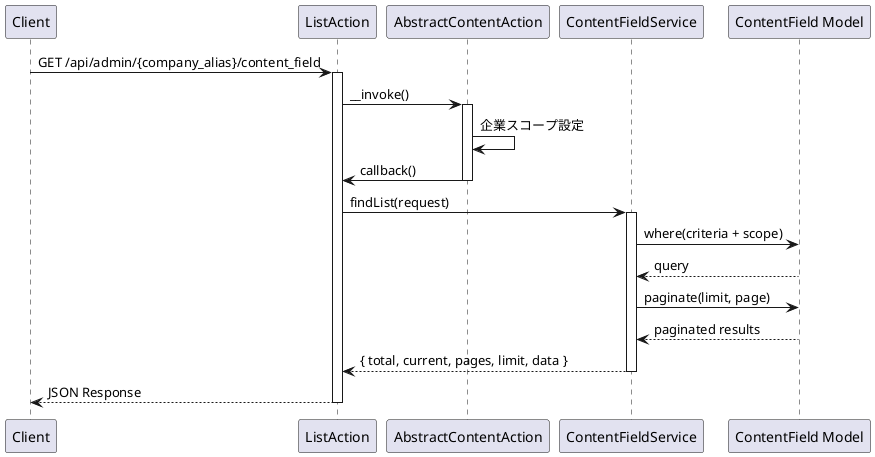
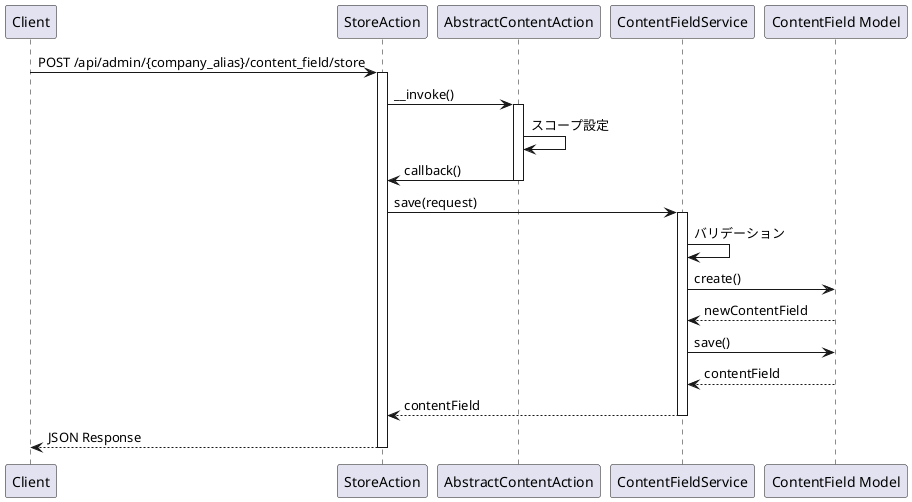
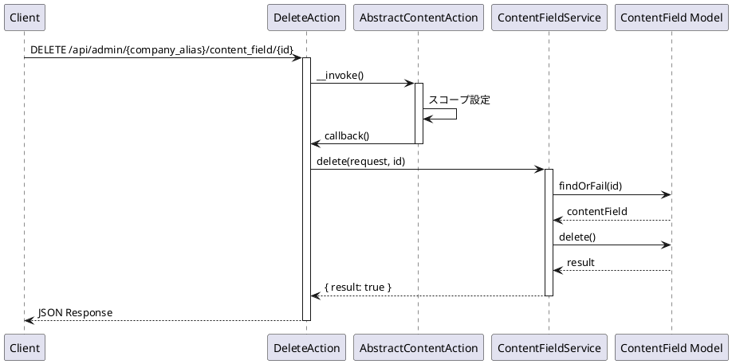
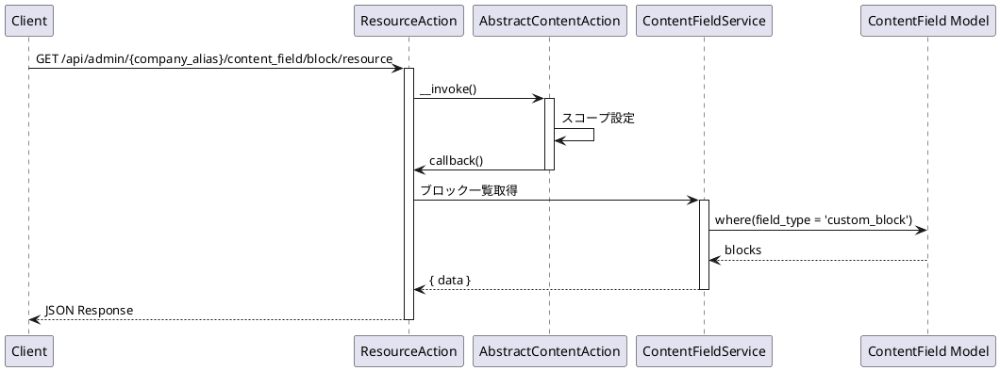

# ContentField API 仕様書

## 概要

コンテンツフィールド管理に関する API エンドポイントです。コンテンツフィールドの CRUD 操作、カスタムフィールド管理、ブロック管理などの機能を提供します。

---

## コンテンツフィールド API

### 1. コンテンツフィールド一覧取得

#### エンドポイント

```
GET /api/admin/{company_alias}/content_field
```

#### HTTP メソッド

`GET`

#### 認証

必須（auth:sanctum, ActionLogMiddleware）

#### リクエストパラメータ

##### Path Parameters

| パラメータ名  | 型     | 必須 | 説明           |
| ------------- | ------ | ---- | -------------- |
| company_alias | string | 必須 | 企業エイリアス |

##### Query Parameters

| パラメータ名 | 型      | 必須 | 説明                                          |
| ------------ | ------- | ---- | --------------------------------------------- |
| current      | integer | 任意 | 現在のページ番号（デフォルト: 1）             |
| limit        | integer | 任意 | 1 ページあたりの件数（デフォルト: config 値） |
| criteria     | array   | 任意 | 検索条件                                      |

#### レスポンス構造

##### 成功時 (200)

```json
{
    "success": true,
    "timestamp": 1234567890,
    "payload": {
        "total": 50,
        "current": 1,
        "pages": 5,
        "limit": 10,
        "data": [
            {
                "id": 1,
                "model_id": 1,
                "name": "タイトル",
                "field_id": "title",
                "is_required": false,
                "is_list_heading": false,
                "field_type": "text",
                "publish_at": "2024-01-01 00:00:00",
                "expires_at": null,
                "sort_num": 1,
                "status": "active",
                "created_by": 1,
                "updated_by": 1,
                "created_at": "2024-01-01 00:00:00",
                "updated_at": "2024-01-01 00:00:00"
            }
        ]
    }
}
```

#### 使用しているモデル・サービス

-   **モデル**: `App\Mod\ContentField\Domain\Models\ContentField`
-   **サービス**: `App\Mod\ContentField\Domain\ContentFieldService`
-   **Action**: `App\Mod\ContentField\Actions\Admin\ListAction`

#### 処理の流れ



#### 想定されるエラーケース

-   **401 Unauthorized**: 認証されていない
-   **404 Not Found**: 企業が見つからない

---

### 2. コンテンツフィールド作成

#### エンドポイント

```
POST /api/admin/{company_alias}/content_field/store
```

#### HTTP メソッド

`POST`

#### 認証

必須（auth:sanctum, ActionLogMiddleware）

#### リクエストパラメータ

##### Path Parameters

| パラメータ名  | 型     | 必須 | 説明           |
| ------------- | ------ | ---- | -------------- |
| company_alias | string | 必須 | 企業エイリアス |

##### Body Parameters

| パラメータ名     | 型      | 必須 | 説明                                              |
| ---------------- | ------- | ---- | ------------------------------------------------- |
| model_id         | integer | 必須 | コンテンツモデル ID                               |
| name             | string  | 必須 | フィールド名                                      |
| field_id         | string  | 必須 | フィールド ID                                     |
| field_type       | string  | 必須 | フィールドタイプ                                  |
| is_required      | boolean | 任意 | 必須フラグ                                        |
| is_list_heading | boolean | 任意 | 一覧見出しフラグ                                  |
| validates        | array   | 任意 | バリデーション設定                                |
| custom_field_id  | integer | 任意 | カスタムフィールド ID（カスタムフィールドの場合） |
| publish_at       | string  | 任意 | 公開開始日時（YYYY-MM-DD HH:mm:ss）               |
| expires_at       | string  | 任意 | 公開終了日時（YYYY-MM-DD HH:mm:ss）               |
| sort_num         | integer | 任意 | 並び順                                            |
| status           | string  | 任意 | ステータス                                        |

#### バリデーション

-   `model_id`: required
-   `name`: required
-   `field_id`: required
-   `field_type`: required

#### レスポンス構造

##### 成功時 (200)

```json
{
    "success": true,
    "timestamp": 1234567890,
    "payload": {
        "data": {
            "id": 1,
            "model_id": 1,
            "name": "タイトル",
            "field_id": "title",
            "is_required": false,
            "is_list_heading": false,
            "field_type": "text",
            "publish_at": "2024-01-01 00:00:00",
            "expires_at": null,
            "sort_num": 1,
            "status": "active",
            "created_by": 1,
            "updated_by": 1,
            "created_at": "2024-01-01 00:00:00",
            "updated_at": "2024-01-01 00:00:00"
        }
    }
}
```

#### 使用しているモデル・サービス

-   **モデル**: `App\Mod\ContentField\Domain\Models\ContentField`
-   **サービス**: `App\Mod\ContentField\Domain\ContentFieldService`
-   **Action**: `App\Mod\ContentField\Actions\Admin\StoreAction`

#### 処理の流れ



#### 想定されるエラーケース

-   **400 Bad Request**: バリデーションエラー
    -   フィールド ID が未入力
    -   フィールド名が未入力
    -   フィールドタイプが未指定
    -   コンテンツモデル ID が未指定
-   **401 Unauthorized**: 認証されていない
-   **404 Not Found**: 企業が見つからない
-   **500 Internal Server Error**: その他のエラー

---

### 3. コンテンツフィールド詳細取得

#### エンドポイント

```
GET /api/admin/{company_alias}/content_field/{id}
```

#### HTTP メソッド

`GET`

#### 認証

必須（auth:sanctum, ActionLogMiddleware）

#### リクエストパラメータ

##### Path Parameters

| パラメータ名  | 型      | 必須 | 説明                    |
| ------------- | ------- | ---- | ----------------------- |
| company_alias | string  | 必須 | 企業エイリアス          |
| id            | integer | 必須 | コンテンツフィールド ID |

#### レスポンス構造

##### 成功時 (200)

```json
{
    "success": true,
    "timestamp": 1234567890,
    "payload": {
        "data": {
            "id": 1,
            "field_id": "title",
            "name": "タイトル",
            "field_type": "text",
            "content_model_id": 1,
            ...
        }
    }
}
```

#### 使用しているモデル・サービス

-   **モデル**: `App\Mod\ContentField\Domain\Models\ContentField`
-   **サービス**: `App\Mod\ContentField\Domain\ContentFieldService`
-   **Action**: `App\Mod\ContentField\Actions\Admin\DetailAction`

#### 処理の流れ

コンテンツフィールド一覧取得と同じ（単一レコード）

#### 想定されるエラーケース

-   **401 Unauthorized**: 認証されていない
-   **404 Not Found**: コンテンツフィールドが見つからない

---

### 4. コンテンツフィールド更新

#### エンドポイント

```
PUT /api/admin/{company_alias}/content_field/{id}
```

#### HTTP メソッド

`PUT`

#### 認証

必須（auth:sanctum, ActionLogMiddleware）

#### リクエストパラメータ

##### Path Parameters

| パラメータ名  | 型      | 必須 | 説明                    |
| ------------- | ------- | ---- | ----------------------- |
| company_alias | string  | 必須 | 企業エイリアス          |
| id            | integer | 必須 | コンテンツフィールド ID |

##### Body Parameters

コンテンツフィールド作成と同じ

#### バリデーション

コンテンツフィールド作成と同じ

#### レスポンス構造

##### 成功時 (200)

```json
{
    "success": true,
    "timestamp": 1234567890,
    "payload": {
        "data": {
            "id": 1,
            "field_id": "title",
            "name": "更新されたタイトル",
            ...
        }
    }
}
```

#### 使用しているモデル・サービス

-   **モデル**: `App\Mod\ContentField\Domain\Models\ContentField`
-   **サービス**: `App\Mod\ContentField\Domain\ContentFieldService`
-   **Action**: `App\Mod\ContentField\Actions\Admin\UpdateAction`

#### 処理の流れ

コンテンツフィールド作成と同じ（更新処理）

#### 想定されるエラーケース

-   **400 Bad Request**: バリデーションエラー
-   **401 Unauthorized**: 認証されていない
-   **404 Not Found**: コンテンツフィールドが見つからない
-   **500 Internal Server Error**: その他のエラー

---

### 5. コンテンツフィールド削除

#### エンドポイント

```
DELETE /api/admin/{company_alias}/content_field/{id}
```

#### HTTP メソッド

`DELETE`

#### 認証

必須（auth:sanctum, ActionLogMiddleware）

#### リクエストパラメータ

##### Path Parameters

| パラメータ名  | 型      | 必須 | 説明                    |
| ------------- | ------- | ---- | ----------------------- |
| company_alias | string  | 必須 | 企業エイリアス          |
| id            | integer | 必須 | コンテンツフィールド ID |

#### レスポンス構造

##### 成功時 (200)

```json
{
    "success": true,
    "timestamp": 1234567890,
    "payload": {
        "data": {
            "result": true
        }
    }
}
```

#### 使用しているモデル・サービス

-   **モデル**: `App\Mod\ContentField\Domain\Models\ContentField`
-   **サービス**: `App\Mod\ContentField\Domain\ContentFieldService`
-   **Action**: `App\Mod\ContentField\Actions\Admin\DeleteAction`

#### 処理の流れ



#### 想定されるエラーケース

-   **401 Unauthorized**: 認証されていない
-   **404 Not Found**: コンテンツフィールドが見つからない
-   **500 Internal Server Error**: その他のエラー
    -   外部キー制約エラー

---

### 6. コンテンツフィールド並び替え

#### エンドポイント

```
POST /api/admin/{company_alias}/content_field/sort
```

#### HTTP メソッド

`POST`

#### 認証

必須（auth:sanctum, ActionLogMiddleware）

#### リクエストパラメータ

##### Path Parameters

| パラメータ名  | 型     | 必須 | 説明           |
| ------------- | ------ | ---- | -------------- |
| company_alias | string | 必須 | 企業エイリアス |

##### Body Parameters

| パラメータ名 | 型    | 必須 | 説明                 |
| ------------ | ----- | ---- | -------------------- |
| sort_ids     | array | 必須 | 並び替え後の ID 配列 |

#### レスポンス構造

##### 成功時 (200)

```json
{
    "success": true,
    "timestamp": 1234567890,
    "payload": {
        "data": {
            "result": true
        }
    }
}
```

#### 使用しているモデル・サービス

-   **モデル**: `App\Mod\ContentField\Domain\Models\ContentField`
-   **サービス**: `App\Mod\ContentField\Domain\ContentFieldService`
-   **Action**: `App\Mod\ContentField\Actions\Admin\SortAction`

#### 処理の流れ

コンテンツモデル並び替えと同じ

#### 想定されるエラーケース

-   **400 Bad Request**: バリデーションエラー
    -   sort_ids が未指定
-   **401 Unauthorized**: 認証されていない
-   **404 Not Found**: 指定された ID のコンテンツフィールドが見つからない
-   **500 Internal Server Error**: その他のエラー

---

### 7. コンテンツフィールドリソース取得（全件）

#### エンドポイント

```
GET /api/admin/{company_alias}/content_field/resource
```

#### HTTP メソッド

`GET`

#### 認証

必須（auth:sanctum）

#### リクエストパラメータ

##### Path Parameters

| パラメータ名  | 型     | 必須 | 説明           |
| ------------- | ------ | ---- | -------------- |
| company_alias | string | 必須 | 企業エイリアス |

##### Query Parameters

| パラメータ名 | 型    | 必須 | 説明     |
| ------------ | ----- | ---- | -------- |
| criteria     | array | 任意 | 検索条件 |

#### レスポンス構造

##### 成功時 (200)

```json
{
    "success": true,
    "timestamp": 1234567890,
    "payload": {
        "data": [...]
    }
}
```

#### 使用しているモデル・サービス

-   **モデル**: `App\Mod\ContentField\Domain\Models\ContentField`
-   **サービス**: `App\Mod\ContentField\Domain\ContentFieldService`
-   **Action**: `App\Mod\ContentField\Actions\Admin\ResourceAction`

#### 処理の流れ

コンテンツフィールド一覧取得と同じ（ページネーションなし）

#### 想定されるエラーケース

-   **401 Unauthorized**: 認証されていない

---

## カスタムフィールド API

### 8. カスタムフィールド一覧取得

#### エンドポイント

```
GET /api/admin/{company_alias}/content_field/custom
```

#### HTTP メソッド

`GET`

#### 認証

必須（auth:sanctum, ActionLogMiddleware）

#### リクエストパラメータ

##### Path Parameters

| パラメータ名  | 型     | 必須 | 説明           |
| ------------- | ------ | ---- | -------------- |
| company_alias | string | 必須 | 企業エイリアス |

##### Query Parameters

| パラメータ名 | 型      | 必須 | 説明                                          |
| ------------ | ------- | ---- | --------------------------------------------- |
| current      | integer | 任意 | 現在のページ番号（デフォルト: 1）             |
| limit        | integer | 任意 | 1 ページあたりの件数（デフォルト: config 値） |
| criteria     | array   | 任意 | 検索条件                                      |

#### レスポンス構造

##### 成功時 (200)

```json
{
    "success": true,
    "timestamp": 1234567890,
    "payload": {
        "total": 20,
        "current": 1,
        "pages": 2,
        "limit": 10,
        "data": [
            {
                "id": 1,
                "title": "カスタムフィールド名",
                "company_id": 1,
                ...
            }
        ]
    }
}
```

#### 使用しているモデル・サービス

-   **モデル**: `App\Mod\ContentField\Domain\Models\ContentCustomField`
-   **サービス**: `App\Mod\ContentField\Domain\ContentCustomFieldService`
-   **Action**: `App\Mod\ContentField\Actions\Admin\Custom\ListAction`

#### 処理の流れ

コンテンツフィールド一覧取得と同じ

#### 想定されるエラーケース

-   **401 Unauthorized**: 認証されていない

---

### 9. カスタムフィールド作成

#### エンドポイント

```
POST /api/admin/{company_alias}/content_field/custom/store
```

#### HTTP メソッド

`POST`

#### 認証

必須（auth:sanctum, ActionLogMiddleware）

#### リクエストパラメータ

##### Path Parameters

| パラメータ名  | 型     | 必須 | 説明           |
| ------------- | ------ | ---- | -------------- |
| company_alias | string | 必須 | 企業エイリアス |

##### Body Parameters

| パラメータ名 | 型      | 必須 | 説明                 |
| ------------ | ------- | ---- | -------------------- |
| title        | string  | 必須 | カスタムフィールド名 |
| company_id   | integer | 必須 | 企業 ID              |
| fields       | array   | 任意 | フィールド定義配列   |

#### バリデーション

-   `title`: required
-   `company_id`: required

#### レスポンス構造

##### 成功時 (200)

```json
{
    "success": true,
    "timestamp": 1234567890,
    "payload": {
        "data": {
            "id": 1,
            "title": "新規カスタムフィールド名",
            "company_id": 1,
            ...
        }
    }
}
```

#### 使用しているモデル・サービス

-   **モデル**: `App\Mod\ContentField\Domain\Models\ContentCustomField`
-   **サービス**: `App\Mod\ContentField\Domain\ContentCustomFieldService`
-   **Action**: `App\Mod\ContentField\Actions\Admin\Custom\StoreAction`

#### 処理の流れ

コンテンツフィールド作成と同じ

#### 想定されるエラーケース

-   **400 Bad Request**: バリデーションエラー
    -   タイトルが未入力
    -   企業 ID が未指定
-   **401 Unauthorized**: 認証されていない
-   **500 Internal Server Error**: その他のエラー

---

### 10. カスタムフィールド詳細取得

#### エンドポイント

```
GET /api/admin/{company_alias}/content_field/custom/{id}
```

#### HTTP メソッド

`GET`

#### 認証

必須（auth:sanctum, ActionLogMiddleware）

#### リクエストパラメータ

##### Path Parameters

| パラメータ名  | 型      | 必須 | 説明                  |
| ------------- | ------- | ---- | --------------------- |
| company_alias | string  | 必須 | 企業エイリアス        |
| id            | integer | 必須 | カスタムフィールド ID |

#### レスポンス構造

##### 成功時 (200)

```json
{
    "success": true,
    "timestamp": 1234567890,
    "payload": {
        "data": {
            "id": 1,
            "title": "カスタムフィールド名",
            "company_id": 1,
            "fields": [...],
            ...
        }
    }
}
```

#### 使用しているモデル・サービス

-   **モデル**: `App\Mod\ContentField\Domain\Models\ContentCustomField`
-   **サービス**: `App\Mod\ContentField\Domain\ContentCustomFieldService`
-   **Action**: `App\Mod\ContentField\Actions\Admin\Custom\DetailAction`

#### 処理の流れ

カスタムフィールド一覧取得と同じ（単一レコード）

#### 想定されるエラーケース

-   **401 Unauthorized**: 認証されていない
-   **404 Not Found**: カスタムフィールドが見つからない

---

### 11. カスタムフィールド更新

#### エンドポイント

```
PUT /api/admin/{company_alias}/content_field/custom/{id}
```

#### HTTP メソッド

`PUT`

#### 認証

必須（auth:sanctum, ActionLogMiddleware）

#### リクエストパラメータ

##### Path Parameters

| パラメータ名  | 型      | 必須 | 説明                  |
| ------------- | ------- | ---- | --------------------- |
| company_alias | string  | 必須 | 企業エイリアス        |
| id            | integer | 必須 | カスタムフィールド ID |

##### Body Parameters

カスタムフィールド作成と同じ

#### バリデーション

カスタムフィールド作成と同じ

#### レスポンス構造

##### 成功時 (200)

```json
{
    "success": true,
    "timestamp": 1234567890,
    "payload": {
        "data": {
            "id": 1,
            "title": "更新されたカスタムフィールド名",
            ...
        }
    }
}
```

#### 使用しているモデル・サービス

-   **モデル**: `App\Mod\ContentField\Domain\Models\ContentCustomField`
-   **サービス**: `App\Mod\ContentField\Domain\ContentCustomFieldService`
-   **Action**: `App\Mod\ContentField\Actions\Admin\Custom\UpdateAction`

#### 処理の流れ

カスタムフィールド作成と同じ（更新処理）

#### 想定されるエラーケース

-   **400 Bad Request**: バリデーションエラー
-   **401 Unauthorized**: 認証されていない
-   **404 Not Found**: カスタムフィールドが見つからない
-   **500 Internal Server Error**: その他のエラー

---

### 12. カスタムフィールド削除

#### エンドポイント

```
DELETE /api/admin/{company_alias}/content_field/custom/{id}
```

#### HTTP メソッド

`DELETE`

#### 認証

必須（auth:sanctum, ActionLogMiddleware）

#### リクエストパラメータ

##### Path Parameters

| パラメータ名  | 型      | 必須 | 説明                  |
| ------------- | ------- | ---- | --------------------- |
| company_alias | string  | 必須 | 企業エイリアス        |
| id            | integer | 必須 | カスタムフィールド ID |

#### レスポンス構造

##### 成功時 (200)

```json
{
    "success": true,
    "timestamp": 1234567890,
    "payload": {
        "data": {
            "result": true
        }
    }
}
```

#### 使用しているモデル・サービス

-   **モデル**: `App\Mod\ContentField\Domain\Models\ContentCustomField`
-   **サービス**: `App\Mod\ContentField\Domain\ContentCustomFieldService`
-   **Action**: `App\Mod\ContentField\Actions\Admin\Custom\DeleteAction`

#### 処理の流れ

コンテンツフィールド削除と同じ

#### 想定されるエラーケース

-   **401 Unauthorized**: 認証されていない
-   **404 Not Found**: カスタムフィールドが見つからない
-   **500 Internal Server Error**: その他のエラー

---

### 13. カスタムフィールド並び替え

#### エンドポイント

```
POST /api/admin/{company_alias}/content_field/custom/sort
```

#### HTTP メソッド

`POST`

#### 認証

必須（auth:sanctum, ActionLogMiddleware）

#### リクエストパラメータ

##### Path Parameters

| パラメータ名  | 型     | 必須 | 説明           |
| ------------- | ------ | ---- | -------------- |
| company_alias | string | 必須 | 企業エイリアス |

##### Body Parameters

| パラメータ名 | 型    | 必須 | 説明                 |
| ------------ | ----- | ---- | -------------------- |
| sort_ids     | array | 必須 | 並び替え後の ID 配列 |

#### レスポンス構造

##### 成功時 (200)

```json
{
    "success": true,
    "timestamp": 1234567890,
    "payload": {
        "data": {
            "result": true
        }
    }
}
```

#### 使用しているモデル・サービス

-   **モデル**: `App\Mod\ContentField\Domain\Models\ContentCustomField`
-   **サービス**: `App\Mod\ContentField\Domain\ContentCustomFieldService`
-   **Action**: `App\Mod\ContentField\Actions\Admin\Custom\SortAction`

#### 処理の流れ

コンテンツフィールド並び替えと同じ

#### 想定されるエラーケース

-   **400 Bad Request**: バリデーションエラー
    -   sort_ids が未指定
-   **401 Unauthorized**: 認証されていない
-   **404 Not Found**: 指定された ID のカスタムフィールドが見つからない
-   **500 Internal Server Error**: その他のエラー

---

### 14. カスタムフィールドリソース取得（全件）

#### エンドポイント

```
GET /api/admin/{company_alias}/content_field/custom/resource
```

#### HTTP メソッド

`GET`

#### 認証

必須（auth:sanctum）

#### リクエストパラメータ

##### Path Parameters

| パラメータ名  | 型     | 必須 | 説明           |
| ------------- | ------ | ---- | -------------- |
| company_alias | string | 必須 | 企業エイリアス |

##### Query Parameters

| パラメータ名 | 型    | 必須 | 説明     |
| ------------ | ----- | ---- | -------- |
| criteria     | array | 任意 | 検索条件 |

#### レスポンス構造

##### 成功時 (200)

```json
{
    "success": true,
    "timestamp": 1234567890,
    "payload": {
        "data": [...]
    }
}
```

#### 使用しているモデル・サービス

-   **モデル**: `App\Mod\ContentField\Domain\Models\ContentCustomField`
-   **サービス**: `App\Mod\ContentField\Domain\ContentCustomFieldService`
-   **Action**: `App\Mod\ContentField\Actions\Admin\Custom\ResourceAction`

#### 処理の流れ

カスタムフィールド一覧取得と同じ（ページネーションなし）

#### 想定されるエラーケース

-   **401 Unauthorized**: 認証されていない

---

## ブロック API

### 15. ブロックリソース取得

#### エンドポイント

```
GET /api/admin/{company_alias}/content_field/block/resource
```

#### HTTP メソッド

`GET`

#### 認証

必須（auth:sanctum）

#### リクエストパラメータ

##### Path Parameters

| パラメータ名  | 型     | 必須 | 説明           |
| ------------- | ------ | ---- | -------------- |
| company_alias | string | 必須 | 企業エイリアス |

#### レスポンス構造

##### 成功時 (200)

```json
{
    "success": true,
    "timestamp": 1234567890,
    "payload": {
        "data": [
            {
                "id": 1,
                "field_id": "block-1",
                "name": "ブロック名",
                ...
            }
        ]
    }
}
```

#### 使用しているモデル・サービス

-   **モデル**: `App\Mod\ContentField\Domain\Models\ContentField`
-   **サービス**: `App\Mod\ContentField\Domain\ContentFieldService`
-   **Action**: `App\Mod\ContentField\Actions\Admin\Block\ResourceAction`

#### 処理の流れ



#### 想定されるエラーケース

-   **401 Unauthorized**: 認証されていない
