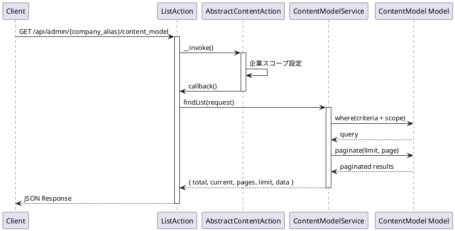
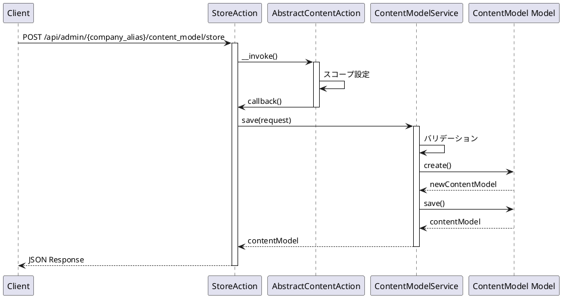
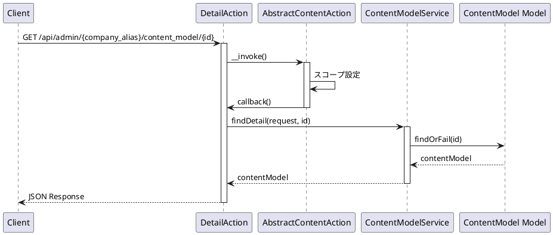
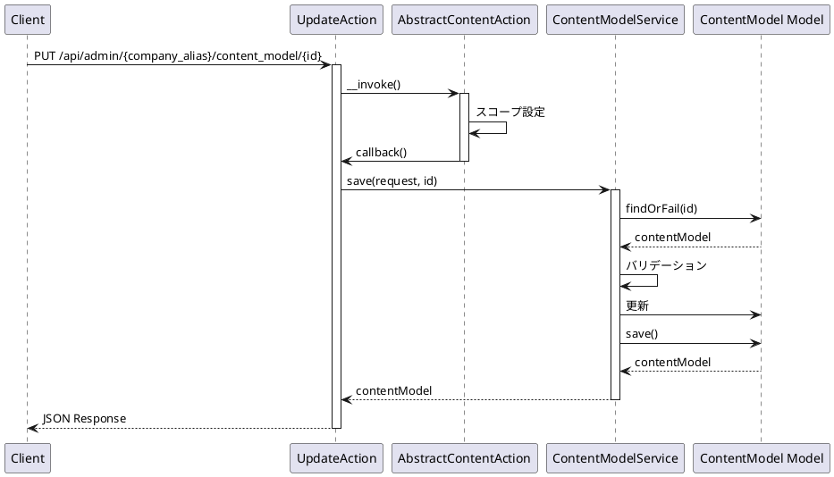
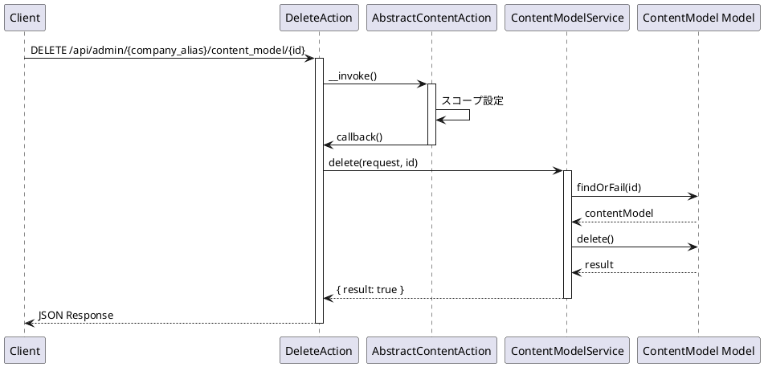
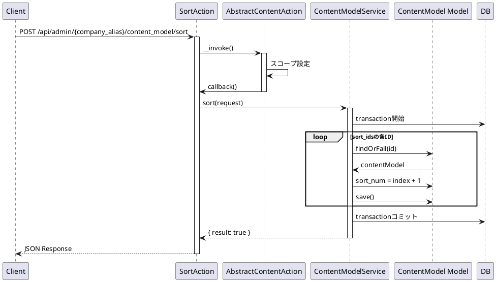
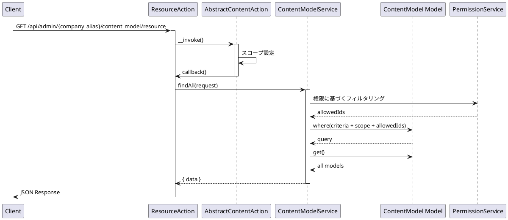
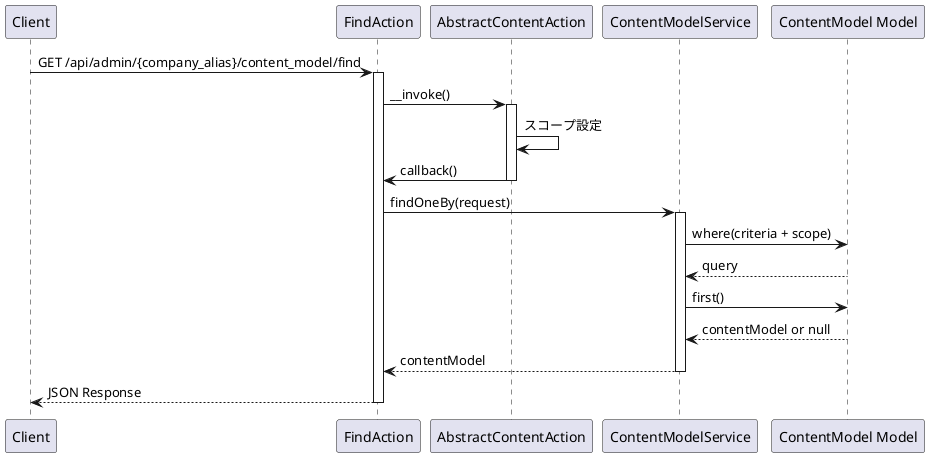

# ContentModel API 仕様書

## 概要

コンテンツモデル管理に関する API エンドポイントです。コンテンツモデルの CRUD 操作、マークアップ管理などの機能を提供します。

---

## コンテンツモデル API

### 1. コンテンツモデル一覧取得

#### エンドポイント

```
GET /api/admin/{company_alias}/content_model
```

#### HTTP メソッド

`GET`

#### 認証

必須（auth:sanctum, ActionLogMiddleware）

#### リクエストパラメータ

##### Path Parameters

| パラメータ名  | 型     | 必須 | 説明           |
| ------------- | ------ | ---- | -------------- |
| company_alias | string | 必須 | 企業エイリアス |

##### Query Parameters

| パラメータ名 | 型      | 必須 | 説明                                          |
| ------------ | ------- | ---- | --------------------------------------------- |
| current      | integer | 任意 | 現在のページ番号（デフォルト: 1）             |
| limit        | integer | 任意 | 1 ページあたりの件数（デフォルト: config 値） |
| criteria     | array   | 任意 | 検索条件                                      |

#### レスポンス構造

##### 成功時 (200)

```json
{
    "success": true,
    "timestamp": 1234567890,
    "payload": {
        "total": 20,
        "current": 1,
        "pages": 2,
        "limit": 10,
        "data": [
            {
                "id": 1,
                "title": "コンテンツモデル名",
                "alias": "model-alias",
                "description": "説明文",
                "company_id": 1,
                "webhook_url": "https://example.com/webhook",
                "created_at": "2024-01-01 00:00:00",
                "updated_at": "2024-01-01 00:00:00"
            }
        ]
    }
}
```

#### 使用しているモデル・サービス

-   **モデル**: `App\Mod\ContentModel\Domain\Models\ContentModel`
-   **サービス**: `App\Mod\ContentModel\Domain\ContentModelService`
-   **Action**: `App\Mod\ContentModel\Actions\Admin\ListAction`

#### 処理の流れ



#### 想定されるエラーケース

-   **401 Unauthorized**: 認証されていない
-   **404 Not Found**: 企業が見つからない

---

### 2. コンテンツモデル作成

#### エンドポイント

```
POST /api/admin/{company_alias}/content_model/store
```

#### HTTP メソッド

`POST`

#### 認証

必須（auth:sanctum, ActionLogMiddleware）

#### リクエストパラメータ

##### Path Parameters

| パラメータ名  | 型     | 必須 | 説明           |
| ------------- | ------ | ---- | -------------- |
| company_alias | string | 必須 | 企業エイリアス |

##### Body Parameters

| パラメータ名 | 型      | 必須 | 説明                           |
| ------------ | ------- | ---- | ------------------------------ |
| title        | string  | 必須 | コンテンツモデル名             |
| alias        | string  | 必須 | エイリアス（企業内でユニーク） |
| description  | string  | 任意 | 説明                           |
| webhook_url  | string  | 任意 | Webhook URL（URL 形式）        |
| company_id   | integer | 必須 | 企業 ID                        |

#### バリデーション

-   `title`: required
-   `alias`: required, unique:content_model,alias,{company_id}
-   `webhook_url`: nullable, url

#### レスポンス構造

##### 成功時 (200)

```json
{
    "success": true,
    "timestamp": 1234567890,
    "payload": {
        "data": {
            "id": 1,
            "title": "新規コンテンツモデル名",
            "alias": "new-model-alias",
            "description": "説明文",
            "company_id": 1,
            "webhook_url": "https://example.com/webhook",
            "created_at": "2024-01-01 00:00:00",
            "updated_at": "2024-01-01 00:00:00"
        }
    }
}
```

#### 使用しているモデル・サービス

-   **モデル**: `App\Mod\ContentModel\Domain\Models\ContentModel`
-   **サービス**: `App\Mod\ContentModel\Domain\ContentModelService`
-   **Action**: `App\Mod\ContentModel\Actions\Admin\StoreAction`

#### 処理の流れ



#### 想定されるエラーケース

-   **400 Bad Request**: バリデーションエラー
    -   タイトルが未入力
    -   エイリアスが未入力または既に使用されている
    -   Webhook URL が不正な形式
-   **401 Unauthorized**: 認証されていない
-   **404 Not Found**: 企業が見つからない
-   **500 Internal Server Error**: その他のエラー

---

### 3. コンテンツモデル詳細取得

#### エンドポイント

```
GET /api/admin/{company_alias}/content_model/{id}
```

#### HTTP メソッド

`GET`

#### 認証

必須（auth:sanctum, ActionLogMiddleware）

#### リクエストパラメータ

##### Path Parameters

| パラメータ名  | 型      | 必須 | 説明                |
| ------------- | ------- | ---- | ------------------- |
| company_alias | string  | 必須 | 企業エイリアス      |
| id            | integer | 必須 | コンテンツモデル ID |

#### レスポンス構造

##### 成功時 (200)

```json
{
    "success": true,
    "timestamp": 1234567890,
    "payload": {
        "data": {
            "id": 1,
            "title": "コンテンツモデル名",
            "alias": "model-alias",
            "description": "説明文",
            "company_id": 1,
            "webhook_url": "https://example.com/webhook",
            "created_at": "2024-01-01 00:00:00",
            "updated_at": "2024-01-01 00:00:00"
        }
    }
}
```

#### 使用しているモデル・サービス

-   **モデル**: `App\Mod\ContentModel\Domain\Models\ContentModel`
-   **サービス**: `App\Mod\ContentModel\Domain\ContentModelService`
-   **Action**: `App\Mod\ContentModel\Actions\Admin\DetailAction`

#### 処理の流れ



#### 想定されるエラーケース

-   **401 Unauthorized**: 認証されていない
-   **404 Not Found**: コンテンツモデルが見つからない

---

### 4. コンテンツモデル更新

#### エンドポイント

```
PUT /api/admin/{company_alias}/content_model/{id}
```

#### HTTP メソッド

`PUT`

#### 認証

必須（auth:sanctum, ActionLogMiddleware）

#### リクエストパラメータ

##### Path Parameters

| パラメータ名  | 型      | 必須 | 説明                |
| ------------- | ------- | ---- | ------------------- |
| company_alias | string  | 必須 | 企業エイリアス      |
| id            | integer | 必須 | コンテンツモデル ID |

##### Body Parameters

| パラメータ名 | 型      | 必須 | 説明                           |
| ------------ | ------- | ---- | ------------------------------ |
| title        | string  | 必須 | コンテンツモデル名             |
| alias        | string  | 必須 | エイリアス（企業内でユニーク） |
| webhook_url  | string  | 任意 | Webhook URL（URL 形式）        |
| company_id   | integer | 必須 | 企業 ID                        |

#### バリデーション

-   `title`: required
-   `alias`: required, unique:content_model,alias,{company_id},{id}
-   `webhook_url`: nullable, url

#### レスポンス構造

##### 成功時 (200)

```json
{
    "success": true,
    "timestamp": 1234567890,
    "payload": {
        "data": {
            "id": 1,
            "title": "更新されたコンテンツモデル名",
            "alias": "updated-alias",
            ...
        }
    }
}
```

#### 使用しているモデル・サービス

-   **モデル**: `App\Mod\ContentModel\Domain\Models\ContentModel`
-   **サービス**: `App\Mod\ContentModel\Domain\ContentModelService`
-   **Action**: `App\Mod\ContentModel\Actions\Admin\UpdateAction`

#### 処理の流れ



#### 想定されるエラーケース

-   **400 Bad Request**: バリデーションエラー
    -   タイトルが未入力
    -   エイリアスが未入力または既に使用されている
    -   Webhook URL が不正な形式
-   **401 Unauthorized**: 認証されていない
-   **404 Not Found**: コンテンツモデルが見つからない
-   **500 Internal Server Error**: その他のエラー

---

### 5. コンテンツモデル削除

#### エンドポイント

```
DELETE /api/admin/{company_alias}/content_model/{id}
```

#### HTTP メソッド

`DELETE`

#### 認証

必須（auth:sanctum, ActionLogMiddleware）

#### リクエストパラメータ

##### Path Parameters

| パラメータ名  | 型      | 必須 | 説明                |
| ------------- | ------- | ---- | ------------------- |
| company_alias | string  | 必須 | 企業エイリアス      |
| id            | integer | 必須 | コンテンツモデル ID |

#### レスポンス構造

##### 成功時 (200)

```json
{
    "success": true,
    "timestamp": 1234567890,
    "payload": {
        "data": {
            "result": true
        }
    }
}
```

#### 使用しているモデル・サービス

-   **モデル**: `App\Mod\ContentModel\Domain\Models\ContentModel`
-   **サービス**: `App\Mod\ContentModel\Domain\ContentModelService`
-   **Action**: `App\Mod\ContentModel\Actions\Admin\DeleteAction`

#### 処理の流れ



#### 想定されるエラーケース

-   **401 Unauthorized**: 認証されていない
-   **404 Not Found**: コンテンツモデルが見つからない
-   **500 Internal Server Error**: その他のエラー
    -   外部キー制約エラー

---

### 6. コンテンツモデル並び替え

#### エンドポイント

```
POST /api/admin/{company_alias}/content_model/sort
```

#### HTTP メソッド

`POST`

#### 認証

必須（auth:sanctum, ActionLogMiddleware）

#### リクエストパラメータ

##### Path Parameters

| パラメータ名  | 型     | 必須 | 説明           |
| ------------- | ------ | ---- | -------------- |
| company_alias | string | 必須 | 企業エイリアス |

##### Body Parameters

| パラメータ名 | 型    | 必須 | 説明                 |
| ------------ | ----- | ---- | -------------------- |
| sort_ids     | array | 必須 | 並び替え後の ID 配列 |

#### レスポンス構造

##### 成功時 (200)

```json
{
    "success": true,
    "timestamp": 1234567890,
    "payload": {
        "data": {
            "result": true
        }
    }
}
```

#### 使用しているモデル・サービス

-   **モデル**: `App\Mod\ContentModel\Domain\Models\ContentModel`
-   **サービス**: `App\Mod\ContentModel\Domain\ContentModelService`
-   **Action**: `App\Mod\ContentModel\Actions\Admin\SortAction`

#### 処理の流れ



#### 想定されるエラーケース

-   **400 Bad Request**: バリデーションエラー
    -   sort_ids が未指定
-   **401 Unauthorized**: 認証されていない
-   **404 Not Found**: 指定された ID のコンテンツモデルが見つからない
-   **500 Internal Server Error**: その他のエラー

---

### 7. コンテンツモデルリソース取得（全件）

#### エンドポイント

```
GET /api/admin/{company_alias}/content_model/resource
```

#### HTTP メソッド

`GET`

#### 認証

必須（auth:sanctum）

#### リクエストパラメータ

##### Path Parameters

| パラメータ名  | 型     | 必須 | 説明           |
| ------------- | ------ | ---- | -------------- |
| company_alias | string | 必須 | 企業エイリアス |

##### Query Parameters

| パラメータ名 | 型    | 必須 | 説明     |
| ------------ | ----- | ---- | -------- |
| criteria     | array | 任意 | 検索条件 |

#### レスポンス構造

##### 成功時 (200)

```json
{
    "success": true,
    "timestamp": 1234567890,
    "payload": {
        "data": [
            {
                "id": 1,
                "title": "コンテンツモデル名",
                "alias": "model-alias",
                ...
            }
        ]
    }
}
```

#### 使用しているモデル・サービス

-   **モデル**: `App\Mod\ContentModel\Domain\Models\ContentModel`
-   **サービス**: `App\Mod\ContentModel\Domain\ContentModelService`
-   **Action**: `App\Mod\ContentModel\Actions\Admin\ResourceAction`

#### 処理の流れ



#### 想定されるエラーケース

-   **401 Unauthorized**: 認証されていない

---

### 8. コンテンツモデル検索

#### エンドポイント

```
GET /api/admin/{company_alias}/content_model/find
```

#### HTTP メソッド

`GET`

#### 認証

必須（auth:sanctum）

#### リクエストパラメータ

##### Path Parameters

| パラメータ名  | 型     | 必須 | 説明           |
| ------------- | ------ | ---- | -------------- |
| company_alias | string | 必須 | 企業エイリアス |

##### Query Parameters

| パラメータ名 | 型    | 必須 | 説明     |
| ------------ | ----- | ---- | -------- |
| criteria     | array | 任意 | 検索条件 |

#### レスポンス構造

##### 成功時 (200)

```json
{
    "success": true,
    "timestamp": 1234567890,
    "payload": {
        "data": {
            "id": 1,
            "title": "コンテンツモデル名",
            "alias": "model-alias",
            ...
        }
    }
}
```

#### 使用しているモデル・サービス

-   **モデル**: `App\Mod\ContentModel\Domain\Models\ContentModel`
-   **サービス**: `App\Mod\ContentModel\Domain\ContentModelService`
-   **Action**: `App\Mod\ContentModel\Actions\Admin\FindAction`

#### 処理の流れ



#### 想定されるエラーケース

-   **401 Unauthorized**: 認証されていない

---

## マークアップ API

### 9. マークアップ一覧取得

#### エンドポイント

```
GET /api/admin/{company_alias}/content_model/markup
```

#### HTTP メソッド

`GET`

#### 認証

必須（auth:sanctum, ActionLogMiddleware）

#### リクエストパラメータ

##### Path Parameters

| パラメータ名  | 型     | 必須 | 説明           |
| ------------- | ------ | ---- | -------------- |
| company_alias | string | 必須 | 企業エイリアス |

##### Query Parameters

| パラメータ名 | 型      | 必須 | 説明                                          |
| ------------ | ------- | ---- | --------------------------------------------- |
| current      | integer | 任意 | 現在のページ番号（デフォルト: 1）             |
| limit        | integer | 任意 | 1 ページあたりの件数（デフォルト: config 値） |
| criteria     | array   | 任意 | 検索条件                                      |

#### レスポンス構造

##### 成功時 (200)

```json
{
    "success": true,
    "timestamp": 1234567890,
    "payload": {
        "total": 10,
        "current": 1,
        "pages": 1,
        "limit": 10,
        "data": [
            {
                "id": 1,
                "title": "マークアップ名",
                "content_model_id": 1,
                ...
            }
        ]
    }
}
```

#### 使用しているモデル・サービス

-   **モデル**: `App\Mod\ContentModel\Domain\Models\ContentModelMarkup`
-   **サービス**: `App\Mod\ContentModel\Domain\ContentModelMarkupService`
-   **Action**: `App\Mod\ContentModel\Actions\Admin\Markup\ListAction`

#### 処理の流れ

コンテンツモデル一覧取得と同じ

#### 想定されるエラーケース

-   **401 Unauthorized**: 認証されていない

---

### 10. マークアップ作成

#### エンドポイント

```
POST /api/admin/{company_alias}/content_model/markup/store
```

#### HTTP メソッド

`POST`

#### 認証

必須（auth:sanctum, ActionLogMiddleware）

#### リクエストパラメータ

##### Path Parameters

| パラメータ名  | 型     | 必須 | 説明           |
| ------------- | ------ | ---- | -------------- |
| company_alias | string | 必須 | 企業エイリアス |

##### Body Parameters

| パラメータ名     | 型      | 必須 | 説明                |
| ---------------- | ------- | ---- | ------------------- |
| title            | string  | 必須 | マークアップ名      |
| content_model_id | integer | 必須 | コンテンツモデル ID |
| markup           | string  | 任意 | マークアップ内容    |

#### バリデーション

-   `title`: required
-   `content_model_id`: required

#### レスポンス構造

##### 成功時 (200)

```json
{
    "success": true,
    "timestamp": 1234567890,
    "payload": {
        "data": {
            "id": 1,
            "title": "新規マークアップ名",
            "content_model_id": 1,
            "markup": "...",
            ...
        }
    }
}
```

#### 使用しているモデル・サービス

-   **モデル**: `App\Mod\ContentModel\Domain\Models\ContentModelMarkup`
-   **サービス**: `App\Mod\ContentModel\Domain\ContentModelMarkupService`
-   **Action**: `App\Mod\ContentModel\Actions\Admin\Markup\StoreAction`

#### 処理の流れ

コンテンツモデル作成と同じ

#### 想定されるエラーケース

-   **400 Bad Request**: バリデーションエラー
    -   タイトルが未入力
    -   コンテンツモデル ID が未指定
-   **401 Unauthorized**: 認証されていない
-   **500 Internal Server Error**: その他のエラー

---

### 11. マークアップ詳細取得

#### エンドポイント

```
GET /api/admin/{company_alias}/content_model/markup/{id}
```

#### HTTP メソッド

`GET`

#### 認証

必須（auth:sanctum, ActionLogMiddleware）

#### リクエストパラメータ

##### Path Parameters

| パラメータ名  | 型      | 必須 | 説明            |
| ------------- | ------- | ---- | --------------- |
| company_alias | string  | 必須 | 企業エイリアス  |
| id            | integer | 必須 | マークアップ ID |

#### レスポンス構造

##### 成功時 (200)

```json
{
    "success": true,
    "timestamp": 1234567890,
    "payload": {
        "data": {
            "id": 1,
            "title": "マークアップ名",
            "content_model_id": 1,
            "markup": "...",
            ...
        }
    }
}
```

#### 使用しているモデル・サービス

-   **モデル**: `App\Mod\ContentModel\Domain\Models\ContentModelMarkup`
-   **サービス**: `App\Mod\ContentModel\Domain\ContentModelMarkupService`
-   **Action**: `App\Mod\ContentModel\Actions\Admin\Markup\DetailAction`

#### 処理の流れ

コンテンツモデル詳細取得と同じ

#### 想定されるエラーケース

-   **401 Unauthorized**: 認証されていない
-   **404 Not Found**: マークアップが見つからない

---

### 12. マークアップ更新

#### エンドポイント

```
PUT /api/admin/{company_alias}/content_model/markup/{id}
```

#### HTTP メソッド

`PUT`

#### 認証

必須（auth:sanctum, ActionLogMiddleware）

#### リクエストパラメータ

##### Path Parameters

| パラメータ名  | 型      | 必須 | 説明            |
| ------------- | ------- | ---- | --------------- |
| company_alias | string  | 必須 | 企業エイリアス  |
| id            | integer | 必須 | マークアップ ID |

##### Body Parameters

| パラメータ名     | 型      | 必須 | 説明                |
| ---------------- | ------- | ---- | ------------------- |
| title            | string  | 必須 | マークアップ名      |
| content_model_id | integer | 必須 | コンテンツモデル ID |
| markup           | string  | 任意 | マークアップ内容    |

#### バリデーション

-   `title`: required
-   `content_model_id`: required

#### レスポンス構造

##### 成功時 (200)

```json
{
    "success": true,
    "timestamp": 1234567890,
    "payload": {
        "data": {
            "id": 1,
            "title": "更新されたマークアップ名",
            ...
        }
    }
}
```

#### 使用しているモデル・サービス

-   **モデル**: `App\Mod\ContentModel\Domain\Models\ContentModelMarkup`
-   **サービス**: `App\Mod\ContentModel\Domain\ContentModelMarkupService`
-   **Action**: `App\Mod\ContentModel\Actions\Admin\Markup\UpdateAction`

#### 処理の流れ

コンテンツモデル更新と同じ

#### 想定されるエラーケース

-   **400 Bad Request**: バリデーションエラー
-   **401 Unauthorized**: 認証されていない
-   **404 Not Found**: マークアップが見つからない
-   **500 Internal Server Error**: その他のエラー

---

### 13. マークアップ削除

#### エンドポイント

```
DELETE /api/admin/{company_alias}/content_model/markup/{id}
```

#### HTTP メソッド

`DELETE`

#### 認証

必須（auth:sanctum, ActionLogMiddleware）

#### リクエストパラメータ

##### Path Parameters

| パラメータ名  | 型      | 必須 | 説明            |
| ------------- | ------- | ---- | --------------- |
| company_alias | string  | 必須 | 企業エイリアス  |
| id            | integer | 必須 | マークアップ ID |

#### レスポンス構造

##### 成功時 (200)

```json
{
    "success": true,
    "timestamp": 1234567890,
    "payload": {
        "data": {
            "result": true
        }
    }
}
```

#### 使用しているモデル・サービス

-   **モデル**: `App\Mod\ContentModel\Domain\Models\ContentModelMarkup`
-   **サービス**: `App\Mod\ContentModel\Domain\ContentModelMarkupService`
-   **Action**: `App\Mod\ContentModel\Actions\Admin\Markup\DeleteAction`

#### 処理の流れ

コンテンツモデル削除と同じ

#### 想定されるエラーケース

-   **401 Unauthorized**: 認証されていない
-   **404 Not Found**: マークアップが見つからない
-   **500 Internal Server Error**: その他のエラー

---

### 14. マークアップ並び替え

#### エンドポイント

```
POST /api/admin/{company_alias}/content_model/markup/sort
```

#### HTTP メソッド

`POST`

#### 認証

必須（auth:sanctum, ActionLogMiddleware）

#### リクエストパラメータ

##### Path Parameters

| パラメータ名  | 型     | 必須 | 説明           |
| ------------- | ------ | ---- | -------------- |
| company_alias | string | 必須 | 企業エイリアス |

##### Body Parameters

| パラメータ名 | 型    | 必須 | 説明                 |
| ------------ | ----- | ---- | -------------------- |
| sort_ids     | array | 必須 | 並び替え後の ID 配列 |

#### レスポンス構造

##### 成功時 (200)

```json
{
    "success": true,
    "timestamp": 1234567890,
    "payload": {
        "data": {
            "result": true
        }
    }
}
```

#### 使用しているモデル・サービス

-   **モデル**: `App\Mod\ContentModel\Domain\Models\ContentModelMarkup`
-   **サービス**: `App\Mod\ContentModel\Domain\ContentModelMarkupService`
-   **Action**: `App\Mod\ContentModel\Actions\Admin\Markup\SortAction`

#### 処理の流れ

コンテンツモデル並び替えと同じ

#### 想定されるエラーケース

-   **400 Bad Request**: バリデーションエラー
    -   sort_ids が未指定
-   **401 Unauthorized**: 認証されていない
-   **404 Not Found**: 指定された ID のマークアップが見つからない
-   **500 Internal Server Error**: その他のエラー

---

### 15. マークアップリソース取得（全件）

#### エンドポイント

```
GET /api/admin/{company_alias}/content_model/markup/resource
```

#### HTTP メソッド

`GET`

#### 認証

必須（auth:sanctum）

#### リクエストパラメータ

##### Path Parameters

| パラメータ名  | 型     | 必須 | 説明           |
| ------------- | ------ | ---- | -------------- |
| company_alias | string | 必須 | 企業エイリアス |

##### Query Parameters

| パラメータ名 | 型    | 必須 | 説明     |
| ------------ | ----- | ---- | -------- |
| criteria     | array | 任意 | 検索条件 |

#### レスポンス構造

##### 成功時 (200)

```json
{
    "success": true,
    "timestamp": 1234567890,
    "payload": {
        "data": [...]
    }
}
```

#### 使用しているモデル・サービス

-   **モデル**: `App\Mod\ContentModel\Domain\Models\ContentModelMarkup`
-   **サービス**: `App\Mod\ContentModel\Domain\ContentModelMarkupService`
-   **Action**: `App\Mod\ContentModel\Actions\Admin\Markup\ResourceAction`

#### 処理の流れ

コンテンツモデルリソース取得と同じ

#### 想定されるエラーケース

-   **401 Unauthorized**: 認証されていない

---

### 16. マークアップ検索

#### エンドポイント

```
GET /api/admin/{company_alias}/content_model/markup/find
```

#### HTTP メソッド

`GET`

#### 認証

必須（auth:sanctum）

#### リクエストパラメータ

##### Path Parameters

| パラメータ名  | 型     | 必須 | 説明           |
| ------------- | ------ | ---- | -------------- |
| company_alias | string | 必須 | 企業エイリアス |

##### Query Parameters

| パラメータ名 | 型    | 必須 | 説明     |
| ------------ | ----- | ---- | -------- |
| criteria     | array | 任意 | 検索条件 |

#### レスポンス構造

##### 成功時 (200)

```json
{
    "success": true,
    "timestamp": 1234567890,
    "payload": {
        "data": {...}
    }
}
```

#### 使用しているモデル・サービス

-   **モデル**: `App\Mod\ContentModel\Domain\Models\ContentModelMarkup`
-   **サービス**: `App\Mod\ContentModel\Domain\ContentModelMarkupService`
-   **Action**: `App\Mod\ContentModel\Actions\Admin\Markup\FindAction`

#### 処理の流れ

コンテンツモデル検索と同じ

#### 想定されるエラーケース

-   **401 Unauthorized**: 認証されていない
