# Contract API 仕様書

## 概要

企業（Company）と施設（Facility）の管理に関する API エンドポイントです。企業と施設の CRUD 操作、並び替え、リソース取得などの機能を提供します。

---

## 企業（Company）API

### 1. 企業一覧取得

#### エンドポイント

```
GET /api/admin/contract/company
```

#### HTTP メソッド

`GET`

#### 認証

必須（auth:sanctum, ActionLogMiddleware）

#### リクエストパラメータ

##### Query Parameters

| パラメータ名 | 型      | 必須 | 説明                                          |
| ------------ | ------- | ---- | --------------------------------------------- |
| current      | integer | 任意 | 現在のページ番号（デフォルト: 1）             |
| limit        | integer | 任意 | 1 ページあたりの件数（デフォルト: config 値） |
| criteria     | array   | 任意 | 検索条件                                      |

#### レスポンス構造

##### 成功時 (200)

```json
{
  "success": true,
  "timestamp": 1234567890,
  "payload": {
    "total": 50,
    "current": 1,
    "pages": 5,
    "limit": 10,
    "data": [
      {
        "id": 1,
        "company_name": "企業名",
        "alias": "company-alias",
        "zip_code": "123-4567",
        "address": "東京都...",
        "phone": "03-1234-5678",
        "website": "https://example.com",
        "publish_at": "2024-01-01 00:00:00",
        "expires_at": null,
        "sort_num": 1,
        "status": "active",
        "created_by": 1,
        "updated_by": 1,
        "free_search": null,
        "created_at": "2024-01-01 00:00:00",
        "updated_at": "2024-01-01 00:00:00"
      }
    ]
  }
}
```

#### 使用しているモデル・サービス

-   **モデル**: `App\Core\Contract\Domain\Models\ContractCompany`
-   **サービス**: `App\Core\Contract\Domain\ContractCompanyService`
-   **Action**: `App\Core\Contract\Actions\Admin\Company\ListAction`

#### 処理の流れ

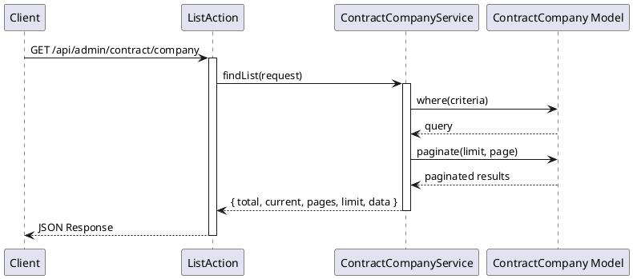

#### 想定されるエラーケース

-   **401 Unauthorized**: 認証されていない

---

### 2. 企業作成

#### エンドポイント

```
POST /api/admin/contract/company/store
```

#### HTTP メソッド

`POST`

#### 認証

必須（auth:sanctum, ActionLogMiddleware）

#### リクエストパラメータ

##### Body Parameters

| パラメータ名 | 型      | 必須 | 説明                           |
| ------------ | ------- | ---- | ------------------------------ |
| company_name | string  | 必須 | 企業名                         |
| alias        | string  | 必須 | エイリアス（ユニーク）         |
| zip_code     | string  | 任意 | 郵便番号                       |
| address      | string  | 任意 | 住所                           |
| phone        | string  | 任意 | 電話番号                       |
| website      | string  | 任意 | ウェブサイト                   |
| publish_at   | string  | 任意 | 公開開始日時（YYYY-MM-DD HH:mm:ss） |
| expires_at   | string  | 任意 | 公開終了日時（YYYY-MM-DD HH:mm:ss） |
| sort_num     | integer | 任意 | 並び順                         |
| status       | string  | 任意 | ステータス                     |

#### バリデーション

-   `company_name`: required
-   `alias`: required, unique:contract_company,alias

#### レスポンス構造

##### 成功時 (200)

```json
{
  "success": true,
  "timestamp": 1234567890,
  "payload": {
    "data": {
      "id": 1,
      "company_name": "新規企業名",
      "alias": "new-company-alias",
      "zip_code": "123-4567",
      "address": "東京都...",
      "phone": "03-1234-5678",
      "website": "https://example.com",
      "publish_at": "2024-01-01 00:00:00",
      "expires_at": null,
      "sort_num": 1,
      "status": "active",
      "created_by": 1,
      "updated_by": 1,
      "free_search": null,
      "created_at": "2024-01-01 00:00:00",
      "updated_at": "2024-01-01 00:00:00"
    }
  }
}
```

#### 使用しているモデル・サービス

-   **モデル**: `App\Core\Contract\Domain\Models\ContractCompany`
-   **サービス**: `App\Core\Contract\Domain\ContractCompanyService`
-   **Action**: `App\Core\Contract\Actions\Admin\Company\StoreAction`

#### 処理の流れ

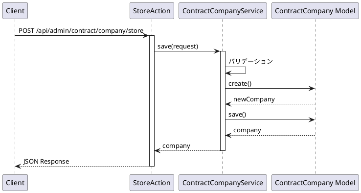

#### 想定されるエラーケース

-   **400 Bad Request**: バリデーションエラー
    -   企業名が未入力
    -   エイリアスが未入力または既に使用されている
-   **401 Unauthorized**: 認証されていない
-   **500 Internal Server Error**: その他のエラー

---

### 3. 企業詳細取得

#### エンドポイント

```
GET /api/admin/contract/company/{id}
```

#### HTTP メソッド

`GET`

#### 認証

必須（auth:sanctum, ActionLogMiddleware）

#### リクエストパラメータ

##### Path Parameters

| パラメータ名 | 型      | 必須 | 説明    |
| ------------ | ------- | ---- | ------- |
| id           | integer | 必須 | 企業 ID |

#### レスポンス構造

##### 成功時 (200)

```json
{
  "success": true,
  "timestamp": 1234567890,
  "payload": {
    "data": {
      "id": 1,
      "company_name": "企業名",
      "alias": "company-alias",
      "zip_code": "123-4567",
      "address": "東京都...",
      "phone": "03-1234-5678",
      "website": "https://example.com",
      "publish_at": "2024-01-01 00:00:00",
      "expires_at": null,
      "sort_num": 1,
      "status": "active",
      "created_by": 1,
      "updated_by": 1,
      "free_search": null,
      "created_at": "2024-01-01 00:00:00",
      "updated_at": "2024-01-01 00:00:00"
    }
  }
}
```

#### 使用しているモデル・サービス

-   **モデル**: `App\Core\Contract\Domain\Models\ContractCompany`
-   **サービス**: `App\Core\Contract\Domain\ContractCompanyService`
-   **Action**: `App\Core\Contract\Actions\Admin\Company\DetailAction`

#### 処理の流れ

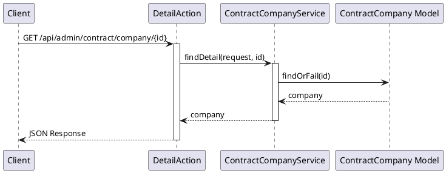

#### 想定されるエラーケース

-   **401 Unauthorized**: 認証されていない
-   **404 Not Found**: 企業が見つからない

---

### 4. 企業更新

#### エンドポイント

```
PUT /api/admin/contract/company/{id}
```

#### HTTP メソッド

`PUT`

#### 認証

必須（auth:sanctum, ActionLogMiddleware）

#### リクエストパラメータ

##### Path Parameters

| パラメータ名 | 型      | 必須 | 説明    |
| ------------ | ------- | ---- | ------- |
| id           | integer | 必須 | 企業 ID |

##### Body Parameters

| パラメータ名 | 型      | 必須 | 説明                             |
| ------------ | ------- | ---- | -------------------------------- |
| company_name | string  | 必須 | 企業名                           |
| alias        | string  | 必須 | エイリアス（ユニーク、自分以外） |
| zip_code     | string  | 任意 | 郵便番号                         |
| address      | string  | 任意 | 住所                             |
| phone        | string  | 任意 | 電話番号                         |
| website      | string  | 任意 | ウェブサイト                     |
| publish_at   | string  | 任意 | 公開開始日時（YYYY-MM-DD HH:mm:ss） |
| expires_at   | string  | 任意 | 公開終了日時（YYYY-MM-DD HH:mm:ss） |
| sort_num     | integer | 任意 | 並び順                           |
| status       | string  | 任意 | ステータス                       |

#### バリデーション

-   `company_name`: required
-   `alias`: required, unique:contract_company,alias,{id}

#### レスポンス構造

##### 成功時 (200)

```json
{
  "success": true,
  "timestamp": 1234567890,
  "payload": {
    "data": {
      "id": 1,
      "company_name": "更新された企業名",
      "alias": "updated-alias",
      "zip_code": "123-4567",
      "address": "東京都...",
      "phone": "03-1234-5678",
      "website": "https://example.com",
      "publish_at": "2024-01-01 00:00:00",
      "expires_at": null,
      "sort_num": 1,
      "status": "active",
      "created_by": 1,
      "updated_by": 1,
      "free_search": null,
      "created_at": "2024-01-01 00:00:00",
      "updated_at": "2024-01-01 00:00:00"
    }
  }
}
```

#### 使用しているモデル・サービス

-   **モデル**: `App\Core\Contract\Domain\Models\ContractCompany`
-   **サービス**: `App\Core\Contract\Domain\ContractCompanyService`
-   **Action**: `App\Core\Contract\Actions\Admin\Company\UpdateAction`

#### 処理の流れ

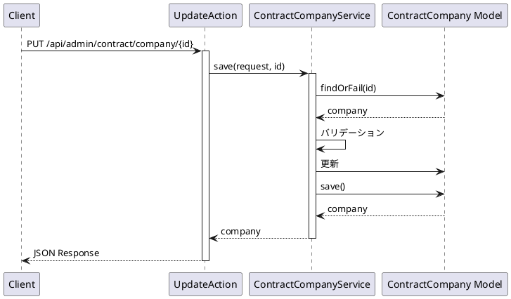

#### 想定されるエラーケース

-   **400 Bad Request**: バリデーションエラー
    -   企業名が未入力
    -   エイリアスが未入力または既に使用されている
-   **401 Unauthorized**: 認証されていない
-   **404 Not Found**: 企業が見つからない
-   **500 Internal Server Error**: その他のエラー

---

### 5. 企業削除

#### エンドポイント

```
DELETE /api/admin/contract/company/{id}
```

#### HTTP メソッド

`DELETE`

#### 認証

必須（auth:sanctum, ActionLogMiddleware）

#### リクエストパラメータ

##### Path Parameters

| パラメータ名 | 型      | 必須 | 説明    |
| ------------ | ------- | ---- | ------- |
| id           | integer | 必須 | 企業 ID |

#### レスポンス構造

##### 成功時 (200)

```json
{
    "success": true,
    "timestamp": 1234567890,
    "payload": {
        "data": {
            "result": true
        }
    }
}
```

#### 使用しているモデル・サービス

-   **モデル**: `App\Core\Contract\Domain\Models\ContractCompany`
-   **サービス**: `App\Core\Contract\Domain\ContractCompanyService`
-   **Action**: `App\Core\Contract\Actions\Admin\Company\DeleteAction`

#### 処理の流れ

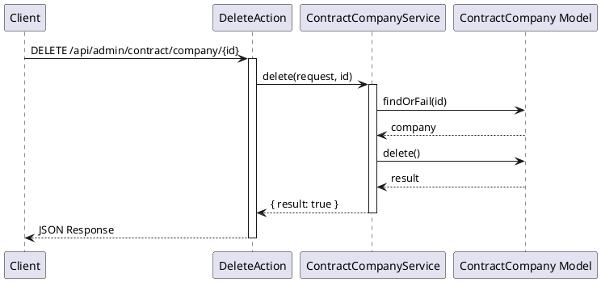

#### 想定されるエラーケース

-   **401 Unauthorized**: 認証されていない
-   **404 Not Found**: 企業が見つからない
-   **500 Internal Server Error**: その他のエラー
    -   外部キー制約エラー

---

### 6. 企業並び替え

#### エンドポイント

```
POST /api/admin/contract/company/sort
```

#### HTTP メソッド

`POST`

#### 認証

必須（auth:sanctum, ActionLogMiddleware）

#### リクエストパラメータ

##### Body Parameters

| パラメータ名 | 型    | 必須 | 説明                 |
| ------------ | ----- | ---- | -------------------- |
| sort_ids     | array | 必須 | 並び替え後の ID 配列 |

#### レスポンス構造

##### 成功時 (200)

```json
{
    "success": true,
    "timestamp": 1234567890,
    "payload": {
        "data": {
            "result": true
        }
    }
}
```

#### 使用しているモデル・サービス

-   **モデル**: `App\Core\Contract\Domain\Models\ContractCompany`
-   **サービス**: `App\Core\Contract\Domain\ContractCompanyService`
-   **Action**: `App\Core\Contract\Actions\Admin\Company\SortAction`

#### 処理の流れ

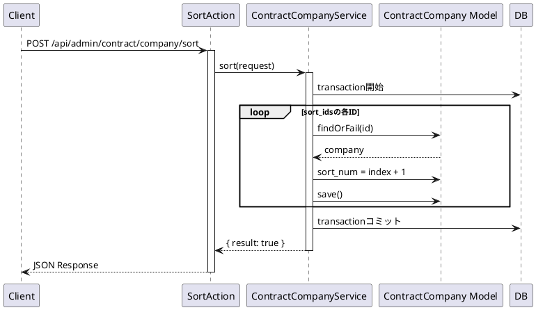

#### 想定されるエラーケース

-   **400 Bad Request**: バリデーションエラー
    -   sort_ids が未指定
-   **401 Unauthorized**: 認証されていない
-   **404 Not Found**: 指定された ID の企業が見つからない
-   **500 Internal Server Error**: その他のエラー

---

### 7. 企業リソース取得（全件）

#### エンドポイント

```
GET /api/admin/contract/company/resource
```

#### HTTP メソッド

`GET`

#### 認証

必須（auth:sanctum）

#### リクエストパラメータ

##### Query Parameters

| パラメータ名 | 型    | 必須 | 説明     |
| ------------ | ----- | ---- | -------- |
| criteria     | array | 任意 | 検索条件 |

#### レスポンス構造

##### 成功時 (200)

```json
{
  "success": true,
  "timestamp": 1234567890,
  "payload": {
    "data": [
      {
        "id": 1,
        "company_name": "企業名",
        "alias": "company-alias",
        ...
      }
    ]
  }
}
```

#### 使用しているモデル・サービス

-   **モデル**: `App\Core\Contract\Domain\Models\ContractCompany`
-   **サービス**: `App\Core\Contract\Domain\ContractCompanyService`
-   **Action**: `App\Core\Contract\Actions\Admin\Company\ResourceAction`

#### 処理の流れ

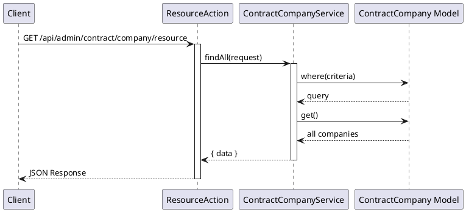

#### 想定されるエラーケース

-   **401 Unauthorized**: 認証されていない

---

### 8. 企業検索

#### エンドポイント

```
GET /api/admin/contract/company/find
```

#### HTTP メソッド

`GET`

#### 認証

必須（auth:sanctum）

#### リクエストパラメータ

##### Query Parameters

| パラメータ名 | 型    | 必須 | 説明     |
| ------------ | ----- | ---- | -------- |
| criteria     | array | 任意 | 検索条件 |

#### レスポンス構造

##### 成功時 (200)

```json
{
  "success": true,
  "timestamp": 1234567890,
  "payload": {
    "data": {
      "id": 1,
      "company_name": "企業名",
      "alias": "company-alias",
      ...
    }
  }
}
```

#### 使用しているモデル・サービス

-   **モデル**: `App\Core\Contract\Domain\Models\ContractCompany`
-   **サービス**: `App\Core\Contract\Domain\ContractCompanyService`
-   **Action**: `App\Core\Contract\Actions\Admin\Company\FindAction`

#### 処理の流れ

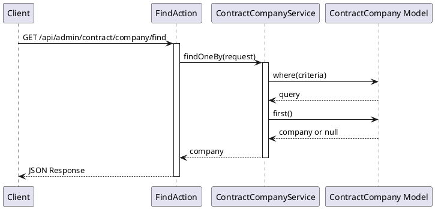

#### 想定されるエラーケース

-   **401 Unauthorized**: 認証されていない

---

## 施設（Facility）API

### 9. 施設一覧取得

#### エンドポイント

```
GET /api/admin/contract/facility
```

#### HTTP メソッド

`GET`

#### 認証

必須（auth:sanctum, ActionLogMiddleware）

#### リクエストパラメータ

##### Query Parameters

| パラメータ名 | 型      | 必須 | 説明                                           |
| ------------ | ------- | ---- | ---------------------------------------------- |
| current      | integer | 任意 | 現在のページ番号（デフォルト: 1）              |
| limit        | integer | 任意 | 1 ページあたりの件数（デフォルト: config 値）  |
| criteria     | array   | 任意 | 検索条件（company_ids: カンマ区切りの企業 ID） |

#### レスポンス構造

##### 成功時 (200)

```json
{
  "success": true,
  "timestamp": 1234567890,
  "payload": {
    "total": 100,
    "current": 1,
    "pages": 10,
    "limit": 10,
    "data": [
      {
        "id": 1,
        "facility_name": "施設名",
        "alias": "facility-alias",
        "company_id": 1,
        "company": {
          "id": 1,
          "company_name": "企業名",
          "alias": "company-alias"
        },
        "zip_code": "123-4567",
        "address": "東京都...",
        "phone": "03-1234-5678",
        "website": "https://example.com",
        "publish_at": "2024-01-01 00:00:00",
        "expires_at": null,
        "sort_num": 1,
        "status": "active",
        "created_by": 1,
        "updated_by": 1,
        "free_search": null,
        "created_at": "2024-01-01 00:00:00",
        "updated_at": "2024-01-01 00:00:00"
      }
    ]
  }
}
```

#### 使用しているモデル・サービス

-   **モデル**: `App\Core\Contract\Domain\Models\ContractFacility`
-   **サービス**: `App\Core\Contract\Domain\ContractFacilityService`
-   **Action**: `App\Core\Contract\Actions\Admin\Facility\ListAction`

#### 処理の流れ

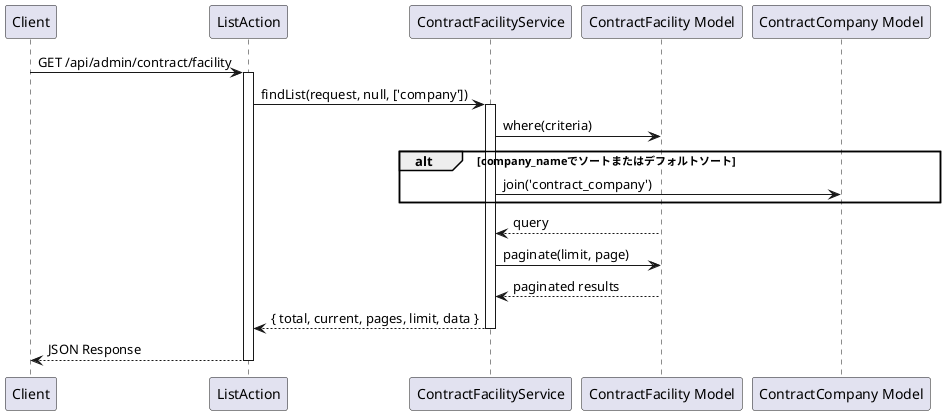

#### 想定されるエラーケース

-   **401 Unauthorized**: 認証されていない

---

### 10. 施設作成

#### エンドポイント

```
POST /api/admin/contract/facility/store
```

#### HTTP メソッド

`POST`

#### 認証

必須（auth:sanctum, ActionLogMiddleware）

#### リクエストパラメータ

##### Body Parameters

| パラメータ名  | 型      | 必須 | 説明                                           |
| ------------- | ------- | ---- | ---------------------------------------------- |
| facility_name | string  | 必須 | 施設名                                         |
| alias         | string  | 必須 | エイリアス（企業内でユニーク、"master"は不可） |
| company_id    | object  | 必須 | 企業 ID（{value: 1}形式）                      |
| zip_code      | string  | 任意 | 郵便番号                                       |
| address       | string  | 任意 | 住所                                           |
| phone         | string  | 任意 | 電話番号                                       |
| website       | string  | 任意 | ウェブサイト                                   |
| publish_at    | string  | 任意 | 公開開始日時（YYYY-MM-DD HH:mm:ss）            |
| expires_at    | string  | 任意 | 公開終了日時（YYYY-MM-DD HH:mm:ss）            |
| sort_num      | integer | 任意 | 並び順                                         |
| status        | string  | 任意 | ステータス                                     |

#### バリデーション

-   `facility_name`: required
-   `alias`: required, 企業内でユニーク, "master"は使用不可

#### レスポンス構造

##### 成功時 (200)

```json
{
  "success": true,
  "timestamp": 1234567890,
  "payload": {
    "data": {
      "id": 1,
      "facility_name": "新規施設名",
      "alias": "new-facility-alias",
      "company_id": 1,
      "zip_code": "123-4567",
      "address": "東京都...",
      "phone": "03-1234-5678",
      "website": "https://example.com",
      "publish_at": "2024-01-01 00:00:00",
      "expires_at": null,
      "sort_num": 1,
      "status": "active",
      "created_by": 1,
      "updated_by": 1,
      "free_search": null,
      "created_at": "2024-01-01 00:00:00",
      "updated_at": "2024-01-01 00:00:00"
    }
  }
}
```

#### 使用しているモデル・サービス

-   **モデル**: `App\Core\Contract\Domain\Models\ContractFacility`
-   **サービス**: `App\Core\Contract\Domain\ContractFacilityService`
-   **Action**: `App\Core\Contract\Actions\Admin\Facility\StoreAction`

#### 処理の流れ

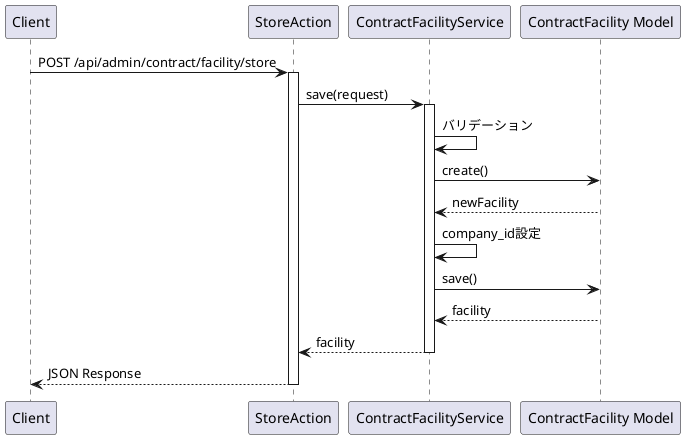

#### 想定されるエラーケース

-   **400 Bad Request**: バリデーションエラー
    -   施設名が未入力
    -   エイリアスが未入力または既に使用されている
    -   エイリアスが"master"
-   **401 Unauthorized**: 認証されていない
-   **500 Internal Server Error**: その他のエラー

---

### 11. 施設詳細取得

#### エンドポイント

```
GET /api/admin/contract/facility/{id}
```

#### HTTP メソッド

`GET`

#### 認証

必須（auth:sanctum, ActionLogMiddleware）

#### リクエストパラメータ

##### Path Parameters

| パラメータ名 | 型      | 必須 | 説明    |
| ------------ | ------- | ---- | ------- |
| id           | integer | 必須 | 施設 ID |

#### レスポンス構造

##### 成功時 (200)

```json
{
  "success": true,
  "timestamp": 1234567890,
  "payload": {
    "data": {
      "id": 1,
      "facility_name": "施設名",
      "alias": "facility-alias",
      "company_id": 1,
      "status": true,
      "sort_num": 1,
      ...
    }
  }
}
```

#### 使用しているモデル・サービス

-   **モデル**: `App\Core\Contract\Domain\Models\ContractFacility`
-   **サービス**: `App\Core\Contract\Domain\ContractFacilityService`
-   **Action**: `App\Core\Contract\Actions\Admin\Facility\DetailAction`

#### 処理の流れ

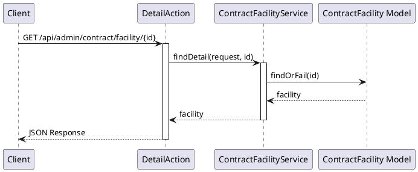

#### 想定されるエラーケース

-   **401 Unauthorized**: 認証されていない
-   **404 Not Found**: 施設が見つからない

---

### 12. 施設更新

#### エンドポイント

```
PUT /api/admin/contract/facility/{id}
```

#### HTTP メソッド

`PUT`

#### 認証

必須（auth:sanctum, ActionLogMiddleware）

#### リクエストパラメータ

##### Path Parameters

| パラメータ名 | 型      | 必須 | 説明    |
| ------------ | ------- | ---- | ------- |
| id           | integer | 必須 | 施設 ID |

##### Body Parameters

| パラメータ名  | 型      | 必須 | 説明                                                     |
| ------------- | ------- | ---- | -------------------------------------------------------- |
| facility_name | string  | 必須 | 施設名                                                   |
| alias         | string  | 必須 | エイリアス（企業内でユニーク、"master"は不可、自分以外） |
| company_id    | object  | 必須 | 企業 ID                                                  |
| status        | boolean | 任意 | ステータス                                               |
| sort_num      | integer | 任意 | 並び順                                                   |

#### バリデーション

-   `facility_name`: required
-   `alias`: required, 企業内でユニーク（自分以外）, "master"は使用不可

#### レスポンス構造

##### 成功時 (200)

```json
{
  "success": true,
  "timestamp": 1234567890,
  "payload": {
    "data": {
      "id": 1,
      "facility_name": "更新された施設名",
      "alias": "updated-alias",
      ...
    }
  }
}
```

#### 使用しているモデル・サービス

-   **モデル**: `App\Core\Contract\Domain\Models\ContractFacility`
-   **サービス**: `App\Core\Contract\Domain\ContractFacilityService`
-   **Action**: `App\Core\Contract\Actions\Admin\Facility\UpdateAction`

#### 処理の流れ

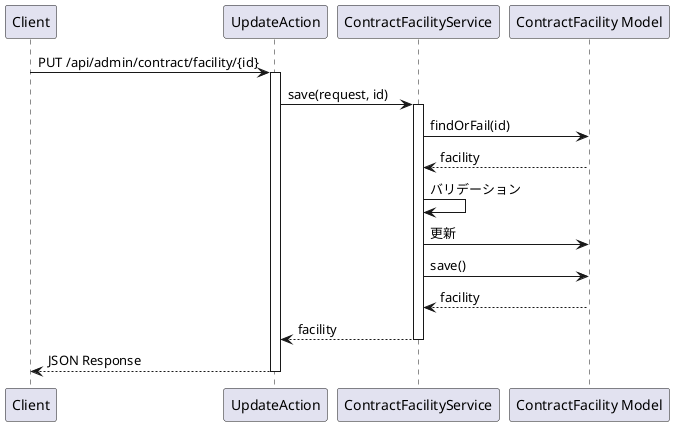

#### 想定されるエラーケース

-   **400 Bad Request**: バリデーションエラー
    -   施設名が未入力
    -   エイリアスが未入力または既に使用されている
    -   エイリアスが"master"
-   **401 Unauthorized**: 認証されていない
-   **404 Not Found**: 施設が見つからない
-   **500 Internal Server Error**: その他のエラー

---

### 13. 施設削除

#### エンドポイント

```
DELETE /api/admin/contract/facility/{id}
```

#### HTTP メソッド

`DELETE`

#### 認証

必須（auth:sanctum, ActionLogMiddleware）

#### リクエストパラメータ

##### Path Parameters

| パラメータ名 | 型      | 必須 | 説明    |
| ------------ | ------- | ---- | ------- |
| id           | integer | 必須 | 施設 ID |

#### レスポンス構造

##### 成功時 (200)

```json
{
    "success": true,
    "timestamp": 1234567890,
    "payload": {
        "data": {
            "result": true
        }
    }
}
```

#### 使用しているモデル・サービス

-   **モデル**: `App\Core\Contract\Domain\Models\ContractFacility`
-   **サービス**: `App\Core\Contract\Domain\ContractFacilityService`
-   **Action**: `App\Core\Contract\Actions\Admin\Facility\DeleteAction`

#### 処理の流れ

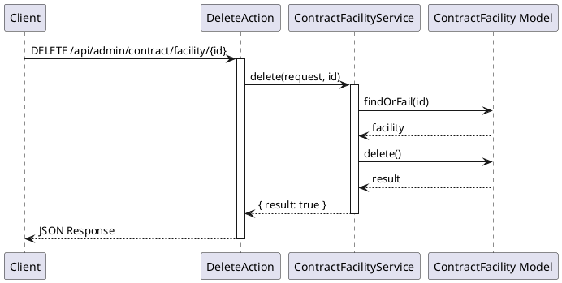

#### 想定されるエラーケース

-   **401 Unauthorized**: 認証されていない
-   **404 Not Found**: 施設が見つからない
-   **500 Internal Server Error**: その他のエラー
    -   外部キー制約エラー

---

### 14. 施設並び替え

#### エンドポイント

```
POST /api/admin/contract/facility/sort
```

#### HTTP メソッド

`POST`

#### 認証

必須（auth:sanctum, ActionLogMiddleware）

#### リクエストパラメータ

##### Body Parameters

| パラメータ名 | 型    | 必須 | 説明                 |
| ------------ | ----- | ---- | -------------------- |
| sort_ids     | array | 必須 | 並び替え後の ID 配列 |

#### レスポンス構造

##### 成功時 (200)

```json
{
    "success": true,
    "timestamp": 1234567890,
    "payload": {
        "data": {
            "result": true
        }
    }
}
```

#### 使用しているモデル・サービス

-   **モデル**: `App\Core\Contract\Domain\Models\ContractFacility`
-   **サービス**: `App\Core\Contract\Domain\ContractFacilityService`
-   **Action**: `App\Core\Contract\Actions\Admin\Facility\SortAction`

#### 処理の流れ

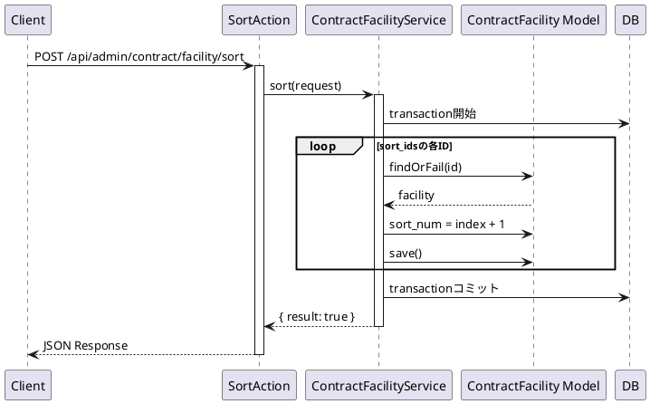

#### 想定されるエラーケース

-   **400 Bad Request**: バリデーションエラー
    -   sort_ids が未指定
-   **401 Unauthorized**: 認証されていない
-   **404 Not Found**: 指定された ID の施設が見つからない
-   **500 Internal Server Error**: その他のエラー

---

### 15. 施設リソース取得（全件）

#### エンドポイント

```
GET /api/admin/contract/facility/resource
```

#### HTTP メソッド

`GET`

#### 認証

必須（auth:sanctum）

#### リクエストパラメータ

##### Query Parameters

| パラメータ名 | 型    | 必須 | 説明                                           |
| ------------ | ----- | ---- | ---------------------------------------------- |
| criteria     | array | 任意 | 検索条件（company_ids: カンマ区切りの企業 ID） |

#### レスポンス構造

##### 成功時 (200)

```json
{
  "success": true,
  "timestamp": 1234567890,
  "payload": {
    "data": [
      {
        "id": 1,
        "facility_name": "施設名",
        "alias": "facility-alias",
        "company_id": 1,
        ...
      }
    ]
  }
}
```

#### 使用しているモデル・サービス

-   **モデル**: `App\Core\Contract\Domain\Models\ContractFacility`
-   **サービス**: `App\Core\Contract\Domain\ContractFacilityService`
-   **Action**: `App\Core\Contract\Actions\Admin\Facility\ResourceAction`

#### 処理の流れ

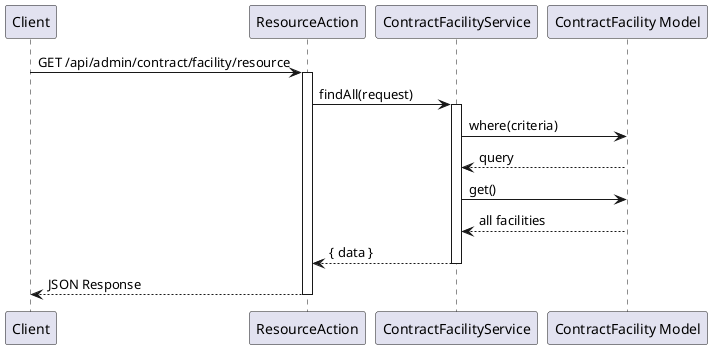

#### 想定されるエラーケース

-   **401 Unauthorized**: 認証されていない

---

### 16. 施設検索

#### エンドポイント

```
GET /api/admin/contract/facility/find
```

#### HTTP メソッド

`GET`

#### 認証

必須（auth:sanctum）

#### リクエストパラメータ

##### Query Parameters

| パラメータ名 | 型    | 必須 | 説明     |
| ------------ | ----- | ---- | -------- |
| criteria     | array | 任意 | 検索条件 |

#### レスポンス構造

##### 成功時 (200)

```json
{
  "success": true,
  "timestamp": 1234567890,
  "payload": {
    "data": {
      "id": 1,
      "facility_name": "施設名",
      "alias": "facility-alias",
      ...
    }
  }
}
```

#### 使用しているモデル・サービス

-   **モデル**: `App\Core\Contract\Domain\Models\ContractFacility`
-   **サービス**: `App\Core\Contract\Domain\ContractFacilityService`
-   **Action**: `App\Core\Contract\Actions\Admin\Facility\FindAction`

#### 処理の流れ

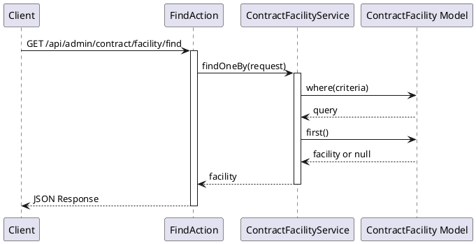

#### 想定されるエラーケース

-   **401 Unauthorized**: 認証されていない
