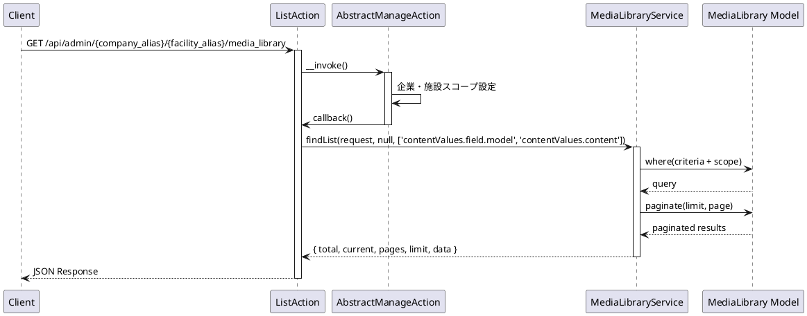
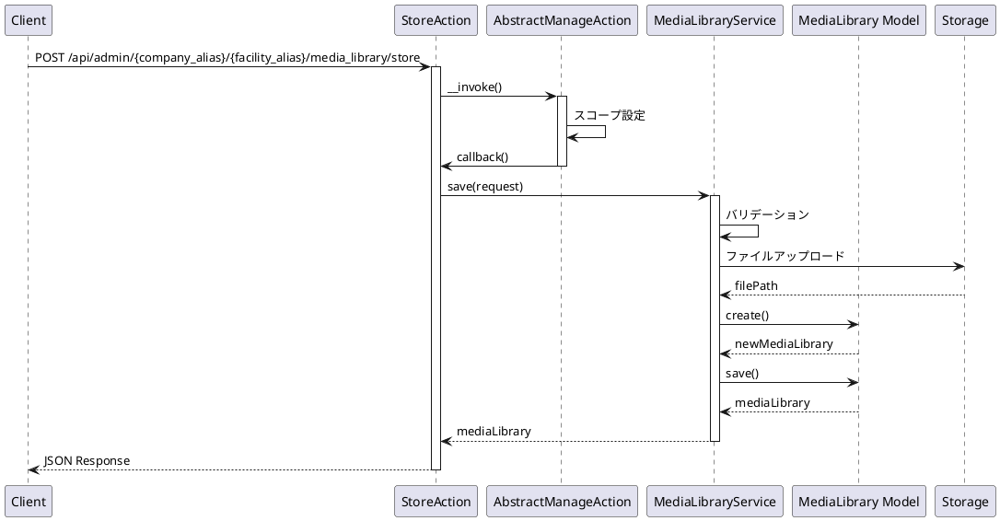
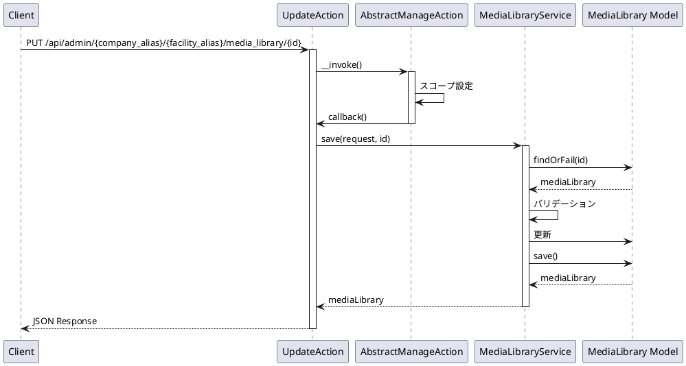
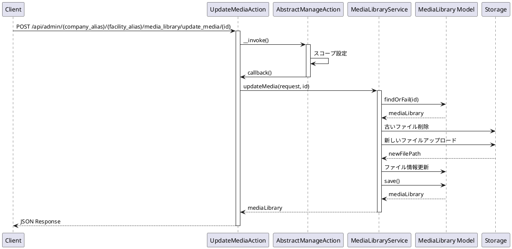
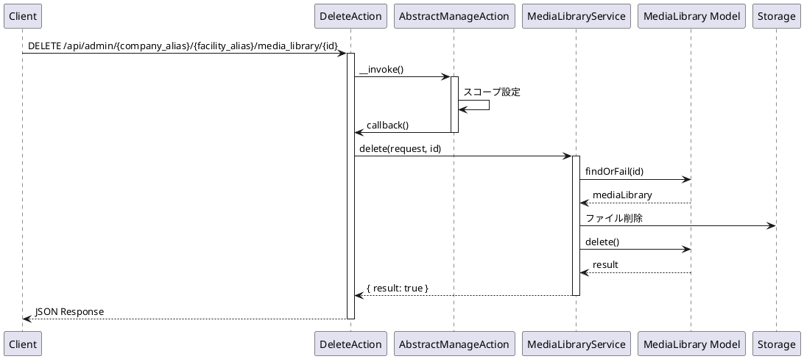

# MediaLibrary API 仕様書

## 概要

メディアライブラリ管理に関する API エンドポイントです。メディアファイルの CRUD 操作、並び替え、リソース取得などの機能を提供します。

---

## メディアライブラリ API

### 1. メディアライブラリ一覧取得

#### エンドポイント

```
GET /api/admin/{company_alias}/{facility_alias}/media_library
```

#### HTTP メソッド

`GET`

#### 認証

必須（auth:sanctum, ActionLogMiddleware）

#### リクエストパラメータ

##### Path Parameters

| パラメータ名   | 型     | 必須 | 説明           |
| -------------- | ------ | ---- | -------------- |
| company_alias  | string | 必須 | 企業エイリアス |
| facility_alias | string | 必須 | 施設エイリアス |

##### Query Parameters

| パラメータ名 | 型      | 必須 | 説明                                          |
| ------------ | ------- | ---- | --------------------------------------------- |
| current      | integer | 任意 | 現在のページ番号（デフォルト: 1）             |
| limit        | integer | 任意 | 1 ページあたりの件数（デフォルト: config 値） |
| criteria     | array   | 任意 | 検索条件                                      |

#### レスポンス構造

##### 成功時 (200)

```json
{
    "success": true,
    "timestamp": 1234567890,
    "payload": {
        "total": 100,
        "current": 1,
        "pages": 10,
        "limit": 10,
        "data": [
            {
                "id": "550e8400-e29b-41d4-a716-446655440000",
                "file_name": "example.jpg",
                "file_path": "/storage/media/example.jpg",
                "file_url": "https://example.com/storage/media/example.jpg",
                "mime_type": "image/jpeg",
                "file_size": 1024000,
                "image_size": "1920x1080",
                "alt_text": "代替テキスト",
                "publish_at": "2024-01-01 00:00:00",
                "expires_at": null,
                "sort_num": 1,
                "status": "active",
                "created_by": 1,
                "updated_by": 1,
                "free_search": null,
                "created_at": "2024-01-01 00:00:00",
                "updated_at": "2024-01-01 00:00:00"
            }
        ]
    }
}
```

#### 使用しているモデル・サービス

-   **モデル**: `App\Mod\MediaLibrary\Domain\Models\MediaLibrary`
-   **サービス**: `App\Mod\MediaLibrary\Domain\MediaLibraryService`
-   **Action**: `App\Mod\MediaLibrary\Actions\Admin\ListAction`

#### 処理の流れ



#### 想定されるエラーケース

-   **401 Unauthorized**: 認証されていない
-   **404 Not Found**: 企業または施設が見つからない

---

### 2. メディアライブラリ作成

#### エンドポイント

```
POST /api/admin/{company_alias}/{facility_alias}/media_library/store
```

#### HTTP メソッド

`POST`

#### 認証

必須（auth:sanctum, ActionLogMiddleware）

#### リクエストパラメータ

##### Path Parameters

| パラメータ名   | 型     | 必須 | 説明           |
| -------------- | ------ | ---- | -------------- |
| company_alias  | string | 必須 | 企業エイリアス |
| facility_alias | string | 必須 | 施設エイリアス |

##### Body Parameters

| パラメータ名 | 型     | 必須 | 説明           |
| ------------ | ------ | ---- | -------------- |
| file         | file   | 必須 | アップロードファイル |
| file_name    | string | 任意 | ファイル名     |
| alt_text     | string | 任意 | 代替テキスト   |

#### バリデーション

-   `file`: required, file

#### レスポンス構造

##### 成功時 (200)

```json
{
    "success": true,
    "timestamp": 1234567890,
    "payload": {
        "data": {
            "id": "550e8400-e29b-41d4-a716-446655440000",
            "file_name": "example.jpg",
            "file_path": "/storage/media/example.jpg",
            "file_url": "https://example.com/storage/media/example.jpg",
            "mime_type": "image/jpeg",
            "file_size": 1024000,
            "image_size": "1920x1080",
            "alt_text": "代替テキスト",
            "publish_at": "2024-01-01 00:00:00",
            "expires_at": null,
            "sort_num": 1,
            "status": "active",
            "created_by": 1,
            "updated_by": 1,
            "free_search": null,
            "created_at": "2024-01-01 00:00:00",
            "updated_at": "2024-01-01 00:00:00"
        }
    }
}
```

#### 使用しているモデル・サービス

-   **モデル**: `App\Mod\MediaLibrary\Domain\Models\MediaLibrary`
-   **サービス**: `App\Mod\MediaLibrary\Domain\MediaLibraryService`
-   **Action**: `App\Mod\MediaLibrary\Actions\Admin\StoreAction`

#### 処理の流れ



#### 想定されるエラーケース

-   **400 Bad Request**: バリデーションエラー
    -   ファイルが未指定
    -   ファイル形式が不正
-   **401 Unauthorized**: 認証されていない
-   **404 Not Found**: 企業または施設が見つからない
-   **500 Internal Server Error**: その他のエラー
    -   ファイルアップロード失敗

---

### 3. メディアライブラリ詳細取得

#### エンドポイント

```
GET /api/admin/{company_alias}/{facility_alias}/media_library/{id}
```

#### HTTP メソッド

`GET`

#### 認証

必須（auth:sanctum, ActionLogMiddleware）

#### リクエストパラメータ

##### Path Parameters

| パラメータ名   | 型      | 必須 | 説明              |
| -------------- | ------- | ---- | ----------------- |
| company_alias  | string  | 必須 | 企業エイリアス    |
| facility_alias | string  | 必須 | 施設エイリアス    |
| id             | integer | 必須 | メディアライブラリ ID |

#### レスポンス構造

##### 成功時 (200)

```json
{
    "success": true,
    "timestamp": 1234567890,
    "payload": {
        "data": {
            "id": 1,
            "file_name": "example.jpg",
            "file_path": "/storage/media/example.jpg",
            "file_size": 1024000,
            "mime_type": "image/jpeg",
            "contentValues": [...],
            ...
        }
    }
}
```

#### 使用しているモデル・サービス

-   **モデル**: `App\Mod\MediaLibrary\Domain\Models\MediaLibrary`
-   **サービス**: `App\Mod\MediaLibrary\Domain\MediaLibraryService`
-   **Action**: `App\Mod\MediaLibrary\Actions\Admin\DetailAction`

#### 処理の流れ

メディアライブラリ一覧取得と同じ（単一レコード）

#### 想定されるエラーケース

-   **401 Unauthorized**: 認証されていない
-   **404 Not Found**: メディアライブラリが見つからない

---

### 4. メディアライブラリ更新

#### エンドポイント

```
PUT /api/admin/{company_alias}/{facility_alias}/media_library/{id}
```

#### HTTP メソッド

`PUT`

#### 認証

必須（auth:sanctum, ActionLogMiddleware）

#### リクエストパラメータ

##### Path Parameters

| パラメータ名   | 型      | 必須 | 説明              |
| -------------- | ------- | ---- | ----------------- |
| company_alias  | string  | 必須 | 企業エイリアス    |
| facility_alias | string  | 必須 | 施設エイリアス    |
| id             | integer | 必須 | メディアライブラリ ID |

##### Body Parameters

| パラメータ名 | 型     | 必須 | 説明         |
| ------------ | ------ | ---- | ------------ |
| file_name    | string | 任意 | ファイル名   |
| alt_text     | string | 任意 | 代替テキスト |

#### レスポンス構造

##### 成功時 (200)

```json
{
    "success": true,
    "timestamp": 1234567890,
    "payload": {
        "data": {
            "id": 1,
            "file_name": "updated-example.jpg",
            ...
        }
    }
}
```

#### 使用しているモデル・サービス

-   **モデル**: `App\Mod\MediaLibrary\Domain\Models\MediaLibrary`
-   **サービス**: `App\Mod\MediaLibrary\Domain\MediaLibraryService`
-   **Action**: `App\Mod\MediaLibrary\Actions\Admin\UpdateAction`

#### 処理の流れ



#### 想定されるエラーケース

-   **400 Bad Request**: バリデーションエラー
-   **401 Unauthorized**: 認証されていない
-   **404 Not Found**: メディアライブラリが見つからない
-   **500 Internal Server Error**: その他のエラー

---

### 5. メディアファイル更新

#### エンドポイント

```
POST /api/admin/{company_alias}/{facility_alias}/media_library/update_media/{id}
```

#### HTTP メソッド

`POST`

#### 認証

必須（auth:sanctum, ActionLogMiddleware）

#### リクエストパラメータ

##### Path Parameters

| パラメータ名   | 型      | 必須 | 説明              |
| -------------- | ------- | ---- | ----------------- |
| company_alias  | string  | 必須 | 企業エイリアス    |
| facility_alias | string  | 必須 | 施設エイリアス    |
| id             | integer | 必須 | メディアライブラリ ID |

##### Body Parameters

| パラメータ名 | 型   | 必須 | 説明           |
| ------------ | ---- | ---- | -------------- |
| file         | file | 必須 | 新しいファイル |

#### バリデーション

-   `file`: required, file

#### レスポンス構造

##### 成功時 (200)

```json
{
    "success": true,
    "timestamp": 1234567890,
    "payload": {
        "data": {
            "id": 1,
            "file_name": "new-example.jpg",
            "file_path": "/storage/media/new-example.jpg",
            ...
        }
    }
}
```

#### 使用しているモデル・サービス

-   **モデル**: `App\Mod\MediaLibrary\Domain\Models\MediaLibrary`
-   **サービス**: `App\Mod\MediaLibrary\Domain\MediaLibraryService`
-   **Action**: `App\Mod\MediaLibrary\Actions\Admin\UpdateMediaAction`

#### 処理の流れ



#### 想定されるエラーケース

-   **400 Bad Request**: バリデーションエラー
    -   ファイルが未指定
    -   ファイル形式が不正
-   **401 Unauthorized**: 認証されていない
-   **404 Not Found**: メディアライブラリが見つからない
-   **500 Internal Server Error**: その他のエラー
    -   ファイルアップロード失敗

---

### 6. メディアライブラリ削除

#### エンドポイント

```
DELETE /api/admin/{company_alias}/{facility_alias}/media_library/{id}
```

#### HTTP メソッド

`DELETE`

#### 認証

必須（auth:sanctum, ActionLogMiddleware）

#### リクエストパラメータ

##### Path Parameters

| パラメータ名   | 型      | 必須 | 説明              |
| -------------- | ------- | ---- | ----------------- |
| company_alias  | string  | 必須 | 企業エイリアス    |
| facility_alias | string  | 必須 | 施設エイリアス    |
| id             | integer | 必須 | メディアライブラリ ID |

#### レスポンス構造

##### 成功時 (200)

```json
{
    "success": true,
    "timestamp": 1234567890,
    "payload": {
        "data": {
            "result": true
        }
    }
}
```

#### 使用しているモデル・サービス

-   **モデル**: `App\Mod\MediaLibrary\Domain\Models\MediaLibrary`
-   **サービス**: `App\Mod\MediaLibrary\Domain\MediaLibraryService`
-   **Action**: `App\Mod\MediaLibrary\Actions\Admin\DeleteAction`

#### 処理の流れ



#### 想定されるエラーケース

-   **401 Unauthorized**: 認証されていない
-   **404 Not Found**: メディアライブラリが見つからない
-   **500 Internal Server Error**: その他のエラー
    -   外部キー制約エラー

---

### 7. メディアライブラリ並び替え

#### エンドポイント

```
POST /api/admin/{company_alias}/{facility_alias}/media_library/sort
```

#### HTTP メソッド

`POST`

#### 認証

必須（auth:sanctum, ActionLogMiddleware）

#### リクエストパラメータ

##### Path Parameters

| パラメータ名   | 型     | 必須 | 説明           |
| -------------- | ------ | ---- | -------------- |
| company_alias  | string | 必須 | 企業エイリアス |
| facility_alias | string | 必須 | 施設エイリアス |

##### Body Parameters

| パラメータ名 | 型    | 必須 | 説明                 |
| ------------ | ----- | ---- | -------------------- |
| sort_ids     | array | 必須 | 並び替え後の ID 配列 |

#### レスポンス構造

##### 成功時 (200)

```json
{
    "success": true,
    "timestamp": 1234567890,
    "payload": {
        "data": {
            "result": true
        }
    }
}
```

#### 使用しているモデル・サービス

-   **モデル**: `App\Mod\MediaLibrary\Domain\Models\MediaLibrary`
-   **サービス**: `App\Mod\MediaLibrary\Domain\MediaLibraryService`
-   **Action**: `App\Mod\MediaLibrary\Actions\Admin\SortAction`

#### 処理の流れ

コンテンツモデル並び替えと同じ

#### 想定されるエラーケース

-   **400 Bad Request**: バリデーションエラー
    -   sort_ids が未指定
-   **401 Unauthorized**: 認証されていない
-   **404 Not Found**: 指定された ID のメディアライブラリが見つからない
-   **500 Internal Server Error**: その他のエラー

---

### 8. メディアライブラリリソース取得（全件）

#### エンドポイント

```
GET /api/admin/{company_alias}/{facility_alias}/media_library/resource
```

#### HTTP メソッド

`GET`

#### 認証

必須（auth:sanctum）

#### リクエストパラメータ

##### Path Parameters

| パラメータ名   | 型     | 必須 | 説明           |
| -------------- | ------ | ---- | -------------- |
| company_alias  | string | 必須 | 企業エイリアス |
| facility_alias | string | 必須 | 施設エイリアス |

##### Query Parameters

| パラメータ名 | 型    | 必須 | 説明     |
| ------------ | ----- | ---- | -------- |
| criteria     | array | 任意 | 検索条件 |

#### レスポンス構造

##### 成功時 (200)

```json
{
    "success": true,
    "timestamp": 1234567890,
    "payload": {
        "data": [...]
    }
}
```

#### 使用しているモデル・サービス

-   **モデル**: `App\Mod\MediaLibrary\Domain\Models\MediaLibrary`
-   **サービス**: `App\Mod\MediaLibrary\Domain\MediaLibraryService`
-   **Action**: `App\Mod\MediaLibrary\Actions\Admin\ResourceAction`

#### 処理の流れ

メディアライブラリ一覧取得と同じ（ページネーションなし）

#### 想定されるエラーケース

-   **401 Unauthorized**: 認証されていない

---

### 9. メディアライブラリ検索

#### エンドポイント

```
GET /api/admin/{company_alias}/{facility_alias}/media_library/find
```

#### HTTP メソッド

`GET`

#### 認証

必須（auth:sanctum）

#### リクエストパラメータ

##### Path Parameters

| パラメータ名   | 型     | 必須 | 説明           |
| -------------- | ------ | ---- | -------------- |
| company_alias  | string | 必須 | 企業エイリアス |
| facility_alias | string | 必須 | 施設エイリアス |

##### Query Parameters

| パラメータ名 | 型    | 必須 | 説明     |
| ------------ | ----- | ---- | -------- |
| criteria     | array | 任意 | 検索条件 |

#### レスポンス構造

##### 成功時 (200)

```json
{
    "success": true,
    "timestamp": 1234567890,
    "payload": {
        "data": {...}
    }
}
```

#### 使用しているモデル・サービス

-   **モデル**: `App\Mod\MediaLibrary\Domain\Models\MediaLibrary`
-   **サービス**: `App\Mod\MediaLibrary\Domain\MediaLibraryService`
-   **Action**: `App\Mod\MediaLibrary\Actions\Admin\FindAction`

#### 処理の流れ

メディアライブラリ詳細取得と同じ（検索条件による）

#### 想定されるエラーケース

-   **401 Unauthorized**: 認証されていない

