# User API 仕様書

## 概要

ユーザー管理と認証に関する API エンドポイントです。ログイン、ログアウト、ユーザー CRUD、パスワードリセット、権限管理などの機能を提供します。

---

## 1. ログイン

### エンドポイント

```
POST /api/admin/user/login
```

### HTTP メソッド

`POST`

### 認証

不要

### リクエストパラメータ

#### Body Parameters

| パラメータ名 | 型     | 必須 | 説明                         |
| ------------ | ------ | ---- | ---------------------------- |
| email        | string | 必須 | メールアドレス（email 形式） |
| password     | string | 必須 | パスワード                   |

#### バリデーション

-   `email`: required, email 形式
-   `password`: required

### レスポンス構造

#### 成功時 (200) - 通常ログイン

```json
{
  "success": true,
  "timestamp": 1234567890,
  "payload": {
    "user": {
      "id": 1,
      "name": "ユーザー名",
      "email": "user@example.com",
      "user_type": "manage",
      ...
    },
    "message": "ログイン成功"
  }
}
```

#### 成功時 (200) - 2段階認証が必要な場合

```json
{
  "success": true,
  "timestamp": 1234567890,
  "payload": {
    "requires_two_factor": true,
    "message": "認証コードをメールで送信しました。コードを入力してください。"
  }
}
```

### 使用しているモデル・サービス

-   **モデル**: `App\Core\User\Domain\Models\User`
-   **サービス**: `App\Core\User\Domain\UserService`
-   **Action**: `App\Core\User\Actions\Admin\LoginAction`

### 処理の流れ

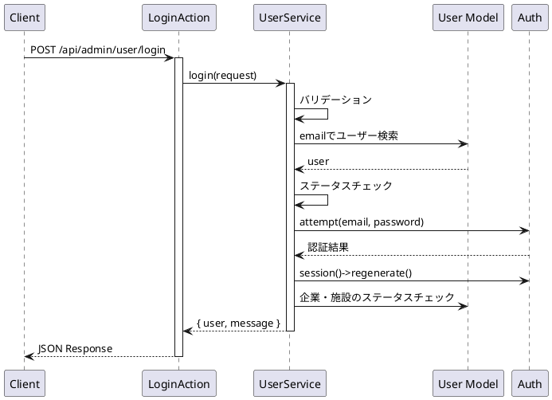

### 想定されるエラーケース

-   **400 Bad Request**: バリデーションエラー
    -   メールアドレスが不正
    -   パスワードが未入力
-   **401 Unauthorized**: 認証失敗
    -   ログイン情報が間違っている
-   **500 Internal Server Error**: その他のエラー
    -   アカウントが無効化されている
    -   紐づいている企業が無効化されている
    -   紐づいている施設が無効化されている

---

## 2. 2段階認証コード検証

### エンドポイント

```
POST /api/admin/user/login/verify-code
```

### HTTP メソッド

`POST`

### 認証

不要

### リクエストパラメータ

#### Body Parameters

| パラメータ名 | 型     | 必須 | 説明                         |
| ------------ | ------ | ---- | ---------------------------- |
| email        | string | 必須 | メールアドレス（email 形式） |
| password     | string | 必須 | パスワード                   |
| code         | string | 必須 | 6桁の認証コード              |

#### バリデーション

-   `email`: required, email 形式
-   `password`: required
-   `code`: required, string, size:6

### レスポンス構造

#### 成功時 (200)

```json
{
  "success": true,
  "timestamp": 1234567890,
  "payload": {
    "user": {
      "id": 1,
      "name": "ユーザー名",
      "email": "user@example.com",
      "user_type": "manage",
      ...
    },
    "message": "ログイン成功"
  }
}
```

### 使用しているモデル・サービス

-   **モデル**: `App\Core\User\Domain\Models\User`
-   **サービス**: `App\Core\User\Domain\UserService`
-   **Action**: `App\Core\User\Actions\Admin\VerifyTwoFactorCodeAction`

### 処理の流れ

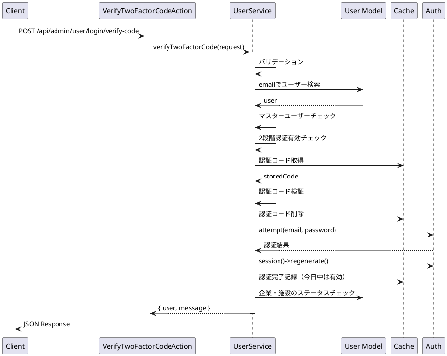

### 想定されるエラーケース

-   **400 Bad Request**: バリデーションエラー
    -   メールアドレスが不正
    -   パスワードが未入力
    -   認証コードが6桁でない
-   **401 Unauthorized**: 認証失敗
    -   認証コードが正しくないか、有効期限が切れている
    -   ログイン情報が間違っている
    -   ユーザーが見つからない
    -   マスターユーザーは2段階認証の対象外
    -   2段階認証が無効化されている
-   **500 Internal Server Error**: その他のエラー
    -   アカウントが無効化されている
    -   紐づいている企業が無効化されている
    -   紐づいている施設が無効化されている

---

## 3. 2段階認証コード再送信

### エンドポイント

```
POST /api/admin/user/login/resend-code
```

### HTTP メソッド

`POST`

### 認証

不要

### リクエストパラメータ

#### Body Parameters

| パラメータ名 | 型     | 必須 | 説明                         |
| ------------ | ------ | ---- | ---------------------------- |
| email        | string | 必須 | メールアドレス（email 形式） |

#### バリデーション

-   `email`: required, email 形式

### レスポンス構造

#### 成功時 (200)

```json
{
  "success": true,
  "timestamp": 1234567890,
  "payload": {
    "message": "認証コードを再送信しました。"
  }
}
```

### 使用しているモデル・サービス

-   **モデル**: `App\Core\User\Domain\Models\User`
-   **サービス**: `App\Core\User\Domain\UserService`
-   **Action**: `App\Core\User\Actions\Admin\ResendVerificationCodeAction`

### 処理の流れ

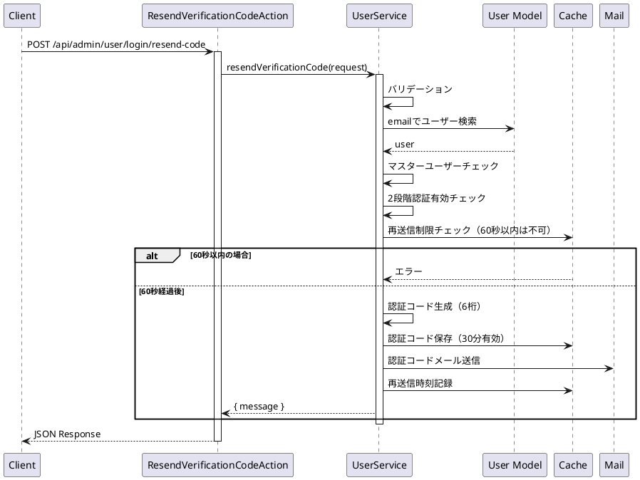

### 想定されるエラーケース

-   **400 Bad Request**: バリデーションエラーまたは再送信制限
    -   メールアドレスが未入力または不正
    -   60秒以内の再送信は不可
-   **401 Unauthorized**: 認証失敗
    -   ユーザーが見つからない
    -   マスターユーザーは2段階認証の対象外
    -   2段階認証が無効化されている

---

## 4. ログアウト

### エンドポイント

```
POST /api/admin/user/logout
```

### HTTP メソッド

`POST`

### 認証

必須（auth:sanctum）

### リクエストパラメータ

なし

### レスポンス構造

#### 成功時 (200)

```json
{
    "success": true,
    "timestamp": 1234567890,
    "payload": {
        "message": "ログアウト成功"
    }
}
```

### 使用しているモデル・サービス

-   **サービス**: `App\Core\User\Domain\UserService`
-   **Action**: `App\Core\User\Actions\Admin\LogoutAction`

### 処理の流れ

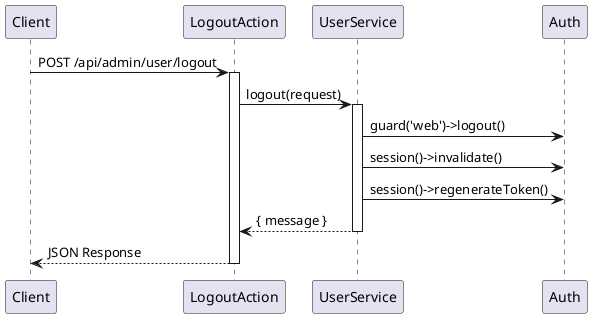

### 想定されるエラーケース

-   **401 Unauthorized**: 認証されていない

---

## 5. 認証ユーザー取得

### エンドポイント

```
GET /api/admin/me
```

### HTTP メソッド

`GET`

### 認証

必須（auth:sanctum）

### リクエストパラメータ

なし

### レスポンス構造

#### 成功時 (200)

```json
{
    "id": 1,
    "name": "ユーザー名",
    "email": "user@example.com",
    "user_type": "manage",
    "companies": [
        {
            "id": 1,
            "company_name": "企業名",
            "alias": "company-alias"
        }
    ],
    "facilities": [
        {
            "id": 1,
            "facility_name": "施設名",
            "alias": "facility-alias",
            "company": {
                "id": 1,
                "alias": "company-alias"
            }
        }
    ]
}
```

### 使用しているモデル・サービス

-   **モデル**: `App\Core\User\Domain\Models\User`
-   **ルート定義**: `api/app/Core/User/routes/api_admin.php` (インライン定義)

### 処理の流れ

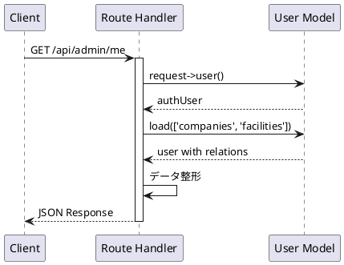

### 想定されるエラーケース

-   **401 Unauthorized**: 認証されていない

---

## 6. 認証ユーザー更新

### エンドポイント

```
PUT /api/admin/user/me
```

### HTTP メソッド

`PUT`

### 認証

必須（auth:sanctum）

### リクエストパラメータ

#### Body Parameters

| パラメータ名          | 型     | 必須 | 説明                                                  |
| --------------------- | ------ | ---- | ----------------------------------------------------- |
| name                  | string | 必須 | ユーザー名（最大 255 文字）                           |
| email                 | string | 必須 | メールアドレス（email 形式、最大 255 文字、ユニーク） |
| password              | string | 任意 | パスワード（8 文字以上、変更する場合のみ）            |
| password_confirmation | string | 任意 | パスワード確認（password 指定時必須）                 |

#### バリデーション

-   `name`: required, string, max:255
-   `email`: required, email, max:255, unique:users,email,{current_user_id}
-   `password`: nullable, string, min:8, confirmed

### レスポンス構造

#### 成功時 (200)

```json
{
  "success": true,
  "timestamp": 1234567890,
  "payload": {
    "user": {
      "id": 1,
      "name": "更新されたユーザー名",
      "email": "updated@example.com",
      ...
    },
    "message": "アカウント情報を更新しました。"
  }
}
```

### 使用しているモデル・サービス

-   **モデル**: `App\Core\User\Domain\Models\User`
-   **サービス**: `App\Core\User\Domain\UserService`
-   **Action**: `App\Core\User\Actions\Admin\UpdateMeAction`

### 処理の流れ

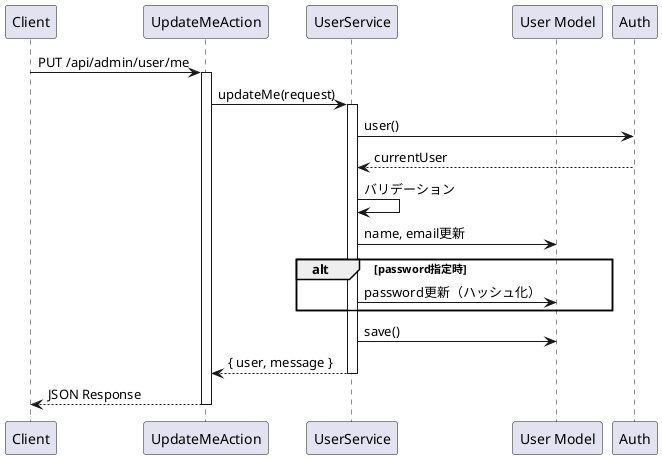

### 想定されるエラーケース

-   **400 Bad Request**: バリデーションエラー
    -   名前が未入力または 255 文字超過
    -   メールアドレスが不正または既に使用されている
    -   パスワードが 8 文字未満
    -   パスワード確認が一致しない
-   **401 Unauthorized**: 認証されていない

---

## 7. パスワードリセット依頼

### エンドポイント

```
POST /api/admin/user/password/forgot
```

### HTTP メソッド

`POST`

### 認証

不要

### リクエストパラメータ

#### Body Parameters

| パラメータ名 | 型     | 必須 | 説明                         |
| ------------ | ------ | ---- | ---------------------------- |
| email        | string | 必須 | メールアドレス（email 形式） |

#### バリデーション

-   `email`: required, email 形式

### レスポンス構造

#### 成功時 (200)

```json
{
    "success": true,
    "timestamp": 1234567890,
    "payload": {
        "message": "パスワードリセット用メールを送信しました。",
        "status": "passwords.sent"
    }
}
```

### 使用しているモデル・サービス

-   **サービス**: `App\Core\User\Domain\UserService`
-   **Action**: `App\Core\User\Actions\Admin\ForgotPasswordAction`
-   **Laravel Password Broker**: `Password::broker('users')`

### 処理の流れ

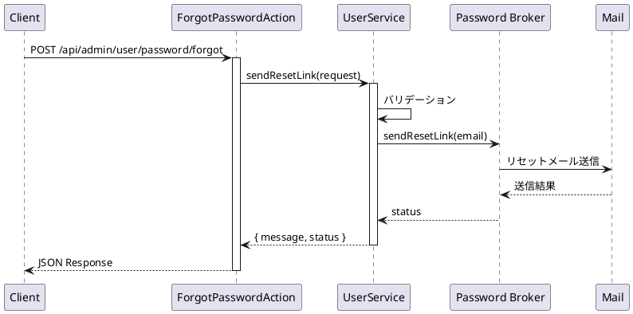

### 想定されるエラーケース

-   **400 Bad Request**: バリデーションエラー
    -   メールアドレスが未入力または不正
-   **500 Internal Server Error**: その他のエラー
    -   メール送信失敗

---

## 8. パスワードリセット実行

### エンドポイント

```
POST /api/admin/user/password/reset
```

### HTTP メソッド

`POST`

### 認証

不要

### リクエストパラメータ

#### Body Parameters

| パラメータ名          | 型     | 必須 | 説明                           |
| --------------------- | ------ | ---- | ------------------------------ |
| token                 | string | 必須 | リセットトークン               |
| email                 | string | 必須 | メールアドレス（email 形式）   |
| password              | string | 必須 | 新しいパスワード（8 文字以上） |
| password_confirmation | string | 必須 | パスワード確認                 |

#### バリデーション

-   `token`: required, string
-   `email`: required, email 形式
-   `password`: required, string, min:8, confirmed

### レスポンス構造

#### 成功時 (200)

```json
{
    "success": true,
    "timestamp": 1234567890,
    "payload": {
        "message": "パスワードを更新しました。",
        "status": "passwords.reset"
    }
}
```

### 使用しているモデル・サービス

-   **サービス**: `App\Core\User\Domain\UserService`
-   **Action**: `App\Core\User\Actions\Admin\ResetPasswordAction`
-   **Laravel Password Broker**: `Password::broker('users')`

### 処理の流れ

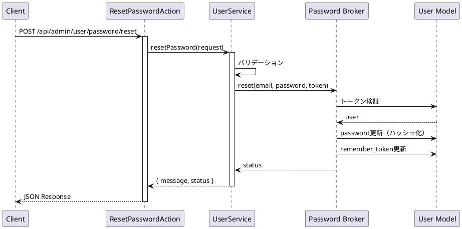

### 想定されるエラーケース

-   **400 Bad Request**: バリデーションエラー
    -   トークンが無効
    -   メールアドレスが未入力または不正
    -   パスワードが 8 文字未満
    -   パスワード確認が一致しない
-   **500 Internal Server Error**: その他のエラー
    -   トークンが無効または期限切れ

---

## 9. ユーザー一覧取得

### エンドポイント

```
GET /api/admin/user
```

### HTTP メソッド

`GET`

### 認証

必須（auth:sanctum）

### リクエストパラメータ

#### Query Parameters

| パラメータ名 | 型      | 必須 | 説明                                          |
| ------------ | ------- | ---- | --------------------------------------------- |
| current      | integer | 任意 | 現在のページ番号（デフォルト: 1）             |
| limit        | integer | 任意 | 1 ページあたりの件数（デフォルト: config 値） |
| criteria     | array   | 任意 | 検索条件                                      |

### レスポンス構造

#### 成功時 (200)

```json
{
  "success": true,
  "timestamp": 1234567890,
  "payload": {
    "total": 100,
    "current": 1,
    "pages": 10,
    "limit": 10,
    "data": [
      {
        "id": 1,
        "name": "ユーザー名",
        "email": "user@example.com",
        "user_type": "manage",
        ...
      }
    ]
  }
}
```

### 使用しているモデル・サービス

-   **モデル**: `App\Core\User\Domain\Models\User`
-   **サービス**: `App\Core\User\Domain\UserService`
-   **Action**: `App\Core\User\Actions\Admin\ListAction`

### 処理の流れ

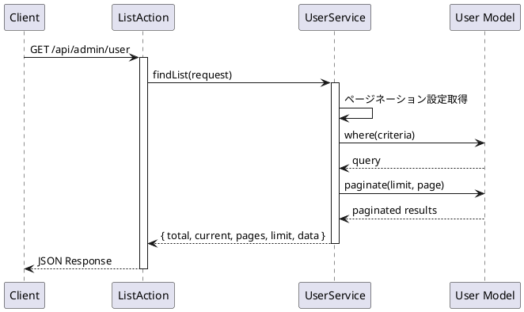

### 想定されるエラーケース

-   **401 Unauthorized**: 認証されていない

---

## 10. ユーザー作成

### エンドポイント

```
POST /api/admin/user/store
```

### HTTP メソッド

`POST`

### 認証

必須（auth:sanctum）

### リクエストパラメータ

#### Body Parameters

| パラメータ名        | 型     | 必須         | 説明                                                     |
| ------------------- | ------ | ------------ | -------------------------------------------------------- |
| name                | string | 必須         | ユーザー名（最大 255 文字）                              |
| email               | string | 必須         | メールアドレス（email 形式、最大 255 文字、ユニーク）    |
| password            | string | 必須         | パスワード（8 文字以上）                                 |
| user_type           | string | 任意         | ユーザータイプ（manage, company, facility）              |
| company_id          | object | 条件付き必須 | 企業 ID（user_type が company, manage, facility の場合） |
| facility_id         | array  | 条件付き必須 | 施設 ID 配列（user_type が facility の場合）             |
| permission_settings | array  | 任意         | 権限設定                                                 |

#### バリデーション

-   `name`: required, string, max:255
-   `email`: required, email, max:255, unique:users,email
-   `password`: required, string, min:8
-   `company_id`: required（user_type が company, manage, facility の場合）
-   `facility_id`: required, array（user_type が facility の場合）

### レスポンス構造

#### 成功時 (200)

```json
{
  "success": true,
  "timestamp": 1234567890,
  "payload": {
    "data": {
      "id": 1,
      "name": "新規ユーザー名",
      "email": "newuser@example.com",
      "user_type": "company",
      ...
    }
  }
}
```

### 使用しているモデル・サービス

-   **モデル**: `App\Core\User\Domain\Models\User`
-   **サービス**: `App\Core\User\Domain\UserService`
-   **Action**: `App\Core\User\Actions\Admin\StoreAction`

### 処理の流れ

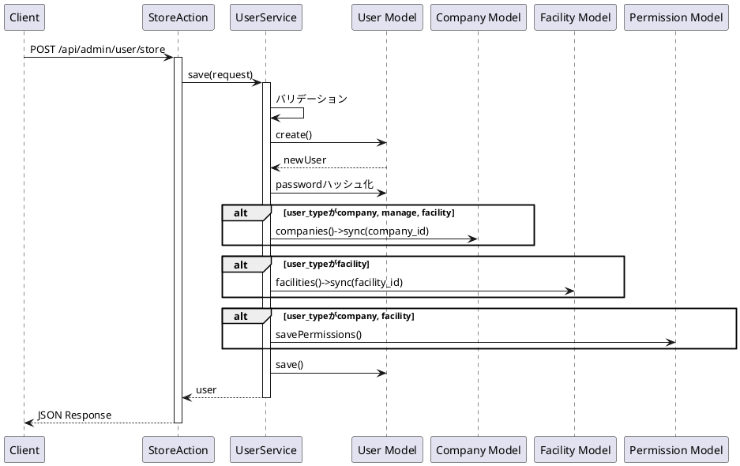

### 想定されるエラーケース

-   **400 Bad Request**: バリデーションエラー
    -   名前が未入力または 255 文字超過
    -   メールアドレスが不正または既に使用されている
    -   パスワードが 8 文字未満
    -   企業 ID が未指定（条件付き必須）
    -   施設 ID が未指定（条件付き必須）
-   **401 Unauthorized**: 認証されていない
-   **500 Internal Server Error**: その他のエラー
    -   データベースエラー

---

## 11. ユーザー詳細取得

### エンドポイント

```
GET /api/admin/user/{id}
```

### HTTP メソッド

`GET`

### 認証

必須（auth:sanctum）

### リクエストパラメータ

#### Path Parameters

| パラメータ名 | 型      | 必須 | 説明        |
| ------------ | ------- | ---- | ----------- |
| id           | integer | 必須 | ユーザー ID |

### レスポンス構造

#### 成功時 (200)

```json
{
  "success": true,
  "timestamp": 1234567890,
  "payload": {
    "data": {
      "id": 1,
      "name": "ユーザー名",
      "email": "user@example.com",
      "user_type": "company",
      "companies": [...],
      "facilities": [...],
      "permissions": [
        {
          "resource_type": "content_model",
          "resource_id": 1,
          "read": {
            "enabled": true,
            "scope": "all"
          },
          "write": {
            "enabled": true,
            "scope": "all"
          },
          "delete": {
            "enabled": false,
            "scope": "all"
          },
          "sort": {
            "enabled": true
          }
        }
      ]
    }
  }
}
```

### 使用しているモデル・サービス

-   **モデル**: `App\Core\User\Domain\Models\User`
-   **サービス**: `App\Core\User\Domain\UserService`
-   **Action**: `App\Core\User\Actions\Admin\DetailAction`

### 処理の流れ

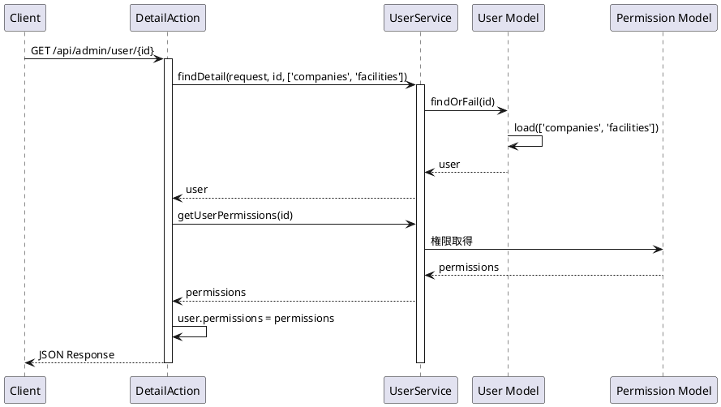

### 想定されるエラーケース

-   **401 Unauthorized**: 認証されていない
-   **404 Not Found**: ユーザーが見つからない

---

## 12. ユーザー更新

### エンドポイント

```
PUT /api/admin/user/{id}
```

### HTTP メソッド

`PUT`

### 認証

必須（auth:sanctum）

### リクエストパラメータ

#### Path Parameters

| パラメータ名 | 型      | 必須 | 説明        |
| ------------ | ------- | ---- | ----------- |
| id           | integer | 必須 | ユーザー ID |

#### Body Parameters

| パラメータ名        | 型      | 必須         | 説明                                                            |
| ------------------- | ------- | ------------ | --------------------------------------------------------------- |
| name                | string  | 必須         | ユーザー名（最大 255 文字）                                     |
| email               | string  | 必須         | メールアドレス（email 形式、最大 255 文字、ユニーク、自分以外） |
| password            | string  | 条件付き必須 | パスワード（8 文字以上、is_chg_pass が true の場合）            |
| is_chg_pass         | boolean | 任意         | パスワード変更フラグ                                            |
| user_type           | string  | 任意         | ユーザータイプ                                                  |
| company_id          | object  | 条件付き必須 | 企業 ID                                                         |
| facility_id         | array   | 条件付き必須 | 施設 ID 配列                                                    |
| permission_settings | array   | 任意         | 権限設定                                                        |

#### バリデーション

-   `name`: required, string, max:255
-   `email`: required, email, max:255, unique:users,email,{id}
-   `password`: required（is_chg_pass が true の場合）, string, min:8

### レスポンス構造

#### 成功時 (200)

```json
{
  "success": true,
  "timestamp": 1234567890,
  "payload": {
    "data": {
      "id": 1,
      "name": "更新されたユーザー名",
      "email": "updated@example.com",
      ...
    }
  }
}
```

### 使用しているモデル・サービス

-   **モデル**: `App\Core\User\Domain\Models\User`
-   **サービス**: `App\Core\User\Domain\UserService`
-   **Action**: `App\Core\User\Actions\Admin\UpdateAction`

### 処理の流れ

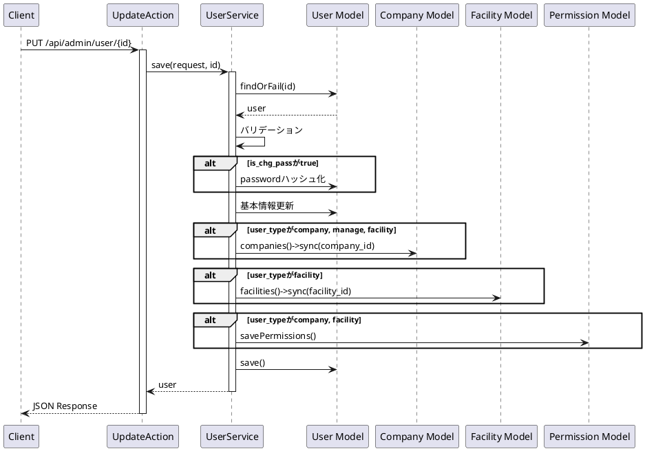

### 想定されるエラーケース

-   **400 Bad Request**: バリデーションエラー
    -   名前が未入力または 255 文字超過
    -   メールアドレスが不正または既に使用されている
    -   パスワードが 8 文字未満（変更時）
-   **401 Unauthorized**: 認証されていない
-   **404 Not Found**: ユーザーが見つからない
-   **500 Internal Server Error**: その他のエラー

---

## 13. ユーザー削除

### エンドポイント

```
DELETE /api/admin/user/{id}
```

### HTTP メソッド

`DELETE`

### 認証

必須（auth:sanctum）

### リクエストパラメータ

#### Path Parameters

| パラメータ名 | 型      | 必須 | 説明        |
| ------------ | ------- | ---- | ----------- |
| id           | integer | 必須 | ユーザー ID |

### レスポンス構造

#### 成功時 (200)

```json
{
    "success": true,
    "timestamp": 1234567890,
    "payload": {
        "data": {
            "result": true
        }
    }
}
```

### 使用しているモデル・サービス

-   **モデル**: `App\Core\User\Domain\Models\User`
-   **サービス**: `App\Core\User\Domain\UserService`
-   **Action**: `App\Core\User\Actions\Admin\DeleteAction`

### 処理の流れ

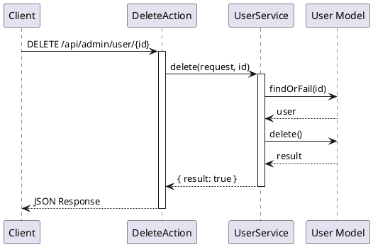

### 想定されるエラーケース

-   **401 Unauthorized**: 認証されていない
-   **404 Not Found**: ユーザーが見つからない
-   **500 Internal Server Error**: その他のエラー
    -   外部キー制約エラー

---

## 14. ユーザーリソース取得（全件）

### エンドポイント

```
GET /api/admin/user/resource
```

### HTTP メソッド

`GET`

### 認証

必須（auth:sanctum）

### リクエストパラメータ

#### Query Parameters

| パラメータ名 | 型    | 必須 | 説明     |
| ------------ | ----- | ---- | -------- |
| criteria     | array | 任意 | 検索条件 |

### レスポンス構造

#### 成功時 (200)

```json
{
  "success": true,
  "timestamp": 1234567890,
  "payload": {
    "data": [
      {
        "id": 1,
        "name": "ユーザー名",
        "email": "user@example.com",
        ...
      }
    ]
  }
}
```

### 使用しているモデル・サービス

-   **モデル**: `App\Core\User\Domain\Models\User`
-   **サービス**: `App\Core\User\Domain\UserService`
-   **Action**: `App\Core\User\Actions\Admin\ResourceAction`

### 処理の流れ

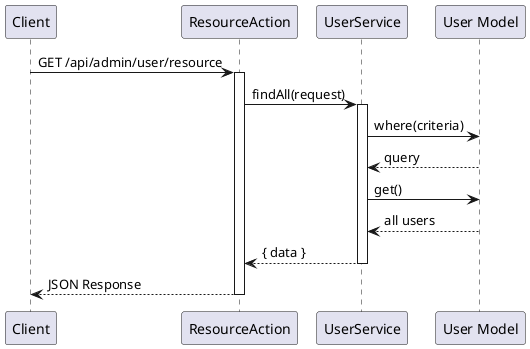

### 想定されるエラーケース

-   **401 Unauthorized**: 認証されていない

---

## 15. ユーザー検索

### エンドポイント

```
GET /api/admin/user/find
```

### HTTP メソッド

`GET`

### 認証

必須（auth:sanctum）

### リクエストパラメータ

#### Query Parameters

| パラメータ名 | 型    | 必須 | 説明     |
| ------------ | ----- | ---- | -------- |
| criteria     | array | 任意 | 検索条件 |

### レスポンス構造

#### 成功時 (200)

```json
{
  "success": true,
  "timestamp": 1234567890,
  "payload": {
    "data": {
      "id": 1,
      "name": "ユーザー名",
      "email": "user@example.com",
      ...
    }
  }
}
```

### 使用しているモデル・サービス

-   **モデル**: `App\Core\User\Domain\Models\User`
-   **サービス**: `App\Core\User\Domain\UserService`
-   **Action**: `App\Core\User\Actions\Admin\FindAction`

### 処理の流れ

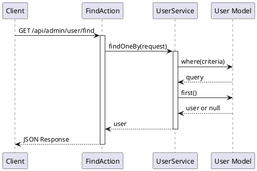

### 想定されるエラーケース

-   **401 Unauthorized**: 認証されていない

---

## 16. ユーザー並び替え

### エンドポイント

```
POST /api/admin/user/sort
```

### HTTP メソッド

`POST`

### 認証

必須（auth:sanctum）

### リクエストパラメータ

#### Body Parameters

| パラメータ名 | 型    | 必須 | 説明                 |
| ------------ | ----- | ---- | -------------------- |
| sort_ids     | array | 必須 | 並び替え後の ID 配列 |

### レスポンス構造

#### 成功時 (200)

```json
{
    "success": true,
    "timestamp": 1234567890,
    "payload": {
        "data": {
            "result": true
        }
    }
}
```

### 使用しているモデル・サービス

-   **モデル**: `App\Core\User\Domain\Models\User`
-   **サービス**: `App\Core\User\Domain\UserService`
-   **Action**: `App\Core\User\Actions\Admin\SortAction`

### 処理の流れ

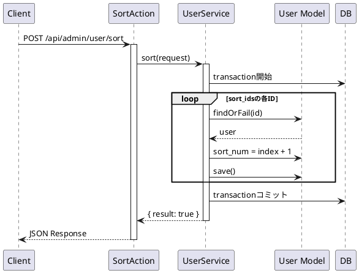

### 想定されるエラーケース

-   **400 Bad Request**: バリデーションエラー
    -   sort_ids が未指定
-   **401 Unauthorized**: 認証されていない
-   **404 Not Found**: 指定された ID のユーザーが見つからない
-   **500 Internal Server Error**: その他のエラー

---

## 17. 企業ユーザー一覧取得

### エンドポイント

```
GET /api/admin/{company_alias}/{facility_alias}/user
```

### HTTP メソッド

`GET`

### 認証

必須（auth:sanctum）

### リクエストパラメータ

#### Path Parameters

| パラメータ名   | 型     | 必須 | 説明           |
| -------------- | ------ | ---- | -------------- |
| company_alias  | string | 必須 | 企業エイリアス |
| facility_alias | string | 必須 | 施設エイリアス |

#### Query Parameters

| パラメータ名 | 型      | 必須 | 説明                 |
| ------------ | ------- | ---- | -------------------- |
| current      | integer | 任意 | 現在のページ番号     |
| limit        | integer | 任意 | 1 ページあたりの件数 |
| criteria     | array   | 任意 | 検索条件             |

### レスポンス構造

#### 成功時 (200)

```json
{
  "success": true,
  "timestamp": 1234567890,
  "payload": {
    "total": 50,
    "current": 1,
    "pages": 5,
    "limit": 10,
    "data": [...]
  }
}
```

### 使用しているモデル・サービス

-   **モデル**: `App\Core\User\Domain\Models\User`
-   **サービス**: `App\Core\User\Domain\UserService`
-   **Action**: `App\Core\User\Actions\Admin\Company\ListAction`

### 処理の流れ

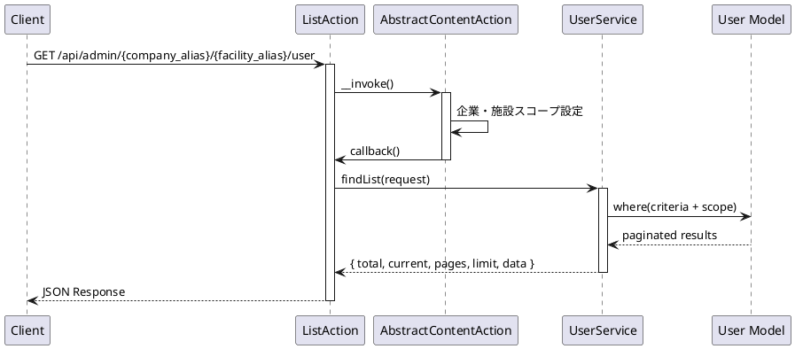

### 想定されるエラーケース

-   **401 Unauthorized**: 認証されていない
-   **404 Not Found**: 企業または施設が見つからない

---

## 18. 企業ユーザー作成

### エンドポイント

```
POST /api/admin/{company_alias}/{facility_alias}/user/store
```

### HTTP メソッド

`POST`

### 認証

必須（auth:sanctum）

### リクエストパラメータ

#### Path Parameters

| パラメータ名   | 型     | 必須 | 説明           |
| -------------- | ------ | ---- | -------------- |
| company_alias  | string | 必須 | 企業エイリアス |
| facility_alias | string | 必須 | 施設エイリアス |

#### Body Parameters

ユーザー作成と同じ（企業・施設はパスから自動設定）

### レスポンス構造

#### 成功時 (200)

```json
{
  "success": true,
  "timestamp": 1234567890,
  "payload": {
    "data": {...}
  }
}
```

### 使用しているモデル・サービス

-   **モデル**: `App\Core\User\Domain\Models\User`
-   **サービス**: `App\Core\User\Domain\UserService`
-   **Action**: `App\Core\User\Actions\Admin\Company\StoreAction`

### 処理の流れ

ユーザー作成と同じ（企業・施設スコープが適用される）

### 想定されるエラーケース

ユーザー作成と同じ

---

## 19. 企業ユーザー詳細取得

### エンドポイント

```
GET /api/admin/{company_alias}/{facility_alias}/user/{id}
```

### HTTP メソッド

`GET`

### 認証

必須（auth:sanctum）

### リクエストパラメータ

#### Path Parameters

| パラメータ名   | 型      | 必須 | 説明           |
| -------------- | ------- | ---- | -------------- |
| company_alias  | string  | 必須 | 企業エイリアス |
| facility_alias | string  | 必須 | 施設エイリアス |
| id             | integer | 必須 | ユーザー ID    |

### レスポンス構造

ユーザー詳細取得と同じ

### 使用しているモデル・サービス

-   **モデル**: `App\Core\User\Domain\Models\User`
-   **サービス**: `App\Core\User\Domain\UserService`
-   **Action**: `App\Core\User\Actions\Admin\Company\DetailAction`

### 処理の流れ

ユーザー詳細取得と同じ（企業・施設スコープが適用される）

### 想定されるエラーケース

ユーザー詳細取得と同じ

---

## 20. 企業ユーザー更新

### エンドポイント

```
PUT /api/admin/{company_alias}/{facility_alias}/user/{id}
```

### HTTP メソッド

`PUT`

### 認証

必須（auth:sanctum）

### リクエストパラメータ

#### Path Parameters

| パラメータ名   | 型      | 必須 | 説明           |
| -------------- | ------- | ---- | -------------- |
| company_alias  | string  | 必須 | 企業エイリアス |
| facility_alias | string  | 必須 | 施設エイリアス |
| id             | integer | 必須 | ユーザー ID    |

#### Body Parameters

ユーザー更新と同じ

### レスポンス構造

ユーザー更新と同じ

### 使用しているモデル・サービス

-   **モデル**: `App\Core\User\Domain\Models\User`
-   **サービス**: `App\Core\User\Domain\UserService`
-   **Action**: `App\Core\User\Actions\Admin\Company\UpdateAction`

### 処理の流れ

ユーザー更新と同じ（企業・施設スコープが適用される）

### 想定されるエラーケース

ユーザー更新と同じ

---

## 21. 企業ユーザー削除

### エンドポイント

```
DELETE /api/admin/{company_alias}/{facility_alias}/user/{id}
```

### HTTP メソッド

`DELETE`

### 認証

必須（auth:sanctum）

### リクエストパラメータ

#### Path Parameters

| パラメータ名   | 型      | 必須 | 説明           |
| -------------- | ------- | ---- | -------------- |
| company_alias  | string  | 必須 | 企業エイリアス |
| facility_alias | string  | 必須 | 施設エイリアス |
| id             | integer | 必須 | ユーザー ID    |

### レスポンス構造

ユーザー削除と同じ

### 使用しているモデル・サービス

-   **モデル**: `App\Core\User\Domain\Models\User`
-   **サービス**: `App\Core\User\Domain\UserService`
-   **Action**: `App\Core\User\Actions\Admin\Company\DeleteAction`

### 処理の流れ

ユーザー削除と同じ（企業・施設スコープが適用される）

### 想定されるエラーケース

ユーザー削除と同じ

---

## 22. 2段階認証の有効/無効設定

### エンドポイント

```
PUT /api/admin/user/{id}/two-factor/enabled
```

### HTTP メソッド

`PUT`

### 認証

必須（auth:sanctum）

### リクエストパラメータ

#### Path Parameters

| パラメータ名 | 型      | 必須 | 説明        |
| ------------ | ------- | ---- | ----------- |
| id           | integer | 必須 | ユーザー ID |

#### Body Parameters

| パラメータ名 | 型      | 必須 | 説明                                                      |
| ------------ | ------- | ---- | --------------------------------------------------------- |
| enabled      | boolean | 必須 | 有効化する場合はtrue、無効化する場合はfalse               |

#### バリデーション

-   `enabled`: required, boolean

### レスポンス構造

#### 成功時 (200)

```json
{
  "success": true,
  "timestamp": 1234567890,
  "payload": {
    "user": {
      "id": 1,
      "name": "ユーザー名",
      "email": "user@example.com",
      "two_factor_enabled": true,
      ...
    },
    "message": "2段階認証を有効化しました。"
  }
}
```

### 使用しているモデル・サービス

-   **モデル**: `App\Core\User\Domain\Models\User`
-   **サービス**: `App\Core\User\Domain\UserService`
-   **Action**: `App\Core\User\Actions\Admin\SetTwoFactorEnabledAction`

### 処理の流れ

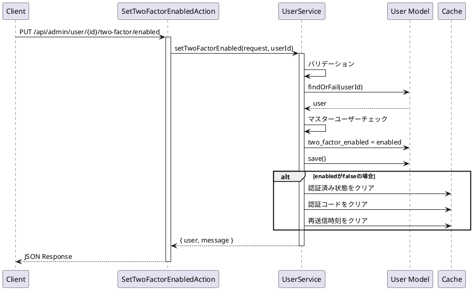

### 想定されるエラーケース

-   **400 Bad Request**: バリデーションエラー
    -   enabled が未指定または真偽値でない
-   **401 Unauthorized**: 認証されていない
-   **404 Not Found**: ユーザーが見つからない
-   **500 Internal Server Error**: その他のエラー
    -   マスターユーザーの2段階認証設定は変更できない

---

## 23. 2段階認証の状態リセット

### エンドポイント

```
POST /api/admin/user/{id}/two-factor/reset
```

### HTTP メソッド

`POST`

### 認証

必須（auth:sanctum）

### リクエストパラメータ

#### Path Parameters

| パラメータ名 | 型      | 必須 | 説明        |
| ------------ | ------- | ---- | ----------- |
| id           | integer | 必須 | ユーザー ID |

### レスポンス構造

#### 成功時 (200)

```json
{
  "success": true,
  "timestamp": 1234567890,
  "payload": {
    "message": "2段階認証の状態をリセットしました。次回ログイン時に認証コードが要求されます。"
  }
}
```

### 使用しているモデル・サービス

-   **モデル**: `App\Core\User\Domain\Models\User`
-   **サービス**: `App\Core\User\Domain\UserService`
-   **Action**: `App\Core\User\Actions\Admin\ResetTwoFactorAction`

### 処理の流れ

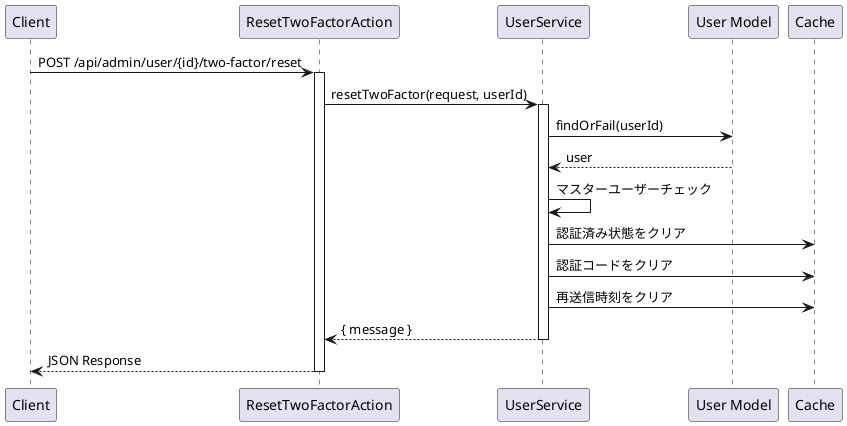

### 想定されるエラーケース

-   **401 Unauthorized**: 認証されていない
-   **404 Not Found**: ユーザーが見つからない
-   **500 Internal Server Error**: その他のエラー
    -   マスターユーザーの2段階認証はリセットできない

---

## 24. 権限チェック

### エンドポイント

```
GET /api/admin/user/permissions/check
```

### HTTP メソッド

`GET`

### 認証

必須（auth:sanctum）

### リクエストパラメータ

#### Query Parameters

| パラメータ名   | 型      | 必須 | 説明                                             |
| -------------- | ------- | ---- | ------------------------------------------------ |
| resource_type  | string  | 必須 | リソースタイプ（content_model, contact_setting） |
| permission     | string  | 任意 | 権限（read, write, delete, sort）                |
| permissions    | string  | 任意 | 権限（カンマ区切り、複数指定時）                 |
| resource_id    | integer | 任意 | リソース ID（content_model の場合）              |
| company_alias  | string  | 任意 | 企業エイリアス                                   |
| facility_alias | string  | 任意 | 施設エイリアス                                   |
| model_name     | string  | 任意 | モデル名（content の場合）                       |

### レスポンス構造

#### 成功時 (200) - 単一権限

```json
{
    "success": true,
    "timestamp": 1234567890,
    "payload": {
        "has_permission": true,
        "scope": "all"
    }
}
```

#### 成功時 (200) - 複数権限

```json
{
    "success": true,
    "timestamp": 1234567890,
    "payload": {
        "read": {
            "has_permission": true,
            "scope": "all"
        },
        "write": {
            "has_permission": true,
            "scope": "all"
        },
        "delete": {
            "has_permission": false,
            "scope": null
        }
    }
}
```

### 使用しているモデル・サービス

-   **サービス**: `App\Core\User\Domain\PermissionService`
-   **Action**: `App\Core\User\Actions\Admin\Permissions\CheckAction`

### 処理の流れ

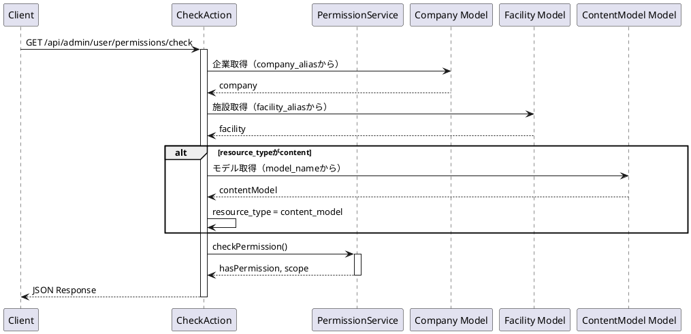

### 想定されるエラーケース

-   **400 Bad Request**: パラメータ不足
    -   resource_type が未指定
-   **401 Unauthorized**: 認証されていない

---

## 25. 機能リソース取得

### エンドポイント

```
GET /api/admin/user/permissions/function/resource
```

### HTTP メソッド

`GET`

### 認証

必須（auth:sanctum）

### リクエストパラメータ

なし

### レスポンス構造

#### 成功時 (200)

```json
{
    "success": true,
    "timestamp": 1234567890,
    "payload": {
        "data": [
            {
                "id": 1,
                "title": "コンテンツモデル名",
                "resource_type": "content_model"
            },
            {
                "id": null,
                "title": "お問い合わせ設定",
                "resource_type": "contact_setting"
            }
        ]
    }
}
```

### 使用しているモデル・サービス

-   **サービス**: `App\Mod\ContentModel\Domain\ContentModelService`
-   **Action**: `App\Core\User\Actions\Admin\Permissions\Function\ResourceAction`

### 処理の流れ

```plantuml
@startuml
participant Client
participant ResourceAction
participant ContentModelService
participant "ContentModel Model"

Client -> ResourceAction: GET /api/admin/user/permissions/function/resource
activate ResourceAction
ResourceAction -> ContentModelService: findAll(request)
activate ContentModelService
ContentModelService -> "ContentModel Model" : 全件取得
"ContentModel Model" --> ContentModelService: contentModels
ContentModelService --> ResourceAction: { data }
ResourceAction -> ResourceAction: resource_type追加
ResourceAction -> ResourceAction: お問い合わせ設定追加
ResourceAction --> Client: JSON Response
deactivate ResourceAction
deactivate ContentModelService
@enduml
```

### 想定されるエラーケース

-   **401 Unauthorized**: 認証されていない
