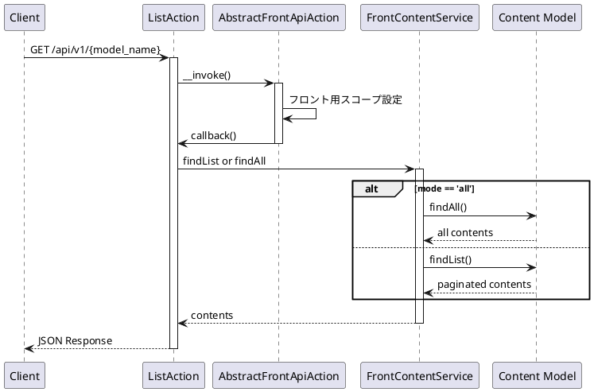
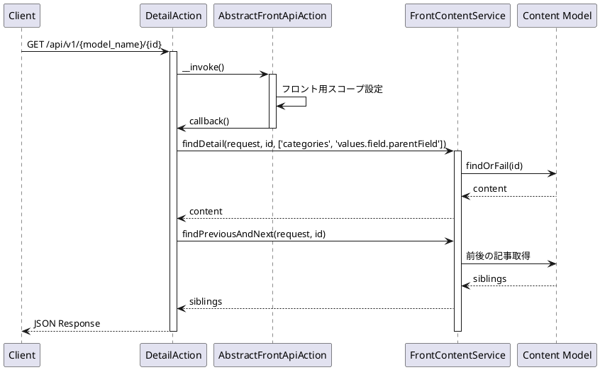
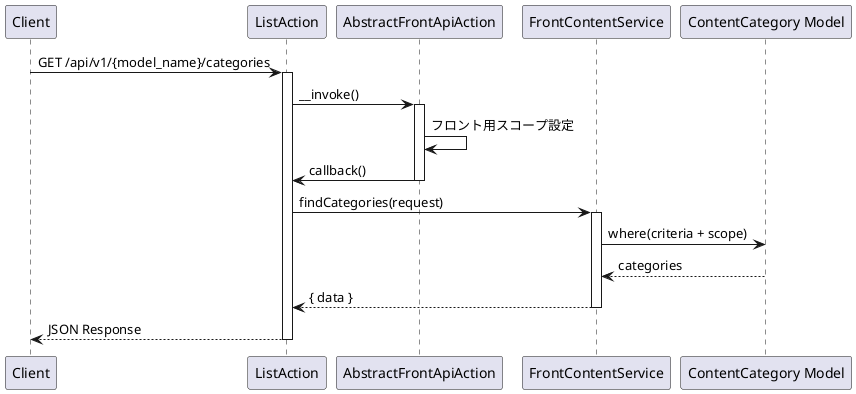
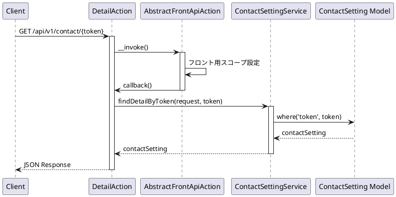
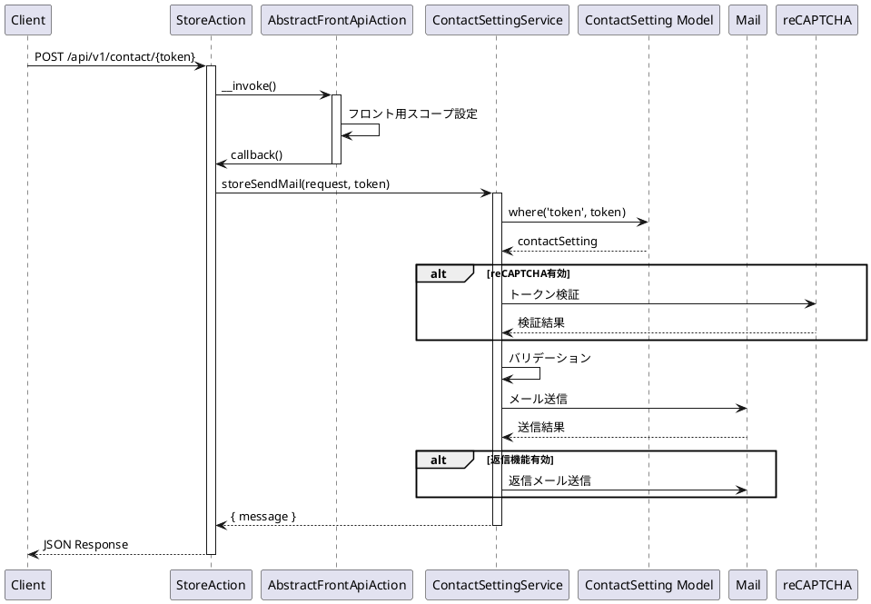

# Front Content API 仕様書

## 概要

フロントエンド向けコンテンツ API エンドポイントです。公開用のコンテンツ一覧取得、詳細取得、カテゴリ一覧取得、マークアップ取得などの機能を提供します。

---

## コンテンツ API

### 1. コンテンツ一覧取得

#### エンドポイント

```
GET /api/v1/{model_name}
```

#### HTTP メソッド

`GET`

#### 認証

不要

#### リクエストパラメータ

##### Path Parameters

| パラメータ名 | 型     | 必須 | 説明                   |
| ------------ | ------ | ---- | ---------------------- |
| model_name   | string | 必須 | コンテンツモデル名（エイリアス） |

##### Query Parameters

| パラメータ名 | 型      | 必須 | 説明                                                          |
| ------------ | ------- | ---- | ------------------------------------------------------------- |
| mode         | string  | 任意 | 取得モード（list: ページネーション、all: 全件取得、デフォルト: list） |
| current      | integer | 任意 | 現在のページ番号（mode=list の場合、デフォルト: 1）            |
| limit        | integer | 任意 | 1 ページあたりの件数（mode=list の場合、デフォルト: config 値） |
| criteria     | array   | 任意 | 検索条件                                                      |

#### レスポンス構造

##### 成功時 (200) - mode=list

```json
{
    "success": true,
    "timestamp": 1234567890,
    "all": 100,
    "current": 1,
    "limit": 10,
    "pages": 10,
    "contents": [
        {
            "id": 1,
            "model_id": 1,
            "values": [...],
            "categories": [...],
            ...
        }
    ]
}
```

##### 成功時 (200) - mode=all

```json
{
    "success": true,
    "timestamp": 1234567890,
    "contents": [
        {
            "id": 1,
            "model_id": 1,
            "values": [...],
            "categories": [...],
            ...
        }
    ]
}
```

#### 使用しているモデル・サービス

-   **モデル**: `App\Mod\Content\Domain\Models\Content`
-   **サービス**: `App\Mod\Content\Domain\FrontContentService`
-   **Action**: `App\Mod\Content\Actions\Front\V1\ListAction`

#### 処理の流れ



#### 想定されるエラーケース

-   **404 Not Found**: コンテンツモデルが見つからない

---

### 2. コンテンツ詳細取得

#### エンドポイント

```
GET /api/v1/{model_name}/{id}
```

#### HTTP メソッド

`GET`

#### 認証

不要

#### リクエストパラメータ

##### Path Parameters

| パラメータ名 | 型      | 必須 | 説明                   |
| ------------ | ------- | ---- | ---------------------- |
| model_name   | string  | 必須 | コンテンツモデル名（エイリアス） |
| id           | integer | 必須 | コンテンツ ID          |

#### レスポンス構造

##### 成功時 (200)

```json
{
    "success": true,
    "timestamp": 1234567890,
    "contents": {
        "id": 1,
        "model_id": 1,
        "values": [
            {
                "field_id": "title",
                "value": "タイトル",
                "field": {...}
            }
        ],
        "categories": [
            {
                "id": 1,
                "title": "カテゴリ名"
            }
        ],
        ...
    },
    "sibLings": {
        "previous": {
            "id": 0,
            "title": "前の記事"
        },
        "next": {
            "id": 2,
            "title": "次の記事"
        }
    }
}
```

#### 使用しているモデル・サービス

-   **モデル**: `App\Mod\Content\Domain\Models\Content`
-   **サービス**: `App\Mod\Content\Domain\FrontContentService`
-   **Action**: `App\Mod\Content\Actions\Front\V1\DetailAction`

#### 処理の流れ



#### 想定されるエラーケース

-   **404 Not Found**: コンテンツが見つからない

---

### 3. カテゴリ一覧取得

#### エンドポイント

```
GET /api/v1/{model_name}/categories
```

#### HTTP メソッド

`GET`

#### 認証

不要

#### リクエストパラメータ

##### Path Parameters

| パラメータ名 | 型     | 必須 | 説明                   |
| ------------ | ------ | ---- | ---------------------- |
| model_name   | string | 必須 | コンテンツモデル名（エイリアス） |

##### Query Parameters

| パラメータ名 | 型    | 必須 | 説明     |
| ------------ | ----- | ---- | -------- |
| criteria     | array | 任意 | 検索条件 |

#### レスポンス構造

##### 成功時 (200)

```json
{
    "success": true,
    "timestamp": 1234567890,
    "payload": {
        "data": [
            {
                "id": 1,
                "title": "カテゴリ名",
                "model_id": 1,
                ...
            }
        ]
    }
}
```

#### 使用しているモデル・サービス

-   **モデル**: `App\Mod\Content\Domain\Models\ContentCategory`
-   **サービス**: `App\Mod\Content\Domain\FrontContentService`
-   **Action**: `App\Mod\Content\Actions\Front\V1\Categories\ListAction`

#### 処理の流れ



#### 想定されるエラーケース

-   **404 Not Found**: コンテンツモデルが見つからない

---

### 4. マークアップ一覧取得

#### エンドポイント

```
GET /api/v1/{model_name}/markup
```

#### HTTP メソッド

`GET`

#### 認証

不要

#### リクエストパラメータ

##### Path Parameters

| パラメータ名 | 型     | 必須 | 説明                   |
| ------------ | ------ | ---- | ---------------------- |
| model_name   | string | 必須 | コンテンツモデル名（エイリアス） |

##### Query Parameters

| パラメータ名 | 型      | 必須 | 説明                                          |
| ------------ | ------- | ---- | --------------------------------------------- |
| current      | integer | 任意 | 現在のページ番号（デフォルト: 1）             |
| limit        | integer | 任意 | 1 ページあたりの件数（デフォルト: config 値） |
| criteria     | array   | 任意 | 検索条件                                      |

#### レスポンス構造

##### 成功時 (200)

```json
{
    "success": true,
    "timestamp": 1234567890,
    "payload": {
        "total": 10,
        "current": 1,
        "pages": 1,
        "limit": 10,
        "data": [
            {
                "id": 1,
                "title": "マークアップ名",
                "content_model_id": 1,
                "markup": "...",
                ...
            }
        ]
    }
}
```

#### 使用しているモデル・サービス

-   **モデル**: `App\Mod\ContentModel\Domain\Models\ContentModelMarkup`
-   **サービス**: `App\Mod\ContentModel\Domain\ContentModelMarkupService`
-   **Action**: `App\Mod\Content\Actions\Front\V1\Markup\ListAction`

#### 処理の流れ

コンテンツ一覧取得と同じ

#### 想定されるエラーケース

-   **404 Not Found**: コンテンツモデルが見つからない

---

### 5. マークアップ詳細取得

#### エンドポイント

```
GET /api/v1/{model_name}/markup/{id}
```

#### HTTP メソッド

`GET`

#### 認証

不要

#### リクエストパラメータ

##### Path Parameters

| パラメータ名 | 型      | 必須 | 説明                   |
| ------------ | ------- | ---- | ---------------------- |
| model_name   | string  | 必須 | コンテンツモデル名（エイリアス） |
| id           | integer | 必須 | マークアップ ID        |

#### レスポンス構造

##### 成功時 (200)

```json
{
    "success": true,
    "timestamp": 1234567890,
    "payload": {
        "data": {
            "id": 1,
            "title": "マークアップ名",
            "content_model_id": 1,
            "markup": "...",
            ...
        }
    }
}
```

#### 使用しているモデル・サービス

-   **モデル**: `App\Mod\ContentModel\Domain\Models\ContentModelMarkup`
-   **サービス**: `App\Mod\ContentModel\Domain\ContentModelMarkupService`
-   **Action**: `App\Mod\Content\Actions\Front\V1\Markup\DetailAction`

#### 処理の流れ

コンテンツ詳細取得と同じ（前後の記事なし）

#### 想定されるエラーケース

-   **404 Not Found**: マークアップが見つからない

---

## お問い合わせ API

### 6. お問い合わせ設定取得

#### エンドポイント

```
GET /api/v1/contact/{token}
```

#### HTTP メソッド

`GET`

#### 認証

不要

#### リクエストパラメータ

##### Path Parameters

| パラメータ名 | 型     | 必須 | 説明           |
| ------------ | ------ | ---- | -------------- |
| token        | string | 必須 | お問い合わせ設定トークン |

#### レスポンス構造

##### 成功時 (200)

```json
{
    "success": true,
    "timestamp": 1234567890,
    "payload": {
        "data": {
            "id": 1,
            "title": "お問い合わせ設定名",
            "token": "abc123",
            "is_recaptcha": true,
            "recaptcha_site_key": "...",
            ...
        }
    }
}
```

#### 使用しているモデル・サービス

-   **モデル**: `App\Mod\ContactSetting\Domain\Models\ContactSetting`
-   **サービス**: `App\Mod\ContactSetting\Domain\ContactSettingService`
-   **Action**: `App\Mod\ContactSetting\Actions\Front\DetailAction`

#### 処理の流れ



#### 想定されるエラーケース

-   **404 Not Found**: お問い合わせ設定が見つからない

---

### 7. お問い合わせ送信

#### エンドポイント

```
POST /api/v1/contact/{token}
```

#### HTTP メソッド

`POST`

#### 認証

不要

#### リクエストパラメータ

##### Path Parameters

| パラメータ名 | 型     | 必須 | 説明           |
| ------------ | ------ | ---- | -------------- |
| token        | string | 必須 | お問い合わせ設定トークン |

##### Body Parameters

| パラメータ名 | 型     | 必須 | 説明                                 |
| ------------ | ------ | ---- | ------------------------------------ |
| {field_name} | mixed  | 条件付き必須 | お問い合わせフィールド値（設定に基づく） |
| recaptcha_token | string | 条件付き必須 | reCAPTCHA トークン（reCAPTCHA 有効時） |

**注意**: リクエストパラメータはお問い合わせ設定のフィールド定義に基づいて動的に決まります。

#### バリデーション

-   お問い合わせ設定のフィールド定義に基づく動的バリデーション
-   reCAPTCHA トークンの検証（reCAPTCHA 有効時）

#### レスポンス構造

##### 成功時 (200)

```json
{
    "success": true,
    "timestamp": 1234567890,
    "payload": {
        "message": "お問い合わせを受け付けました。"
    }
}
```

#### 使用しているモデル・サービス

-   **モデル**: `App\Mod\ContactSetting\Domain\Models\ContactSetting`
-   **サービス**: `App\Mod\ContactSetting\Domain\ContactSettingService`
-   **Action**: `App\Mod\ContactSetting\Actions\Front\StoreAction`

#### 処理の流れ



#### 想定されるエラーケース

-   **400 Bad Request**: バリデーションエラー
    -   必須フィールドが未入力
    -   reCAPTCHA トークンが無効
-   **404 Not Found**: お問い合わせ設定が見つからない
-   **500 Internal Server Error**: その他のエラー
    -   メール送信失敗

